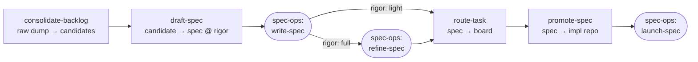

# pm-ops

A four-skill PM workflow — **consolidate → draft → route → promote** — that carries
work from a messy backlog to a spec sitting next to the code it implements. It
**bookends spec-ops**: it feeds spec-ops the right-sized specs and manages the
lifecycle around them. Markdown-in-git is the source of truth; the board is a
projection.



**Everything is a spec** — one format, one folder, one template. spec-ops authors
100% of every spec body via `write-spec` (whose conditional sections make a trivial
item short and a complex one full); rigor only decides whether the heavy
`refine-spec` loop also runs. Developers always pick up a complete spec and never
juggle two formats. A stable **`PM-####` id** threads each item from backlog → spec
→ issue → PR.

## Skills

| Skill | Does |
|-------|------|
| `/pm-ops:consolidate-backlog` | Turn an unstructured dump (brain-dump, meeting notes, raw inbox) into individual **candidate** items — deduped, split to one shippable unit each, classified (`feature`/`bug`/`chore`/`epic`), sized, and tagged with a **suggested rigor**. Allocates a stable id per item. Confirms the calls that matter via `AskUserQuestion`. |
| `/pm-ops:draft-spec` | Scope one candidate into a **spec at the right rigor**. A thin wrapper: sets the pm-ops front-matter, then **always** hands the body to `/spec-ops:write-spec` (which emits a short spec for trivial items, a full one for heavy). **full** rigor additionally runs `/spec-ops:refine-spec`. spec-ops owns 100% of the body. Moves the item `backlog/ → specs/draft/`, keeping its id. |
| `/pm-ops:route-task` | Project the spec onto the board through a **board-agnostic engine** (GitHub Issues + Projects ships first): create/update the item, place it, set fields, link parent/dependencies. **Dry-by-default** — previews the exact plan, applies only on confirm, then writes the board ref back into the spec. |
| `/pm-ops:promote-spec` | Move a verified spec out of the central repo **into the implementation repo** (`docs/specs/`), leaving a forwarding stub behind in `specs/promoted/`. Solves central-vs-in-repo: specs are born central, then live next to the code at build time. Hands off to `/spec-ops:launch-spec`. |

`consolidate-backlog` and `draft-spec` are model-invocable (trigger from a matching
request). `route-task` and `promote-spec` are **explicit-invoke only** — they mutate
external trackers and other repos, so you name them deliberately.

## Design principles

- **Markdown-in-git is canonical; the board is a projection.** Every artifact is a
  markdown file with YAML front-matter. If markdown and board disagree, markdown
  wins — re-route to reconcile.
- **One format, scaled rigor.** There is no separate "story" — everything is a
  spec. `rigor: light|full` (front-matter, queryable) decides process, invisibly to
  the developer. See `rules/rigor-rubric.md`.
- **Board-agnostic core + pluggable engine.** The core only ever emits a
  *normalized task* (JSON) and calls an engine. Swapping boards is a one-line
  `engine` change in `.pm-ops/config.json`. See `engines/INTERFACE.md`.
- **Dry-by-default at every external boundary.** `route-task` (and the board steps
  of `promote-spec`) preview the exact plan and change nothing until you confirm.
- **Determinism in scripts, not prose.** Ids, scaffolding, front-matter I/O,
  normalization, and the index are all `lib/pm.py`; engine dispatch is
  `lib/engine-dispatch.sh`. The skills decide *what*; the scripts do *how*.
- **Stable ids thread everything.** `PM-####` is allocated once and never changes as
  the file moves between folders or onto the board.
- **pm-ops bookends spec-ops.** pm-ops owns the front-matter wrapper + lifecycle;
  spec-ops owns 100% of a full spec's body and the implement/verify loop.

## The central PM repo

`consolidate-backlog` scaffolds it on first run (from `templates/repo-scaffold/`):

```
.pm-ops/            config.json (engine + field maps) · registry.json (id counter)
inbox/              raw, unstructured dumps, verbatim
backlog/            consolidated candidates, one file each
specs/draft/        specs being authored / refined
specs/active/       refined, ready, or in-flight specs
specs/promoted/     forwarding stubs left after a spec moved into its impl repo
index.md            generated cross-link of every item (pm.py reindex — never hand-edit)
```

Full contract — folders, the front-matter schema, the id scheme — is in
`rules/repo-conventions.md` (and ships into each repo as its `CLAUDE.md`).

## Board engine (GitHub first)

The default engine projects tasks onto **GitHub Issues + Projects v2** via the `gh`
CLI: issue create/edit with native issue **types**, project placement, custom
**fields** (size/priority/status/pm-id/spec), and **sub-issue + dependency** links
(`gh ≥ 2.94`; older `gh` degrades to labels/body notes with a warning). Configure
`github.owner`, `project`, and a target repo in `.pm-ops/config.json`. To add
another board, drop an `engines/<name>/engine` + `capabilities.json` and flip
`engine` — see `engines/INTERFACE.md`.

## Quickstart

```text
/pm-ops:consolidate-backlog  @backlog-dump.md      # → PM-#### candidates in backlog/
/pm-ops:draft-spec           PM-0042               # → front-matter + hand body to spec-ops
#   draft-spec runs /spec-ops:write-spec (always); /spec-ops:refine-spec too if rigor: full
/pm-ops:route-task           PM-0042               # dry run → confirm → board item
/pm-ops:promote-spec         PM-0042  ../my-api    # spec → impl repo, stub left behind
#   then in the impl repo: /spec-ops:launch-spec @docs/specs/PM-0042-*.md
```
