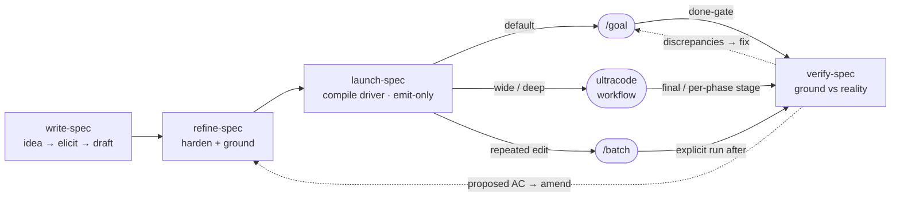

# spec-ops

A spec workflow — **write → refine → launch → verify** — that carries a change from idea to a verified implementation, plus `orchestrate-spec` to run the whole flow end-to-end. Every step that checks a fact does so against **reality** (the codebase at HEAD, git history, live read-only state), never against another doc.



`launch-spec` is **emit-only**: it compiles one of three drivers — `/goal` (default), `ultracode` (wide/deep work), or `/batch` (a repeated mechanical edit) — and stops; the implementer runs it. **Completion is always confirmed by `verify-spec` grounding every `AC-id` against real code**, never the worker's say-so.

## Skills

| Skill | Does |
|-------|------|
| `/spec-ops:write-spec` | **Entrypoint.** Turns a bare idea into an AC-first spec. At `full` rigor a short **discovery** pass elicits and distills requirements (product questions from the idea, *not* codebase grounding) before drafting. Scales to a requested rigor — `light` (AC-only) · `standard` (+ TL;DR + Boundaries) · `full` (exhaustive, self-contained); `light`/`standard` stay **code-free / implementation-agnostic**, `full` may pin implementation. Opens with an id'd **Acceptance Criteria** table and a **Boundaries** section. |
| `/spec-ops:refine-spec` | Hardens a draft into an implementation-ready spec. Parallel `Explore` agents **verify every claim against the codebase**, open questions get resolved with you, bloat and over-engineering are cut, unstated constraints (perf / security / idempotency / limits) **and naive-implementation landmines** hunted (the obvious path that silently breaks) and captured as **load-bearing gotchas** rather than a prescriptive construction plan — looping until an **independent judge** passes the readiness gate. |
| `/spec-ops:launch-spec` | Compiles a verified spec into a self-contained implementation **driver** — goal, spec/checklist references, inlined boundaries, a `verify-spec` done-gate — **phasing by AC group** when the work escalates beyond one context. Picks the driver (see below), copies it to your clipboard, and **stops** (never runs it). |
| `/spec-ops:verify-spec` | Checks that what was built matches the claims — every "we did X" grounded in **real source / git / live read-only CLI**, never the spec. Enumerates and verifies each claim with cited evidence **scaled to what the criterion asserts**, runs a **backward sweep** (delivered code mapping to *no* AC — scope creep), has a fresh judge confirm completeness, and reports discrepancies. **Re-runs drift** against the last clean verification. **Edits nothing.** |
| `/spec-ops:orchestrate-spec` | Runs the full flow — **write → refine → launch → verify** — in one session, delegating each stage to subagents while the main session owns every question. Use when you want the spec driven end-to-end instead of invoking each skill yourself. |

## Design principles

- **Enumerated, gated acceptance criteria.** Every spec opens with a stable-id'd **Acceptance Criteria** table — the reader's contract of *what must be true* and the machine's checklist. `launch-spec`'s done-gate and `verify-spec` both check **every `AC-id`**, so a requirement can't silently fall off between spec and "done". `refine-spec` can organize the criteria into **ordered named groups** with a dependency-derived build order (`needs §X`, never dates); an optional **Checklist** is a thin *code-area → `AC-id`* index, never a restatement.
- **Grounded against reality, never docs.** `refine-spec` and `verify-spec` check claims against the codebase at HEAD, git history, and (for infra/ops) live read-only CLI — sibling or "completed" specs are treated as *possibly stale*. The thing under review is the hypothesis, not the evidence.
- **Grounded HOW = gotchas, not a build script.** `refine-spec` grounds not just the claims that are *present* but the obvious implementation of each AC, surfacing the **landmines** where a hidden codebase behavior silently breaks the naive path — and captures them as **load-bearing gotchas** (plus any config-as-contract value that *is* the requirement). It trims a prescriptive file-by-file construction plan as over-engineering: the dev owns the HOW, and compiling it is `launch-spec`'s job at implement-time. The spec stays a scannable contract a human can verify against, not a build script.
- **Coverage runs both directions, evidence scales with the claim.** `verify-spec` defends *forward* coverage (every `AC-id` has cited evidence — a *threshold* needs a measurement, an *invariant* an exhaustive check, infra a read-only CLI observation, and the method is recorded per `AC-id`) and runs a **backward sweep** flagging delivered code that maps to **no** criterion (scope creep / silent reinterpretation). Backward findings are *reported* with a proposed AC and triage, never auto-applied, and reach `refine-spec` via a `/tmp` amendment artifact — closing the verify→refine loop while verify stays read-only. The sweep's diff base is auto-resolved from the spec's own commit, so it works without manual setup.
- **Re-verification detects drift.** After a clean verification, `verify-spec` records a `/tmp` baseline (each `AC-id`'s verdict + method + verified-at sha); a later run re-grounds **only** the criteria whose evidence moved and flags regressions (`confirmed → contradicted`). Ephemeral and single-machine by design — never committed; if it's gone the run says so and re-verifies in full, never a silent skip.
- **Enforced loops, and a fresh judge decides "done."** `refine-spec` and `verify-spec` run multi-pass loops gated by a `Stop` hook plus a `/tmp` ledger, so neither can sign off after a shallow pass. The agent that did the work never declares it complete — an independent subagent with no memory of the work attests readiness (refine) or completeness (verify).
- **Optional cross-provider second judge.** When the OpenAI Codex CLI is installed and authenticated, a second judge of a **different provider** runs concurrently beside the Claude judge at `verify-spec` (completeness), `refine-spec` (readiness), and `write-spec` (discovery review) — the gate passes only when **both** agree (AND-merge), so a "done" check is never *Claude auditing Claude*. It is strictly **fail-open**: absent / unauthenticated / off (`SPEC_OPS_CODEX=0`) / slow / malformed ⇒ a no-op, Claude-only and behavior-identical. Never a hard dependency of any gate.
- **Commits at every stage, scoped.** `write-spec` commits the draft, `refine-spec` the implementation-ready spec (its `Stop` hook won't release until it's committed), and `launch-spec` bakes a per-phase commit cadence into the driver. Every spec commit is **path-scoped** to the spec file (never `-A`) and never pushes; the shared `scripts/spec_git.py` is the single source. `verify-spec` stays read-only and commits nothing.
- **Emit-only, and ask before guessing.** `launch-spec` compiles the driver and quits — at most a `tasks.md`, never code, never the spec, never running it. Genuine ambiguities go to you via `AskUserQuestion` (at `full` rigor; lighter specs defer to `[NEEDS CLARIFICATION]` markers) — a gap is never filled with an assumption.

## Enabling the Codex second judge

The cross-provider judge activates automatically once the OpenAI Codex CLI is installed and authenticated — but it needs **one environment change** so a Codex review isn't cut short. The bridge allows the judge up to **19.5 min** (`1170s`), while Claude Code caps a foreground `Bash` call at `BASH_MAX_TIMEOUT_MS` (default `600000` / 10 min) and kills it first. Raise the cap to **≥20 min** in your `~/.claude/settings.json`:

```json
{
  "env": {
    "BASH_DEFAULT_TIMEOUT_MS": "1200000",
    "BASH_MAX_TIMEOUT_MS": "1200000"
  }
}
```

`BASH_MAX_TIMEOUT_MS` (`1200000` ms = 20 min) is the hard ceiling the bridge call needs; `BASH_DEFAULT_TIMEOUT_MS` raises the default so a call that sets no explicit timeout also gets the full window. Without it the second judge still **fails open** — a killed call is a no-op and the Claude verdict stands — you just never get the cross-model check. You can disable Codex entirely with `SPEC_OPS_CODEX=0`. Tune the judge's reasoning effort per run with `--codex-effort xhigh|high|medium` (or set `SPEC_OPS_CODEX_EFFORT`); web search for the judge is left to your `~/.codex/config.toml` (ambient — the judge grounds against the repo, not the web). Each call also prints its real elapsed time to stderr (`codex_bridge: completed in Ns`). Full bridge contract and env switches: `references/codex-bridge.md`.

### Auto mode: the Codex layer is opt-in, and never blocks

Every Codex touchpoint in spec-ops is **fully fail-open**: if Codex is not installed, not authenticated, switched off, or its bridge call can't run for any reason, the skill silently proceeds **Claude-only** — nothing fails. Each skill checks availability with a one-line probe that runs the bundled `scripts/codex_bridge.py` at skill load.

In **auto permission mode**, Claude Code's classifier blocks a freshly-installed plugin's scripts until you trust them — so on a brand-new install that load-time probe is **denied**, and the skill correctly reads the denial as "Codex unavailable" and runs Claude-only. **This is expected and harmless** — you simply don't get the cross-model judge until you opt in. To enable it, grant the bridge trust one of two ways in your `~/.claude/settings.json`:

```json
{
  "permissions": {
    "allow": ["Bash(python3 *codex_bridge.py*)"]
  }
}
```

The `*codex_bridge.py*` wildcard matches the script across version bumps (the plugin cache path embeds the version). Alternatively, add the plugin's source to `autoMode.environment` to trust this marketplace's code wholesale. Outside auto mode (the default interactive prompts), you can just approve the bridge when first asked. Either way, **no opt-in is required for the skills to work** — it's only required for the optional Codex judge to participate.

## Choosing the implementation driver (`launch-spec`)

`launch-spec` defaults to **`/goal`** and steps up only on **structural** signals — *how the work is shaped, never how big it is*. A broad-but-shallow change (one mechanical edit across many files) stays in `/goal` regardless of file count.

| Driver | Step up when |
|--------|--------------|
| **`/goal`** (default) | One coherent change that decomposes into bounded, mostly-independent or shallowly-coupled edits. |
| **`ultracode`** (dynamic workflow) | **≥2 independent workstreams** (disjoint files, no ordering) → parallel fan-out; a **shared contract carried through dependent steps** → `pipeline()`; **unbounded scope** ("every / all / across the codebase") → discovery. |
| **`/batch`** | The **same mechanical edit repeated across ≥5 files** with no per-file decision. |

When a step-up fires and the spec carries named **AC groups**, the emitted driver is **phased by group** in `needs §X` order — each phase front-loads only its own `AC-id`s and its exit gate is "these criteria verify clean" — so no single context holds every criterion at once. A one-group or flat spec stays a single context. Whichever driver runs, **completion goes through `verify-spec`** so "done" is always grounded against real code.

## Stop-hook enforcement

The looping skills carry their gate as a skill-scoped `Stop` hook (active only while the skill runs), each backed by a `/tmp` ledger keyed on the session id:

| Skill | Hook | Blocks the stop until… |
|-------|------|------------------------|
| `refine-spec` | `stop_refine_spec.py` | all readiness-gate flags are `true` (set only after an independent judge passes), every open question resolved, and no `TODO` / `TBD` / `FIXME` / `[NEEDS CLARIFICATION]` markers remain. |
| `verify-spec` | `stop_verify_spec.py` | every claim has a cited verdict **and a recorded method**, every unverifiable claim is dispositioned, and an independent judge returns `complete`. On a clean pass it also writes the `/tmp` **drift baseline** (best-effort, never gates). |

`orchestrate-spec` adds its own state-machine `Stop` hook that sequences the stages and reuses each skill's gate unchanged.

## Quickstart

```text
/spec-ops:write-spec  add per-rule long-term discount  @docs/specs/discount.md
/spec-ops:refine-spec @docs/specs/discount.md
/spec-ops:launch-spec @docs/specs/discount.md     # → driver copied to clipboard
#   ⌘V into a fresh /goal session (pair with auto mode) to implement
/spec-ops:verify-spec @docs/specs/discount.md     # after implementation
```

You don't have to type the four core skills — they're model-invocable and trigger from a matching request ("write a spec for…", "review / finalize this spec", "turn this spec into a `/goal` driver", "is this actually done?"); name them to force the choice. `orchestrate-spec` is **invoked explicitly** when you want the full flow driven in one session.
