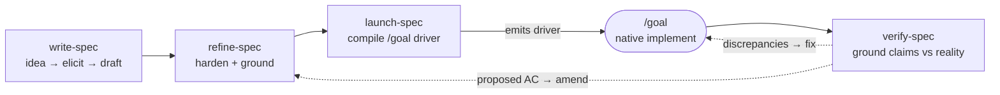

# spec-ops

A four-skill spec workflow — **write → refine → launch → verify** — that carries a change from idea to a verified implementation. Every step that checks a fact does so against **reality** (the codebase at HEAD, git history, live read-only state), never against another doc.



`launch-spec` is **emit-only**: it compiles the driver and stops; the native `/goal` does the implementing, and the driver's done-gate runs `verify-spec` so completion is confirmed against real code, not the worker's say-so.

## Skills

| Skill | Does |
|-------|------|
| `/spec-ops:write-spec` | **The workflow entrypoint** — turns a bare idea into a spec: at `full` rigor a short **discovery** pass elicits and distills the requirements (product questions sourced from the idea, *not* codebase grounding) before drafting, and the file can be named afterward. Drafts a concise, scannable spec — **behavior, not implementation**; tables / mermaid / mockups over prose; say things once; opens with an id'd **Acceptance Criteria** table (the testable contract; optionally split into ordered named groups); an explicit **Boundaries** section (what NOT to touch). Scales to a requested **rigor** — `light` (AC-only) · `standard` (+ TL;DR + Boundaries) · `full` (the exhaustive deep spec). Asks before guessing via `AskUserQuestion` at `full`; lighter tiers defer unknowns to `[NEEDS CLARIFICATION]` markers. |
| `/spec-ops:refine-spec` | Harden a draft into an implementation-ready spec. A grounded multi-pass loop: dispatch parallel `Explore` agents to **verify every claim against the codebase**, resolve open questions with you, cut bloat and over-engineering, **hunt for unstated constraints (perf / security / idempotency / limits)**, and loop until an **independent judge** passes the readiness gate. |
| `/spec-ops:launch-spec` | Compile a verified spec into the self-contained **`/goal` driver** that implements it — goal, spec/checklist references, inlined boundaries, and a `verify-spec` done-gate — **phasing the build by AC group when the work escalates beyond one context**. Picks the driver (see below), copies it to your clipboard, and **stops** (never runs it). |
| `/spec-ops:verify-spec` | Check that what was actually built matches the claims — every "we did X" / "the system does Y" grounded in **real source, git, or live read-only CLI**, never the spec. Enumerates claims, verifies each with cited evidence **scaled to what the criterion asserts (a threshold needs a measurement, an invariant an exhaustive check) while recording how each was grounded**, runs a **backward sweep** (flags delivered code that maps to *no* acceptance criterion — scope creep / silent reinterpretation), has a fresh judge confirm completeness, and reports discrepancies. On a spec **re-run** it drifts against the last clean verification — re-grounding only the criteria whose evidence moved and flagging regressions (`confirmed → contradicted`). **Edits nothing** in the repo (the drift baseline lives in `/tmp`). |

## Design principles

- **Enumerated, gated acceptance criteria.** Every spec opens with a stable-id'd **Acceptance Criteria** table — the reader's scannable contract of *what must be true*, and the machine's checklist. The detailed body says *how/where* and cites each `AC-id`; the criteria say *what*, enumerated exhaustively and never condensed. `launch-spec`'s done-gate and `verify-spec` both check the implementation against **every `AC-id`**, so a requirement can't silently fall off between spec and "done". When it aids the reader, `refine-spec` organizes the criteria into **ordered named groups** — a capability map plus a dependency-derived build order (`needs §X`), never dates. The optional **Checklist** is a third view at a different altitude — a thin *code-area → `AC-id`* index for the implementer, never a restatement of the criteria.
- **Coverage runs both directions.** `verify-spec` defends *forward* coverage (every `AC-id` has cited evidence) and also runs a **backward sweep**: it flags delivered code that maps to **no** criterion — scope creep, silent reinterpretation, or a derived requirement built with no AC. Backward findings are *reported* (with a proposed AC and a triage), never auto-changed — `verify-spec` still edits nothing. Those proposed ACs are handed to **`refine-spec`** through a `/tmp` amendment artifact the verify `Stop` hook writes, so a missed-requirement finding reaches the spec on the next refine run **without manual re-keying** — closing the verify→refine loop while verify stays read-only.
- **Evidence scales with the claim.** `verify-spec` grounds a *measurable threshold* with a measurement, a *universal invariant* with an exhaustive check, and a plain *behavior* against code/git — and records the **verification method** per `AC-id`, so a perf or security constraint can't be rubber-stamped by code-reading (read-only CLI observation stays a first-class method for infra). The completion handoff emits a compact coverage matrix where an empty cell is itself the finding.
- **Re-verification detects drift.** After a clean spec verification, `verify-spec` records a `/tmp` baseline (each `AC-id`'s verdict + method + the verified-at sha). A later run re-grounds **only** the criteria whose evidence moved — a method-aware `git diff` since that sha — and flags any that regressed (`confirmed → contradicted`). Single-machine and ephemeral by design (the baseline is never committed); if it's gone the run says so and does a full verification, never a silent skip.
- **Grounded against reality, never docs.** `refine-spec` and `verify-spec` check claims against the codebase at branch HEAD, the git history, and (for infra/ops) live read-only CLI state. Sibling or "completed" specs are treated as *possibly stale* — the thing under review is the hypothesis, not the evidence.
- **Enforced loops, not one-shot passes.** `refine-spec` and `verify-spec` run multi-pass loops gated by a `Stop` hook plus a `/tmp` ledger, so neither can sign off after a shallow pass.
- **A fresh judge decides "done."** The agent that did the work never declares it complete — an independent subagent with no memory of the work attests readiness (refine) or completeness (verify), mirroring how `/goal` uses a separate evaluator.
- **One format, scaled rigor — and a real front door.** `write-spec` is the workflow's **entrypoint**: at `full` rigor it first runs a short **discovery** pass that elicits and distills requirements from a bare idea (product questions sourced from the idea, *never* codebase grounding — that's `refine-spec`'s line), so it's the place you start with nothing but a thought, not just a transcriber. It then emits the same AC-first contract at three depths — `light` (a few atomic criteria, nothing else), `standard` (+ TL;DR and Boundaries), `full` (the exhaustive, self-contained deep spec that then goes to `refine-spec`). The criteria are always enumerated exhaustively; only the prose scales. A caller (e.g. a board-intake workflow) sets the rigor; direct use defaults to `full`.
- **Ask, don't guess.** Genuine ambiguities go to you via `AskUserQuestion` (at `full` rigor; lighter specs defer them to `[NEEDS CLARIFICATION]` markers); a gap is never filled with an assumption.
- **Emit-only handoff.** `launch-spec` compiles the `/goal` driver and quits — it writes at most a `tasks.md`, never code, never the spec, and never runs the driver itself.
- **Commits at every stage, scoped.** spec-ops commits the spec artifact as it's authored — `write-spec` the draft, `refine-spec` the implementation-ready spec (its `Stop` hook won't release the turn until it's committed) — and `launch-spec` bakes a per-phase commit cadence into the `/goal` driver so the implementation history maps to the AC groups. Every spec commit is **path-scoped to the spec file** (`git add -- <file>`, never `-A`), so it can't sweep up unrelated or untracked changes, and it never pushes. The shared `scripts/spec_git.py` is the single source of that behavior; `verify-spec` stays read-only and commits nothing.

## Choosing the implementation driver (`launch-spec`)

`launch-spec` defaults to **`/goal`** and steps up only on **structural** signals — *how the work is shaped, never how big it is*. A broad-but-shallow change (one mechanical edit across many files) stays in `/goal` regardless of file count.

| Driver | Step up when |
|--------|--------------|
| **`/goal`** (default) | One coherent change that decomposes into bounded, mostly-independent or shallowly-coupled edits. |
| **`ultracode`** (dynamic workflow) | **≥2 independent workstreams** (disjoint files, no ordering) → parallel fan-out; a **shared contract carried through dependent steps** that must stay consistent → `pipeline()`; **unbounded scope** ("every / all / across the codebase") → discovery. |
| **`/batch`** | The **same mechanical edit repeated across ≥5 files** with no per-file decision. |

When a step-up fires and the spec carries named **AC groups**, the emitted driver is **phased by group** in `needs §X` order — each phase front-loads only its own `AC-id`s and its exit gate is "these criteria verify clean" — so no single context must hold every criterion at once. A one-group or flat spec stays a single context.

## Stop-hook enforcement

The two looping skills carry their gate as a skill-scoped `Stop` hook (active only while the skill runs), each backed by a `/tmp` ledger keyed on the session id:

| Skill | Hook | Blocks the stop until… |
|-------|------|------------------------|
| `refine-spec` | `skills/refine-spec/stop_refine_spec.py` | all readiness-gate flags are `true`, every open question resolved, and no `TODO` / `TBD` / `FIXME` / `[NEEDS CLARIFICATION]` markers remain in the spec. (The flags are set only after an independent readiness judge passes.) |
| `verify-spec` | `skills/verify-spec/stop_verify_spec.py` | every claim has a cited verdict **and a recorded verification method**, every unverifiable claim is dispositioned, and an independent judge returns `complete`. On a clean pass it also writes the `/tmp` **drift baseline** for the spec (best-effort, never gates). |

## Quickstart

```text
/spec-ops:write-spec  add per-rule long-term discount  @docs/specs/discount.md
/spec-ops:refine-spec @docs/specs/discount.md
/spec-ops:launch-spec @docs/specs/discount.md     # → driver copied to clipboard
#   ⌘V into a fresh /goal session (pair with auto mode) to implement
/spec-ops:verify-spec @docs/specs/discount.md     # after implementation
```

You don't have to type these commands — all four skills are model-invocable and trigger automatically from a matching request ("write a spec for…", "review / finalize this spec", "turn this spec into a `/goal` driver", "is this actually done?"). Name them explicitly when you want to force the choice.
