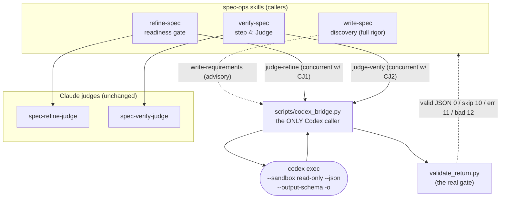

# Codex CLI as a Cross-Provider Second Model Spec

## TL;DR
- Add **OpenAI Codex CLI (GPT-5 family)** as an **optional, fail-open second adversarial judge** at spec-ops' existing independence seams — verify-spec's completeness judge (AC-13…19), refine-spec's readiness judge (AC-20…23), and write-spec's discovery (AC-24…29) — so every "done" check is no longer *Claude auditing Claude*.
- **Breaks if missed:** Codex must be a graceful enhancement, never a dependency — absent CLI / no auth / timeout / bad reply ⇒ the run proceeds **Claude-only, byte-behavior-identical to today** (AC-8, AC-9, AC-10). No Stop hook or ledger may ever require a Codex attestation (AC-11).
- **Stays fast:** the cross-model judge runs **once on the final pass** of a loop you already wait on, **concurrently** with the Claude judge — added wall-clock ≈ the slower judge, not the sum (AC-12).
- One shared wrapper, `scripts/codex_bridge.py`, is the **only** thing that talks to Codex (AC-1); review roles run in an **OS-enforced read-only sandbox** (AC-3).

---

## Acceptance Criteria

<!-- Loosely grouped as a "what am I building" map. No build order / needs §X asserted here — refine-spec commits that after grounding. AC-ids are globally unique and stable across groups. -->

### 1. Codex bridge primitive

| AC | Criterion |
|----|-----------|
| 1 | A single shared helper, `scripts/codex_bridge.py`, is the **only** component that invokes Codex; no skill, agent, or hook shells out to `codex` directly. |
| 2 | The bridge invokes Codex **non-interactively** via `codex exec` and never opens the interactive TUI nor triggers an interactive `codex login`. |
| 3 | A review/judge invocation runs in a **strictly read-only sandbox** — Codex cannot modify any file, create a commit, or reach the network — enforced at the sandbox boundary (`--sandbox read-only --ask-for-approval never`), not by prompt text. |
| 4 | The bridge **never** passes `--yolo`, `--dangerously-bypass-approvals-and-sandbox`, or `--full-auto` (deprecated); their absence is guaranteed by construction. |
| 5 | The bridge returns a deterministic exit-code taxonomy — `0` valid verdict · `10` skipped (Codex absent or unauthenticated) · `11` Codex error / timeout / turn-failed · `12` unparseable-after-retry — and **every non-zero code is fail-open** (the caller proceeds Claude-only). |
| 6 | The bridge extracts Codex's final message through **three fallback channels in order** — the `--json` JSONL stream (taking the **last** `agent_message`), the `--output-last-message` file, then fenced JSON from raw stdout — so a single-channel quirk never loses a valid verdict. |
| 7 | Extracted JSON is validated against the named contract via the existing `scripts/validate_return.py`; on an invalid shape the bridge **re-dispatches exactly once** with the canonical schema appended, then fails open (`12`) if still invalid. |
| 30 | The bridge enforces a **bounded per-call timeout** (default 180s, configurable); on timeout it kills the subprocess and returns `11`. |
| 31 | The Codex **model is resolved at runtime** — explicit caller arg → the user's `~/.codex/config.toml` → a documented, version-sensitive default constant — and is **never hardcoded at a call site**. |
| 32 | **Reasoning effort is set per role** — judge/review = `xhigh`, any future grounding lane = `medium` — via `-c model_reasoning_effort=…`. |
| 33 | The bridge **writes nothing** into any spec-ops `/tmp` ledger or the repo; it only prints validated JSON to stdout, and the calling skill folds the result into its ledger. |
| 34 | `validate_return.py` gains **exactly one** new contract kind, `write-requirements`; the verify and refine wirings **reuse the existing `judge-verify` / `judge-refine` kinds verbatim**. |

### 2. Enablement, graceful degradation & cost control

| AC | Criterion |
|----|-----------|
| 8 | When Codex is installed **and** authenticated, the cross-model checks run **automatically**; when it is absent or unauthenticated, every skill behaves exactly as today (Claude-only), with **no error and no prompt**. |
| 9 | An explicit **off switch** (an environment variable) disables all Codex cross-model checks even when Codex is available; with it set, behavior is byte-behavior-identical to today. |
| 10 | A skipped / errored / timed-out Codex call **logs exactly one line** and does not change the skill's verdict beyond what Claude alone produced. |
| 11 | **No Stop hook and no `/tmp` ledger schema requires a Codex attestation flag** — a run with Codex absent passes every existing gate unchanged. Codex can never be a hard dependency of a gate. |
| 29 | The **write-discovery reviewer** (the only wiring on the interactive authoring path) has its **own independent toggle**, so its single call can be disabled without disabling the verify/refine judges. |

### 3. Cross-model judge policy (shared by verify + refine)

| AC | Criterion |
|----|-----------|
| 12 | The Codex judge dispatches **concurrently** with the Claude judge; the added wall-clock is at most the slower of the two, never their sum. |
| 35 | The Codex judge runs **only on the final pass** of the loop (the completeness pass / the no-fix readiness pass), never on every intermediate iteration — so cross-model review costs ~**one Codex call per run**, not per iteration. |
| 36 | Each Codex judge receives the corresponding Claude judge's rubric file **verbatim** (`agents/spec-verify-judge.md` / `agents/spec-refine-judge.md`) as its system prompt — single-sourced, never paraphrased — and returns that judge's **exact existing return contract**. |
| 37 | Merge is **AND-on-pass**: a completeness verdict / readiness flag passes only when **both** judges pass it; any FAIL from either model holds the gate closed and becomes work for the next pass. The combined gate is strictly stronger, never weaker. |
| 38 | The Codex judge prompt embeds the skill's **exact materiality / diminishing-returns language**, so a different-provider threshold does not manufacture low-value findings. |
| 39 | A Claude/Codex disagreement that **persists to the loop's existing cap escalates to the user** via a single consolidated `AskUserQuestion`, never silent-loops to the cap. |
| 40 | The relevant **Stop hook and ledger schema are unchanged** (`stop_verify_spec.py`, `stop_refine_spec.py`); the skill simply withholds the existing done-signal until both judges agree. |

### 4. verify-spec wiring

| AC | Criterion |
|----|-----------|
| 13 | On verify-spec's **step 4 (Judge)**, a Codex judge is dispatched **in addition to** the Claude `spec-verify-judge`. |
| 14 | The Codex verify judge receives **only** the verification target + the ledger (no memory of prior passes) and runs **read-only**. |
| 15 | The Codex verify judge returns the **identical `judge-verify` contract** (`verdict`, `missed`, `weakEvidence`, `backwardSweepAttested`, `specLinkageSweepAttested`), validated by `validate_return.py --kind judge-verify`. |
| 16 | The completeness gap set is the **union** of both judges' `missed` + `weakEvidence`. |
| 17 | verify-spec writes `complete` (releasing the Stop hook) **only when both judges return `complete`**, within the existing cap. |
| 18 | `stop_verify_spec.py` and the verify ledger schema are **unmodified**. |
| 19 | Because `launch-spec` wires verify-spec as the done-gate for `/goal`, `ultracode`, and `/batch`, the stronger gate applies to **all three drivers with no `launch-spec` change**. |

### 5. refine-spec wiring

| AC | Criterion |
|----|-----------|
| 20 | On refine-spec's **readiness gate** (after a no-fix pass), a Codex judge is dispatched **alongside** the Claude `spec-refine-judge`. |
| 21 | The Codex refine judge receives the **spec path + repo root**, runs **read-only**, and returns the **identical `judge-refine` contract** over the six single-sourced criteria, validated by `validate_return.py --kind judge-refine`. |
| 22 | A readiness flag is set `true` only when **both** judges pass that criterion; any criterion either model FAILs becomes work for the next pass. |
| 23 | `stop_refine_spec.py` and the refine ledger schema are **unmodified**. |

### 6. write-spec discovery requirements reviewer (advisory)

| AC | Criterion |
|----|-----------|
| 24 | At **`full` rigor only**, after the AC table is distilled and **before** the draft is committed, a Codex **requirements reviewer** is dispatched **at most once**. |
| 25 | It receives the **idea + drafted AC table + discovery transcript** and is **firewalled from grounding against the codebase** — it reasons only about requirements the feature *implies* (the write/refine firewall is preserved). |
| 26 | It returns the new **`write-requirements` contract**: `missingACs`, `unaskedQuestions`, `scopeRisks` (three string arrays), validated by `validate_return.py --kind write-requirements`. |
| 27 | Its findings are **advisory — never a gate**: they are surfaced to the user in a **single consolidated `AskUserQuestion` disposition** (not a per-item loop), each accepted (→ new AC / question) or rejected with a reason. |
| 28 | The reviewer is **off-able** independently of the judges (AC-29) and never blocks the draft from being written or committed. |

---

## Architecture



The two judge calls fan out: the skill dispatches its **Claude** judge (Task subagent) **and** the **Codex** judge (the bridge subprocess) at the same time, then AND-merges the two verdicts. The bridge is the single waist — every Codex fact, flag, and failure mode lives in one place.

---

## The Codex bridge (`scripts/codex_bridge.py`)

The bridge is a deterministic wrapper invoked as:

```
codex_bridge.py --kind <judge-verify|judge-refine|write-requirements> \
                --prompt-file <f> [--schema-file <f>] [--cd <repo>] \
                [--model <m>] [--effort xhigh|medium] [--timeout 180]
```

**Invocation it builds** (review/judge role — read-only is the default and the only mode used in this spec):

```
codex exec "<prompt>" \
  --sandbox read-only --ask-for-approval never \
  --skip-git-repo-check -C <repo> \
  --json --output-schema <schema> -o <tmp_last> \
  -m <model> -c model_reasoning_effort=<effort>
```

### Exit-code taxonomy (callers branch on the code)

| Code | Meaning | Caller behavior |
|------|---------|-----------------|
| `0` | valid, contract-checked JSON on stdout | fold into the ledger / disposition |
| `10` | **skipped** — `codex` not on PATH, or no usable auth | proceed Claude-only, no log noise beyond one line |
| `11` | Codex error / timeout / `turn.failed` event | proceed Claude-only, log one line |
| `12` | reply unparseable after one re-dispatch | proceed Claude-only, log one line |

**Every non-zero code is fail-open.** The bridge can only ever *open* a gate further (add findings); it can never close one. (AC-5, AC-10, AC-11)

### Verdict extraction — defense in depth (AC-6)

1. **Primary:** parse the `--json` JSONL stream; take the **last** `item.completed` event whose `item.type == "agent_message"` from the turn ending in `turn.completed`. *Last, not first* — mitigates the known gpt-5.5 schema-leak-into-intermediate-messages bug.
2. **Fallback:** read the `--output-last-message` file.
3. **Last resort:** strip ` ```json ` fences from raw stdout and parse.
4. A `turn.failed` / `error` event ⇒ exit `11`.

Then pipe through `validate_return.validate(kind, data)`; bad shape ⇒ one re-dispatch with the schema appended ⇒ still bad ⇒ exit `12`. (AC-7)

### Model resolution (AC-31) — version-sensitive, never hardcoded

Order: explicit `--model` arg → the user's `~/.codex/config.toml` `model` key → a documented default constant in the bridge (carried with a mirror-anchor comment).

> **Model facts (2026, version-sensitive — verify against the installed `codex --version`):** current valid models are **`gpt-5.5`** (frontier) and **`gpt-5.4`**; **`gpt-5` and `gpt-5-codex` are retired** (removed from the picker / blocked for new requests), and `latest` is **not** a valid identifier. The default constant must therefore be revisitable, not load-bearing.

### `--output-schema` is best-effort, not the gate (AC-7)

The schema flag is known to **silently degrade** — dropped on `*-codex` model slugs, dropped when MCP servers/tools are active, and leaked into intermediate messages on gpt-5.5. It is supplied as *output shaping only*; **`validate_return.py` is the real gate**, and the three-channel extraction + one re-dispatch absorb a degraded schema. Prefer a plain `gpt-5.x` (non-`-codex`) slug for schema-strict review.

---

## Cross-model judge policy

One policy governs both judge wirings, stated once so it can't drift (AC-12, AC-35…40):

- **Final pass only.** The Codex judge fires on the loop's *final* pass (the verify completeness pass / the refine no-fix pass), so it adds ~one call per run, not per iteration.
- **Concurrent.** Claude judge (Task subagent) and Codex judge (bridge subprocess) dispatch together; the skill awaits both. Added wall-clock ≈ `max`, not `sum`.
- **Single-sourced rubric.** The bridge reads the *exact* `agents/spec-*-judge.md` file as Codex's system prompt — no paraphrase — and Codex returns the *same* `judge-verify` / `judge-refine` contract. Zero new contract for the judges.
- **AND-on-pass merge.** A verdict/flag passes only when **both** models pass; any FAIL holds the gate. The merged gate is strictly stronger.
- **Materiality bar carried verbatim.** Codex inherits the skill's diminishing-returns language, so it doesn't churn the loop with low-value FAILs.
- **Escalate, don't loop.** A split that survives the existing cap goes to the user as one consolidated `AskUserQuestion`.

---

## Insertion points

| Skill | Where | Codex receives | Returns | Merge |
|-------|-------|----------------|---------|-------|
| **verify-spec** | step 4 (Judge), beside `spec-verify-judge` | target + ledger only | `judge-verify` | union `missed`+`weakEvidence`; `complete` only when both `complete` |
| **refine-spec** | readiness gate, beside `spec-refine-judge` | spec path + repo root | `judge-refine` (6 criteria) | flag `true` only when both pass |
| **write-spec** | discovery, after AC distill / before commit (`full` only) | idea + AC table + transcript | `write-requirements` | **advisory** — one consolidated disposition, never gates |

`verify-spec` is the strongest fit: it is already read-only and is the done-gate for all three launch drivers, so hardening its judge hardens the entire launch path for free (AC-19). `refine-spec` is the canonical dual-agent expression (two providers, same readiness rubric). `write-spec`'s reviewer is the highest-value single spot (a requirement dropped at discovery is the most expensive miss) but is kept **advisory + independently toggleable** because it is the only wiring on the interactive authoring path.

---

## Boundaries

- **Do not modify** `stop_verify_spec.py`, `stop_refine_spec.py`, `stop_orchestrate_spec.py`, `spec_orchestrator.py`, or `launch-spec` — they stay behavior-identical (Codex influences only *whether the model produces* the existing done-signal, never adds an artifact a hook keys on).
- **Do not** make Codex a hard dependency of any gate, hook, or ledger (AC-11).
- **Do not** use the Codex **MCP-server** path or depend on the **`openai/codex-plugin-cc`** plugin — shell out to `codex exec` only.
- **Do not** hardcode a Codex model id at a call site (AC-31).
- **Do not** let Codex write to the repo or any `/tmp` ledger (AC-33).
- **Do not** change the Claude judges' rubrics (`agents/spec-*-judge.md`) — they are read and reused, not edited.
- **Out of scope (see Roadmap):** Codex-as-grounder / dual-grounder lanes, the backward-sweep reviewer, and any `--require-codex` strict mode.

---

## Roadmap (not gated by this spec)

- **Phase 3 — grounder lanes.** A verify step-2 dual-grounder over a high-stakes claim subset and a Codex backward-sweep reviewer (report-only). Deferred: lower leverage-per-call, and a Codex *grounder* (unlike a judge) interacts with verify-spec's drift baseline, so its model/effort must be pinned and same-source flips treated as grounding errors.
- **Optional `--require-codex` strict mode.** An opt-in that *requires* a Codex attestation — itself failing open when the bridge reports Codex absent. Rejected for this spec because it risks coupling a gate to Codex availability.

---

## Checklist

**Bridge · `scripts/codex_bridge.py` + `scripts/validate_return.py`**
- [ ] Wrapper: availability/auth guard, sandboxed `codex exec` invocation, 3-channel extraction, one re-dispatch, exit taxonomy, timeout, runtime model/effort resolution — AC-1…7, AC-30…33
- [ ] New `write-requirements` contract kind in `validate_return.py` — AC-34
- [ ] Unit tests: exit taxonomy, "last `agent_message`" extraction, fail-open on absent/timeout/malformed — AC-5, AC-6, AC-10

**Docs · `references/codex-bridge.md`**
- [ ] Single-source the invocation contract, exit codes, model-resolution order, and the `--output-schema` reliability caveats — AC-31, AC-7

**Schemas · `schemas/*.schema.json`**
- [ ] `judge_verify`, `judge_refine`, `write_requirements` JSON Schemas for `--output-schema` (root `type:object`, `additionalProperties:false` throughout) — AC-15, AC-21, AC-26

**Enablement (cross-cutting)**
- [ ] Auto-on-when-available, env off switch, independent write-reviewer toggle, one-line skip log — AC-8, AC-9, AC-10, AC-29

**verify-spec · `skills/verify-spec/SKILL.md`**
- [ ] Dispatch Codex judge concurrent with `spec-verify-judge` at step 4; union gaps; both-`complete` gate — AC-12…19

**refine-spec · `skills/refine-spec/SKILL.md`**
- [ ] Dispatch Codex judge concurrent with `spec-refine-judge` at the readiness gate; AND-merge flags — AC-12, AC-20…23, AC-35…40

**write-spec · `skills/write-spec/SKILL.md`**
- [ ] Full-rigor-only requirements reviewer after AC distill; advisory single-disposition; toggle — AC-24…29

**Release · `.claude-plugin/marketplace.json`**
- [ ] Bump spec-ops version (repo rule)
