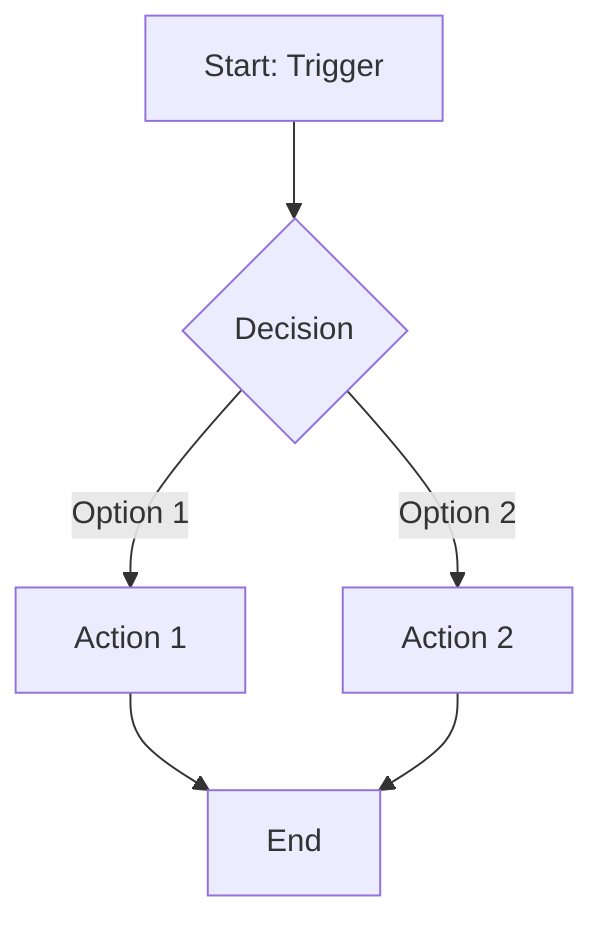
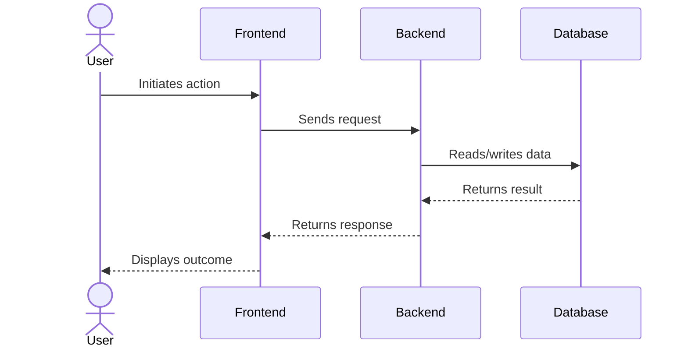
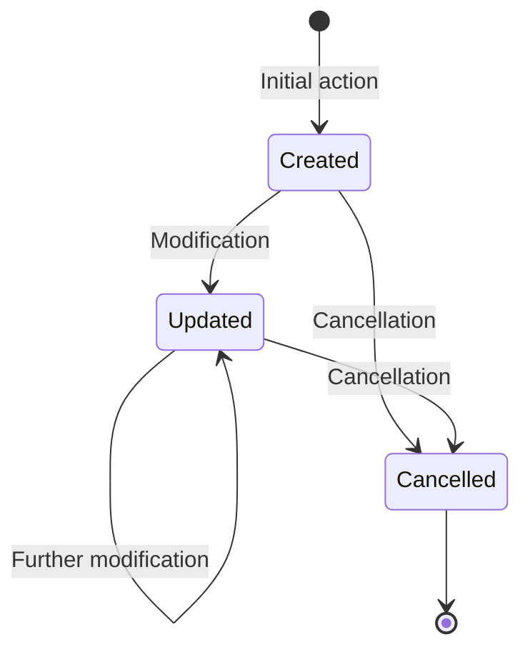

# Spec Doc Template

> **Purpose:** This document defines the optimal structure for Functional Specification Documents (Spec Docs) that serve as living system documentation. Spec docs describe how the system **currently behaves** and are used for onboarding, cross-team reference, and as context when writing PRDs for new features. They are derived from analysis of the Turo Shim spec suite and the existing `specdocs/` template, combined with best practices for documentation consumable by both humans and AI agents.

---

## How This Relates to PRDs

| | PRD | Spec Doc |
|---|-----|----------|
| **Question answered** | "What should we build?" | "How does the system work?" |
| **Written** | Before implementation | After implementation (or retroactively) |
| **Tech-specific?** | Yes — file paths, DDL, JSON contracts | No — technology-agnostic, business logic only |
| **Lifecycle** | Ephemeral, one per feature | Living, one per feature area |
| **Contains** | Implementation plan, acceptance criteria, rollout | User flows, business rules, state machines |

**See also:** [PRD_TEMPLATE.md](./PRD_TEMPLATE.md) — the companion template for implementation-focused documents.

**Workflow:**
1. Read existing spec docs for context when writing a PRD
2. Implement the feature using the PRD
3. Update the relevant spec doc(s) to reflect the new/changed behavior

---

## How to Use This Template

Every section below is annotated with:
- **When to include:** Whether the section is **Required** or **Optional**.
- **Why it matters:** How this section helps readers (human or AI) understand the system.
- **Guidance:** What to write and what to avoid.

**Key principle:** Spec docs describe **WHAT** the system does, never **HOW** it's implemented. No code snippets, no file paths, no data models, no API contracts. A reader should be able to reimplement the feature in any tech stack from this document alone.

---

# `{Feature Area Name}`

## Overview

> **Required.** | The reader's first orientation point — what this feature area is and why it exists.

2-3 sentences covering: what this feature area does, its business purpose, and who uses it.

```
Example:
The Booking Synchronization component receives processed booking messages from an
external marketplace and persists them to the platform database. It handles creation,
modification, and cancellation of bookings while enforcing idempotency and validating
state transitions.
```

### Scope

> **Required.** | Prevents the spec from sprawling into adjacent areas. Especially important when related spec docs exist.

**In Scope:**
- [What this specification covers]

**Out of Scope:**
- [What is explicitly NOT covered — reference the spec doc that does cover it]

### Assumptions

> **Required.** | States what must already be true for this feature area to function. Prevents misunderstanding of preconditions.

- [Key assumptions this specification relies on]
- [E.g., "User is already authenticated", "Business has completed payment onboarding"]

---

## User Roles Involved

> **Required.** | Clarifies who interacts with this feature and in what capacity. Use roles from the project glossary.

| Role | Description |
|------|-------------|
| [Role Name] | [What this role does in this feature area] |

---

## User Flows

> **Required.** | The core of the spec doc. Each significant path through the feature gets its own flow section.

### Flow 1: `{Flow Name}`

**Actor**: [Role]
**Trigger**: [What initiates this flow]

**Preconditions**:
- [What must be true before this flow starts]

**Postconditions (Success)**:
- [What is true after successful completion]

**Postconditions (Failure)**:
- [What happens if the flow fails]

#### Flow Description

[Narrative description in numbered steps]

1. [Step 1]
2. [Step 2]
3. [Step 3]

#### Diagrams

> Include the diagram type that **best illustrates this flow**. Not every flow needs every diagram type. Pick the one that adds the most clarity. Reserve state diagrams for the standalone [State Machine](#state-machine) section — within flows, prefer activity or sequence diagrams.

**Activity Diagram** — Use for decision-heavy flows with branching logic:



**Sequence Diagram** — Use when multiple actors/systems interact:



---

## Data Transformation Rules

> **Optional.** Include when the feature transforms external data into internal format, or vice versa.

| External Field | Internal Field | Transformation |
|----------------|----------------|----------------|
| [source_field] | [target_field] | [Rule: e.g., "Split on first space", "Convert timezone to UTC"] |

---

## State Machine

> **Optional.** Include when the primary entity in this feature area has a defined lifecycle with explicit state transitions. This section documents the **complete** lifecycle of the entity — use it instead of embedding state diagrams in individual flows above.

### State Diagram



### Valid Transitions

| Current State | Allowed Transitions | Notes |
|---------------|---------------------|-------|
| (none) | Created | New entity |
| Created | Updated, Cancelled | Normal lifecycle |
| Updated | Updated, Cancelled | Repeatable |
| Cancelled | (none — terminal) | Cannot be reopened |

---

## Business Rules

> **Required.** | The most referenceable section in the spec. Business rules get IDs so they can be cited from PRDs, tests, and other spec docs.

Use the format `BR-{section_number}-{sequence}` for IDs (e.g., `BR-03-001` for the first rule in section 03 Booking Lifecycle).

| ID | Rule |
|----|------|
| BR-XX-001 | [Rule description — what must be true or what constraint applies] |
| BR-XX-002 | [Rule description] |

**Guidance:**
- Extract rules from validation logic, conditionals, and error handling in the codebase
- Each rule should be a single, testable statement
- Group related rules together
- Cross-reference rules from other spec docs when relevant (e.g., "See BR-04-003 in Pricing")

---

## Edge Cases & Error Handling

> **Required.** | Documents what happens when things go wrong or hit boundary conditions. Use the 4-column format consistently.

| Scenario | Trigger | System Behavior | User Experience |
|----------|---------|-----------------|-----------------|
| [Scenario name] | [What causes it] | [What the system does internally] | [What the user sees/experiences] |

```
Example:
| Duplicate submission | User double-clicks submit | Second request rejected (idempotency key) | No duplicate charge; original confirmation shown |
| Booking conflict | Two users book same item simultaneously | First commit wins; second gets 409 | "This item was just booked" message with search redirect |
```

---

## Concurrency & Idempotency

> **Optional.** Include when the feature handles concurrent access or must be idempotent.

Describe:
- Lock strategy (optimistic/pessimistic, advisory locks, etc.)
- Idempotency mechanism (keys, timestamp comparison, etc.)
- Retry behavior and conflict resolution

---

## Notifications & Communications

> **Optional.** Include only if this feature triggers automated communications.

| Event | Channel | Recipient | Content Summary |
|-------|---------|-----------|-----------------|
| [Event name] | Email / SMS / Push / Slack | [Who receives] | [Brief content description] |

---

## Monitoring & Alerting

> **Optional.** Include when the feature has operational monitoring requirements.

| Metric | Alert Condition | Purpose |
|--------|----------------|---------|
| [What is measured] | [When to alert] | [Why this matters] |

---

## Related Features

> **Required.** | Cross-references prevent duplication and help readers navigate the spec suite.

- [{Feature Name}](../XX-folder/feature.md) — [How it relates to this feature]

---

## Open Questions / TBD

> **Optional.** Use during initial documentation to track items needing clarification. Remove or resolve when spec is finalized.

- [ ] [Question or unclear item]
- ~~[Resolved question]~~ → **Resolved:** [Answer]

---

*Last Updated: {DATE}*

---

## Appendix: Writing Principles for Spec Docs

These principles are distilled from the Turo Shim spec suite and the existing specdocs template:

### 1. Technology-Agnostic Throughout
- **Do:** "The system validates that the email sender is in the business whitelist"
- **Don't:** "The Lambda queries the `turo_email_whitelist` table using `TuroDAO.get_business_by_email()`"
- Describe behavior, not implementation. Someone using a different tech stack should be able to follow.

### 2. Business Rules Get IDs
- Every business rule gets a unique ID (`BR-XX-NNN`)
- This enables cross-referencing from PRDs: "This feature modifies BR-03-005"
- This enables test traceability: "Test covers BR-03-005"

### 3. Diagrams Are Selective, Not Mandatory
- Include the diagram type that adds the **most clarity** for each flow
- Activity diagrams for branching logic
- Sequence diagrams for multi-actor interactions
- State diagrams belong in the standalone State Machine section (not inside individual flows)
- Don't include multiple diagram types for every flow — that's noise, not signal

### 4. Edge Cases Use the 4-Column Format
Always use: `Scenario | Trigger | System Behavior | User Experience`
- "System Behavior" = what happens internally
- "User Experience" = what the end user sees or perceives
- This separation prevents conflating implementation with UX

### 5. Flows Have Pre/Postconditions
Every flow should state:
- **Preconditions:** What must be true before the flow starts
- **Postconditions (Success):** What is true after successful completion
- **Postconditions (Failure):** What happens when the flow fails
- This makes each flow independently understandable

### 6. Scope and Cross-Reference Aggressively
- Every spec doc should link to related spec docs
- Use the Out of Scope section to point readers to the right document
- This prevents duplication and keeps each doc focused

### 7. Use Glossary Terms Consistently
- Maintain a project-level glossary
- Use defined terms exactly as they appear in the glossary
- If you need a new term, add it to the glossary first

### 8. Write for Reimplementation
The litmus test: "Could a team rebuild this feature from scratch using only this spec doc?"
- If yes, the spec is complete
- If no, identify what's missing and add it
