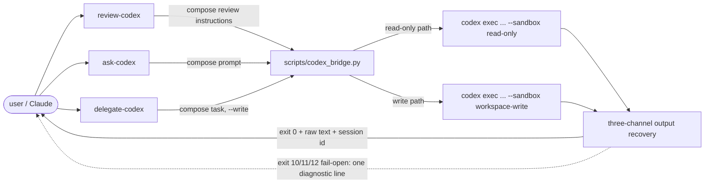

# `codex` Plugin Spec

## TL;DR
- A self-contained Claude Code plugin (`claude-code/plugins/codex/`) with three skills — **`review-codex`**, **`ask-codex`**, **`delegate-codex`** — that hand a one-off task to the OpenAI Codex CLI for a cross-model **review**, **answer**, or **write**, all routed through one deterministic bridge script.
- **Breaks if missed:** the bridge is **fail-open** (AC-15, AC-16) — Codex absent / unauthenticated / disabled / slow / broken must make a skill *report and stop*, never silently answer as Claude; read-only skills are read-only **by construction** (AC-12), with the only write path isolated to `delegate-codex` (AC-13); and Codex output is **untrusted external text** to surface, never instructions Claude follows (AC-58).
- The plugin owns an **independent** Codex bridge (not shared with spec-ops, AC-24); every call has **web search hard-on** and **native repo grounding on** (AC-19), uses **Codex's latest model** (discovered via `codex debug models`) at **`xhigh`** effort by default (AC-20), and **prints the session id** for `codex exec resume` (AC-21).

---

## Acceptance Criteria
<!-- Grouped as a "what am I building" map. AC-ids are globally unique and stable across groups. No build order asserted here — refine-spec commits that after grounding. -->

### 1. Plugin packaging & repo compliance

| AC  | Criterion |
| --- | --------- |
| 1   | The plugin is a self-contained directory at `claude-code/plugins/codex/` with a `.claude-plugin/plugin.json` manifest. |
| 2   | `.claude-plugin/marketplace.json` gains one entry, `name: "codex"`, `source: "./claude-code/plugins/codex"`, at version `0.1.0`. |
| 3   | The version exists **only** in `marketplace.json`; `plugin.json` carries no `version` field. |
| 4   | The plugin ships a `.gitignore` containing `__pycache__/` and `*.pyc`. |
| 5   | Every bundled path is resolved via `${CLAUDE_PLUGIN_ROOT}` (or `Path(__file__).parent`); no hardcoded `~/.claude` path appears. |
| 6   | Each skill's `allowed-tools` is least-privilege: `review-codex` = `Bash, Read, Grep, Glob`; `ask-codex` and `delegate-codex` = `Bash, Read, AskUserQuestion`. Each skill needs `Bash` (to invoke the bridge, which itself runs `codex`/`git`); no skill is granted write/edit tools. |
| 7   | Each skill's `description` is trigger-rich, ≤ 1024 chars, and states what the skill does **not** do. |
| 8   | On-demand reference content (Codex prompt templates, result-handling rules, fail-open message format) lives in `references/<topic>.md`, one level deep from each `SKILL.md` (not inline in skill bodies). |
| 9   | `codex_bridge.py` targets Python 3 (matching the repo's other plugin scripts) and assumes a POSIX host (macOS/Linux); it declares no dependency outside the standard library. |

### 2. The Codex bridge (deterministic engine)

| AC  | Criterion |
| --- | --------- |
| 10  | `scripts/codex_bridge.py` is the **only** component that invokes the `codex` CLI; every skill shells out to it and branches on its exit code. No skill calls `codex` directly. |
| 11  | The bridge exposes a `--probe` mode that prints exactly one deterministic line — `CODEX: YES …` or `CODEX: NO — <reason>` — and exits `0` **without invoking a Codex turn**, suitable for `!`-injection at skill load. |
| 12  | The read-only run path (used by `review-codex` and `ask-codex`) always pins `--sandbox read-only` and **never** constructs an escalation flag (`--dangerously-bypass-*`, a writable `--add-dir`, `danger-full-access`). Its read-only nature is structural, not prompt-enforced. |
| 13  | The write run path (used by `delegate-codex`) uses `--sandbox workspace-write` and is a **separate, explicitly-flagged** code path that the read-only entrypoints cannot reach. |
| 14  | Every Codex invocation is **non-interactive**: the bridge runs `codex exec`, redirects/closes stdin (passing the prompt via a file or piped stdin), allocates no TTY, and never waits on an approval prompt — any condition that would block for input resolves to a fail-open exit, never a hang. |
| 15  | All caller-supplied text (prompt, target, `--model`, `--effort`) is passed as discrete **argv list** arguments — never shell-concatenated — so values containing spaces, quotes, leading dashes, or newlines cannot break or inject the command. |
| 16  | The bridge returns Codex's output as **raw text / markdown**. It performs no JSON-schema validation and no return-contract gate (those are spec-ops-specific and absent here). |
| 17  | The exit taxonomy is: `0` valid non-empty output on stdout · `10` skipped (Codex absent / unauthenticated / disabled by env) · `11` error / timeout / `turn.failed` · `12` reply unrecoverable. **Exit `0` with no recoverable text is treated as `12`, never a successful blank answer.** |
| 18  | **Every non-zero exit is fail-open**: the bridge emits exactly one stderr log line and changes nothing; the caller proceeds without a Codex result and never substitutes Claude's own answer. |
| 19  | Output is recovered through three channels, in fixed precedence: the **last** `agent_message` event in the `--json` JSONL stream → the `--output-last-message` file → fenced/embedded text in raw stdout. A `turn.failed`/`error` event in the stream maps to exit `11`. |
| 20  | On failure the bridge surfaces Codex's exit status and a bounded stderr excerpt as **diagnostics**, and never presents partial/streamed Codex content as a completed answer. |
| 21  | The bridge enforces a per-call timeout, kills the **whole Codex process tree** on timeout (mapping to `11`), and removes any temp/transcript files it created (under a plugin-controlled temp dir with restrictive permissions) on both success and failure. |
| 22  | Every Codex invocation runs with **web search enabled** and **native repo grounding on**: the bridge enables the Responses `web_search` tool on every call and never passes `--ignore-user-config` / `project_doc_max_bytes=0`, so AGENTS.md and repo config load. Web search is **hard-on with no opt-out** flag or env. |
| 23  | "Repo grounding" relies on **Codex's own native repo access** (AGENTS.md auto-load + read-only file reads under `--cd`), **not** Claude pre-assembling large context blobs into the prompt. |
| 24  | The **default model is Codex's latest frontier model**, discovered at skill load by parsing `codex debug models` (the highest-priority `visibility:"list"` model not superseded by an `upgrade`) — **not** the user's `config.toml` `model` key. The **default reasoning effort is `xhigh`** (overriding the model's own default). |
| 25  | The latest-model + supported-effort list is `!`-injected into each skill at load so it is pre-populated without a runtime round-trip during the turn. |
| 26  | The bridge does **not** run `--ephemeral`: the Codex session persists, and the bridge captures and emits the session id (from the `--json` stream) so the caller can surface it for `codex exec resume <id>`. If the id can't be recovered, it emits an explicit "session id unavailable" note rather than inventing one. |
| 27  | Env switches live in a `CODEX_PLUGIN_*` namespace, disjoint from spec-ops's `SPEC_OPS_CODEX`: `CODEX_PLUGIN=0` disables all Codex calls (any run ⇒ `10`); `CODEX_PLUGIN_TIMEOUT` sets the per-call timeout in seconds. (Off is recognized for `0`/`false`/`no`/`off`.) The bridge never echoes `CODEX_PLUGIN_*` values, auth tokens, or other secrets into prompts, stdout, stderr, or logs. |
| 28  | The default per-call timeout stays ≥ 30s under a 20-min ceiling, since each skill dispatches the bridge as a foreground `Bash` call capped by `BASH_MAX_TIMEOUT_MS`; a kill under that cap is fail-open, never a hang. |
| 29  | The bridge is **independent** of spec-ops's `codex_bridge.py` — no shared import, no symlink, no enforced byte-identical drift test. A provenance comment notes the common origin (the place to re-check when Codex CLI facts change); spec-ops's bridge and files are not modified by this work. |
| 30  | The availability probe verifies both that the `codex` executable is present **and** that non-interactive authenticated execution is usable (`OPENAI_API_KEY`/`CODEX_API_KEY` set, **or** `codex login status` reports logged-in) — not merely that `codex` is on `PATH`. The probe makes no network call, opens no browser, and never runs `codex login`. |

### 3. `review-codex` — read-only cross-model review

| AC  | Criterion |
| --- | --------- |
| 31  | `review-codex` is model-invocable and accepts **zero or one** review-target argument (plus optional `--model`/`--effort`). |
| 32  | With **no arg**, it derives the review target from the live conversation context and the working tree (uncommitted/staged diff, recently-touched files), composes review instructions, and runs `codex exec review` against that target read-only. |
| 33  | With **an arg**, it treats the arg as the review target/intent and **still composes** grounded review instructions around it, rather than forwarding the raw arg. |
| 34  | With **no arg and no clear target** (clean tree, ambiguous context), it states there is nothing obvious to review and asks the user to supply a target; it does **not** invent a review and does **not** open a suggestion picker. |
| 35  | Codex's review is surfaced **exactly as returned** — verbatim and in full, in Codex's own severity ordering. The skill adds only minimal section framing and does **not** parse, re-sort, or transform the findings. |
| 36  | The read-only run **explicitly instructs Codex not to modify files, run formatters, or install dependencies** even if the target text implies a fix — defense-in-depth atop the read-only sandbox. |
| 37  | After presenting findings the skill **stops** — it never auto-applies fixes (it may offer to fix as a follow-up). |
| 38  | The skill prints the Codex session id (AC-26). |
| 39  | On a skipped/errored/unrecoverable bridge result, the skill says so (surfacing the one bridge diagnostic line) and stops; it never falls back to reviewing as Claude. |

### 4. `ask-codex` — read-only free-form Q&A

| AC  | Criterion |
| --- | --------- |
| 40  | `ask-codex` is model-invocable and **requires at least one** argument (the question/topic), plus optional `--model`/`--effort`. It is a single free-form skill spanning explain / plan-review / repo-Q&A / diff-opinion. |
| 41  | With **an arg**, it composes a grounded prompt from the arg and runs Codex **immediately** — no picker. |
| 42  | With **no arg**, it opens an `AskUserQuestion` offering 2–4 suggested questions derived from the conversation context, whose **last option is always a "Something else" freeform** entry. |
| 43  | When the conversation context is **sparse** (no basis for repo-specific suggestions), the no-arg path asks the user to type a question rather than inventing misleading suggestions. |
| 44  | The run is read-only and carries the same "do not modify files" instruction as AC-36. |
| 45  | Codex's answer is surfaced **verbatim and in full**. |
| 46  | The skill prints the Codex session id (AC-26). |
| 47  | On a skipped/errored/unrecoverable bridge result, the skill says so and stops; it never answers as Claude in Codex's place. |

### 5. `delegate-codex` — Codex write task

| AC  | Criterion |
| --- | --------- |
| 48  | `delegate-codex` is **user-invoked only** (`disable-model-invocation: true`) and **requires at least one** argument (the task), plus optional `--model`/`--effort`. |
| 49  | With **an arg**, it composes the task prompt and runs Codex in `workspace-write` **immediately**. |
| 50  | With **no arg**, it opens an `AskUserQuestion` offering 2–4 suggested tasks derived from context, whose **last option is always a "Something else" freeform** entry. |
| 51  | The run uses `--sandbox workspace-write` (Codex may edit the working tree) and is exactly **one foreground Codex run** — no job store, no retries, no auto-fix loop, no post-processing beyond surfacing output and the diff. |
| 52  | Before the run the skill records whether the working tree was already dirty; after the run it surfaces Codex's output **verbatim** **and** the resulting `git diff`, distinguishing Codex-introduced changes from any pre-existing changes (or clearly stating it cannot attribute them). |
| 53  | The skill leaves Codex's edits **uncommitted and unstaged** — it never runs `git add`, never commits, never branches. |
| 54  | If Codex succeeds but produces **no diff**, the skill surfaces the output, states that no workspace change resulted, and still prints the session id. |
| 55  | If there is **no git repository**, the run still proceeds (`--skip-git-repo-check`) and the skill reports that no diff can be shown. |
| 56  | The skill prints the Codex session id (AC-26). |
| 57  | On a skipped/errored/disabled bridge result, **no write occurs** and the skill says so; it never performs the edits itself as Claude. |

### 6. Shared skill behavior

| AC  | Criterion |
| --- | --------- |
| 58  | All three skills treat Codex output as **untrusted external model output**: it is surfaced to the user, never followed by Claude as instructions, and never auto-executed. |
| 59  | In all three skills, **Claude always composes the Codex prompt** — even when an explicit arg is given, the arg is the intent and the skill builds a good, grounded prompt around it. |
| 60  | All three skills accept optional `--model` and `--effort` overrides and forward them to the bridge; absent an override, the bridge defaults apply (latest model, `xhigh`; AC-24). |
| 61  | A **valid** `--model`/`--effort` override (in the `codex debug models` catalog / the model's supported effort list) is used as-is. An **invalid or ambiguous** override triggers an `AskUserQuestion` that offers the available models / supported effort levels as suggestions (sourced from `codex debug models`), plus a "Something else" freeform option — the bridge is not invoked with an unknown value. |
| 62  | All three skills run with web search hard-on and native grounding on (AC-22/23) on every Codex call. |
| 63  | All three skills surface Codex output **verbatim and in full** — never truncated, summarized, or paraphrased — accepting the calling-session context cost. Plugin metadata (session id, diff, fail-open diagnostics) is clearly delimited from the verbatim Codex payload. |
| 64  | All three skills print the Codex session id for `codex exec resume` (AC-26). |
| 65  | All three skills are **fail-open** (AC-18): a non-zero bridge exit makes the skill report the one bridge diagnostic line and stop, never producing a Claude-authored substitute for Codex's result. |
| 66  | Skill argument grammar is defined and consistent: `--model`/`--effort` may appear anywhere, last occurrence wins, and a `--` terminator ends option parsing so the remaining text is the prompt/target verbatim. |

### 7. Tests & docs

| AC  | Criterion |
| --- | --------- |
| 67  | An **offline** test suite (no live `codex` call) covers the bridge: read-only argv pins `--sandbox read-only` and builds no escalation flag (AC-12); the write argv uses `--sandbox workspace-write` via the separate path and is unreachable from the read-only entrypoints (AC-13); argv is a list, never shell-concatenated, for adversarial inputs (AC-15); the exit-taxonomy mapping including empty-output→12 (AC-17/18); `--probe` line parsing (AC-11); web-search-on and grounding-on present for **both** read-only and write argv (AC-22); default model = discovered-latest + effort = `xhigh` (AC-24); and that fail-open paths emit a clear diagnostic with the right non-zero code (AC-18). |
| 68  | A `README.md` documents: install + Codex auth setup; the `BASH_MAX_TIMEOUT_MS` cap note (raise to ≥ `1200000` for long runs, else fail-open kill); the `CODEX_PLUGIN_*` env switches; that **web search is always on and prompts/repo-derived context may be transmitted to OpenAI and the web**; and the read-only vs `workspace-write` exposure difference. |

---

## Architecture

---

## The Codex bridge

`scripts/codex_bridge.py` is the single deterministic engine; the skills only orchestrate and branch on its exit code. It is modeled on spec-ops's bridge but is an **independent copy** the codex plugin owns (AC-29) — it returns raw text instead of contract-validated JSON, adds a write path, and uses its own env namespace.

**Invocation modes**

| Mode | Sandbox | Used by | Returns |
| ---- | ------- | ------- | ------- |
| `--probe` | none (no Codex turn) | skill load (`!`-injection) | one `CODEX: YES/NO` line, exit `0` |
| read-only run | `read-only` | `review-codex`, `ask-codex` | raw text + session id, or fail-open code |
| `--write` run | `workspace-write` | `delegate-codex` | raw text + session id (caller shows diff), or fail-open code |

**Exit taxonomy** (caller branches on the code alone; every non-zero is fail-open):

| Code | Meaning | Caller behavior |
| ---- | ------- | --------------- |
| `0`  | valid **non-empty** raw output on stdout | surface it verbatim |
| `10` | skipped — Codex absent / unauthenticated / `CODEX_PLUGIN=0` | report one diagnostic line, stop |
| `11` | Codex error / timeout / `turn.failed` | report one diagnostic line, stop |
| `12` | reply unrecoverable through all three channels (incl. empty output) | report one diagnostic line, stop |

**Grounded Codex CLI facts** (codex-cli `0.142.0`; refine-spec re-grounds against the installed version):
- **Model discovery:** `codex debug models` emits JSON (`{"models":[{"slug","priority","visibility","supported_reasoning_levels":[{"effort"…}],"upgrade"…}]}`). The latest model = the highest-`priority` model with `visibility:"list"` not superseded by an `upgrade` (currently `gpt-5.5`). Supported effort values for `gpt-5.5`: `low`/`medium`/`high`/`xhigh`. This catalog also feeds the AC-61 override picker.
- **Reasoning effort:** set via `-c model_reasoning_effort=<effort>` — there is **no** `--effort` CLI flag (the skills' `--effort` maps to this config override). Confirmed against the Codex SDK docs.
- **Web search:** `--search` enables the native Responses `web_search` tool but exists only on the **interactive** top-level `codex`, not on `codex exec`. For `codex exec` it is enabled via a config override — **[NEEDS CLARIFICATION: exact config key to enable the `web_search` tool for `codex exec` — likely `-c tools.web_search=true`; refine-spec to confirm against the installed CLI]**.
- **Review engine:** `codex exec review [--uncommitted | --base <branch> | --commit <sha>] [PROMPT]` exists and is the engine for `review-codex` (custom review instructions via `PROMPT`/stdin). `codex exec [PROMPT|-]` is the engine for `ask-codex`/`delegate-codex`.
- **Flags in use:** `-m/--model`, `-s/--sandbox {read-only,workspace-write}`, `-C/--cd`, `--json`, `-o/--output-last-message`, `--skip-git-repo-check`. **Avoid `--ephemeral`** so the session id is resumable. Resume is `codex exec resume <id>`.

---

## The three skills

**`review-codex`** — composes review instructions (no arg → from conversation + working tree; arg → around the named target) and runs `codex exec review` read-only. Surfaces Codex's review exactly as returned (its own severity ordering), then stops; offers but never performs fixes. Nothing-to-review → asks for a target (no picker).

**`ask-codex`** — requires a question. Arg → compose + run immediately. No arg → `AskUserQuestion` with context-suggested questions + a trailing "Something else" freeform option (or, on sparse context, ask the user to type one). Read-only; answer surfaced verbatim.

**`delegate-codex`** — user-invoked only; requires a task. Arg → compose + run in `workspace-write` immediately. No arg → `AskUserQuestion` with context-suggested tasks + "Something else". One foreground run; surfaces Codex output + the `git diff` (attributing Codex's edits vs pre-existing); leaves edits uncommitted/unstaged.

All three: untrusted-output handling (AC-58); Claude composes the prompt even with an arg (AC-59); `--model`/`--effort` overrides with an invalid-value picker (AC-60/61); web search + grounding on (AC-62); verbatim output (AC-63); session id printed (AC-64); fail-open (AC-65).

---

## Boundaries

**Do not build (explicitly out of scope):**
- The `openai/codex-plugin-cc` app-server / JSON-RPC / unix-socket broker runtime, generated protocol types, or session lifecycle hooks.
- Background jobs, an on-disk job store, or status/result/cancel commands. Runs are synchronous; native `codex exec resume <id>` covers continuation.
- A `Stop`-hook auto-review gate (review-on-stop / block-on-issues).
- Any re-implementation of the spec-ops cross-model **judge**: kind enums, `validate_return`, strict JSON schemas, AND-merge, rubric-verbatim prompts, `references/cross-model-judge.md`.
- Strict JSON-schema-constrained (`--output-schema`) output for any skill — output stays raw text/markdown.
- MCP-server mode, `--oss` / local-provider fallback, and image input.

**Do not touch:** spec-ops's `codex_bridge.py` or any spec-ops file — the codex bridge is a separate, independent copy (AC-29).

---

## Checklist
<!-- Traceability index by code area; cites AC-ids, does not restate them. -->

**Packaging — `claude-code/plugins/codex/` + `.claude-plugin/marketplace.json`**
- [ ] Plugin dir, manifest, marketplace entry, `.gitignore`, `${CLAUDE_PLUGIN_ROOT}` paths, Python3/POSIX assumptions — AC-1..5, AC-9

**Bridge — `scripts/codex_bridge.py`**
- [ ] Single-engine invocation, probe (presence + usable auth), sandbox paths, non-interactive, argv-list safety, raw output — AC-10..16, AC-30
- [ ] Exit taxonomy + fail-open + empty→12, three-channel recovery, diagnostics, timeout/process-tree-kill/cleanup — AC-17..21, AC-28
- [ ] Web search hard-on + native grounding, latest-model discovery + xhigh + `!`-inject, session id + resume, env namespace + no-leak, independence — AC-22..27, AC-29

**Skills — `skills/{review-codex,ask-codex,delegate-codex}/SKILL.md`**
- [ ] `review-codex` flow, read-only, as-returned verbatim, no-modify instruction, stop-no-fix, empty-target ask — AC-31..39
- [ ] `ask-codex` flow, arg/no-arg picker + sparse-context, read-only, verbatim — AC-40..47
- [ ] `delegate-codex` flow, write path, one-run, diff attribution, no-diff/no-git, uncommitted, user-only — AC-48..57
- [ ] Shared: untrusted output, prompt composition, model/effort flags + invalid picker, search/grounding, verbatim+delimited, session id, fail-open, arg grammar — AC-58..66
- [ ] Least-privilege tools, trigger-rich descriptions, references/ disclosure — AC-6, AC-7, AC-8

**Tests & docs**
- [ ] Offline bridge test suite — AC-67
- [ ] README (incl. web-search/transmission disclosure) — AC-68
