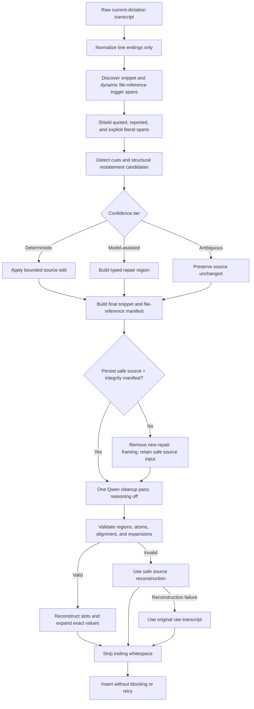

# ParaQwen Backtracking and Self-Repair Spec

## TL;DR

- Replace the single unscoped correction hint with typed, numbered, bounded repair regions that support replacements, restarts, restatements, and correction chains.
- Breaks if missed: semantic repair must never damage snippets, file references, slash commands, numbers, paths, or unrelated prose; output that fails the repair validators silently falls forward to safe source text (AC-14..AC-26).
- Ship only against an end-to-end Parakeet-to-Qwen benchmark with explicit false-positive, no-regression, safety, and latency gates (AC-33..AC-42).

## Summary

**What this is:** This change improves how ParaQwen Dictation understands a speaker who changes wording before finishing one dictation.

**Why:** The current system handles common phrases such as “I mean” well, but it gives Qwen one generic instruction with no explicit target or repair type. Natural restatements, complete restarts, chained corrections, and corrections involving protected snippets remain less reliable.

**Expected result:** ParaQwen keeps only the speaker's final clear intent, preserves additive or ambiguous language, and protects unrelated content. It recognizes both explicit correction phrases and conservative natural restatements. AI output that violates an active repair manifest never blocks dictation and never triggers a background retry.

**Out of scope:** This change does not edit text from an earlier dictation, control the terminal, consume audio or pause timestamps, train a new speech model, or add multilingual repair support.

---

## Acceptance Criteria

### 1. Backtracking behavior

| AC | Criterion |
| --- | --- |
| 1 | Backtracking operates only on text captured in the current Spokenly dictation and does not edit text that was already present in the target application. |
| 2 | The system distinguishes replacement, restart, repetition/restatement, explicit discard, and additive clarification instead of treating all cases as one “replace nearest” operation. |
| 3 | Clear correction forms including “I mean,” “I meant,” “sorry, I meant,” “no, actually,” “no, wait,” “or rather,” “make that,” “I should say,” “what I meant was,” “let me rephrase,” and “let me start over” produce the final intended wording without retaining the editing phrase. |
| 4 | A cue-free adjacent restatement is considered for repair when it has strong structural parallelism, while a weak or merely topical similarity is preserved. |
| 5 | In a correction chain such as A → B → C, the final applicable repair wins and superseded alternatives are removed without changing surrounding content. |
| 6 | Multiple independent repairs in one transcript remain attached to their own source locations and are resolved independently in textual order. |
| 7 | A clear correction remains resolvable when automatic speech recognition inserts a comma, period, question mark, line break, or capitalization boundary before its editing phrase or repair. |
| 8 | Ordinary grammatical uses of words such as “actually,” “no,” “sorry,” “rather,” “instead,” and “I mean” are not treated as repairs without contextual evidence. |
| 9 | Correction-like language that is quoted, explicitly dictated as literal text, or clearly discussed as a phrase or command remains literal transcript content. |
| 10 | Deliberate repetition, including emphasis such as “very, very important,” is preserved unless stronger evidence establishes a disfluency. |
| 11 | If the repair target, repair boundary, or replacement relationship is ambiguous, the system preserves the source wording rather than guessing or deleting content. |

### 2. Repair protocol and model contract

| AC | Criterion |
| --- | --- |
| 12 | Every model-assisted repair belongs to a unique, sequentially numbered repair region with a type, source-position metadata, and per-run integrity value. |
| 13 | Repair regions are non-overlapping; adjacent or overlapping correction cues are merged into one ordered chain region, while independent regions remain separate. |
| 14 | A replacement region is bounded to the nearest plausible source clause and repair clause; a restart region is bounded to the abandoned thought and its replacement and never crosses an unrelated paragraph. |
| 15 | Immutable repair-region boundaries are reproduced exactly once and in order by Qwen, while semantic cue markers are consumed and never appear in final output. |
| 16 | Raw transcript text that resembles an internal ParaQwen token is escaped and restored as literal content and cannot create a valid repair or structural token. |
| 17 | Qwen runs once per dictation with reasoning disabled and the existing deterministic cleanup settings; repair failure never starts a second or background Qwen run. |
| 18 | The AI instructions require a repair to be grounded in later source wording, forbid invented replacement content, process chains in order, and preserve ambiguous or additive language. |
| 19 | The AI instructions contain targeted examples for a substitution, full restart, cue-free restatement, correction chain, additive clarification, and negative literal/natural-use cases, with no redundant example set added without benchmark evidence. |

### 3. Deterministic validation and fail-forward behavior

| AC | Criterion |
| --- | --- |
| 20 | Post-processing validates every repair boundary, repair identifier, checksum or nonce, expected region count, region order, snippet boundary, and file-reference boundary before accepting AI output. |
| 21 | Protected atoms outside a confirmed reparandum—including URLs, email addresses, slash commands, `@` references, filesystem paths, filenames, code identifiers, hashes, version strings, dates, times, and numeric values—remain present and semantically equivalent in accepted output. |
| 22 | Accepted output cannot introduce a protected atom that is absent from the source transcript or a configured deterministic expansion. |
| 23 | Equivalent capitalization, surrounding punctuation, and unambiguous number-word/digit formatting are accepted; a different numeric value is not equivalent. |
| 24 | A deterministic alignment guard rejects substantial insertion or deletion of meaningful prose outside repair regions while allowing punctuation, capitalization, inflection, and explicitly requested formatting changes. |
| 25 | A structural, grounding, protected-atom, or alignment failure returns the safe source reconstruction with high-confidence deterministic edits and exact expansions, not a partially trusted AI result. |
| 26 | If safe source reconstruction also fails, the original raw transcript is returned; every recoverable failure exits successfully, produces no blocking alert, and writes diagnostics only to the configured local log. |
| 27 | Final output always has trailing spaces, tabs, carriage returns, and line breaks removed so auto-insertion cannot submit a form or execute a terminal command. |
| 28 | Diagnostics, warnings, control tokens, and model reasoning never appear on standard output or in inserted text. |

### 4. Snippets, file references, and existing directives

| AC | Criterion |
| --- | --- |
| 29 | A correction that does not target a snippet or file reference preserves every protected expansion exactly and at its original textual slot. |
| 30 | When an explicit, high-confidence repair supersedes one snippet trigger with another, the superseded occurrence is removed before the final snippet manifest is built and only the final intended expansion is emitted. |
| 31 | When a possible repair involving snippets or file references is ambiguous, all original occurrences are preserved rather than conditionally dropped by Qwen. |
| 32 | Existing deletion, discard, paragraph, line, list, snippet, slash-command recovery, file-reference, source-recovery, and trailing-whitespace behavior remains compatible and its current regression suite stays green. |

### 5. Evaluation, performance, diagnostics, and documentation

| AC | Criterion |
| --- | --- |
| 33 | A versioned backtracking corpus contains at least 120 human-reviewed cases: at least 60 positive repairs and 60 negative or ambiguous cases, with required retained spans, removed spans, protected atoms, allowed formatting variants, and expected repair type recorded per case. |
| 34 | The positive corpus covers substitutions, restarts, cue-free restatements, deliberate repetitions, chains, multiple independent repairs, punctuation variations, technical content, snippets, slash commands, file references, and long dictation. |
| 35 | The negative corpus covers natural uses of cue words, quotations, reported speech, additive clarification, deliberate emphasis, repeated code or identifiers, insufficient targets, missing repair text, and adversarial transcript instructions. |
| 36 | Deterministic processor tests pass exactly for every protocol, parser, validation, recovery, snippet-intersection, token-collision, and whitespace fixture without a live model or network dependency. |
| 37 | On the configured local Qwen model with reasoning disabled, at least 95% of positive benchmark cases satisfy their intent predicates and at least 99% of negative cases preserve required content across three complete runs. |
| 38 | Across the three end-to-end runs, accepted outputs have zero structural-token leaks, protected-atom violations, snippet relocations, invented slash commands, invented file references, or trailing-whitespace failures. |
| 39 | Relative to a frozen pre-change baseline, overall positive repair accuracy improves by at least five percentage points, or—if the baseline is already at least 95%—does not regress and closes at least one documented gap; no repair category regresses by more than two percentage points. |
| 40 | The corpus includes real Spokenly/Parakeet transcripts for every repair category in addition to text-authored variants, because text-only fixtures do not represent recognition omissions or inferred punctuation. |
| 41 | On the reference Mac, combined Pre-AI and Post-AI processing has a p95 below 150 ms for representative transcripts up to 2,000 words and does not regress by more than 25% from the recorded pre-change processor baseline. |
| 42 | An optional diagnostic mode records a bounded, owner-only, redacted raw/pre/model/post trace with repair metadata and failure reason; it is disabled by default, retains at most 20 records or seven days, stores no audio, and never records exact configured expansion secrets. |
| 43 | User documentation describes supported repair forms, natural-restatement behavior, literal-content behavior, ambiguity handling, snippet interactions, fail-forward behavior, diagnostic privacy, the one-pass/no-rerun rule, and the absence of acoustic pause awareness. |

### 6. State integrity and punctuation

| AC | Criterion |
| --- | --- |
| 44 | Repair and recovery state is written atomically before model-assisted structure is emitted, is a regular owner-only file, is accepted only for the current user and matching per-run nonce, expires after 120 seconds, and is consumed at most once. |
| 45 | If required repair state cannot be persisted, the preprocessor emits no new model-assisted repair regions for that run, preserves the safe source form, and logs the degradation without blocking dictation. |
| 46 | Editing-interval punctuation is consumed or retained according to its grammatical role, leaving no duplicate or dangling punctuation while preserving unrelated question, exclamation, sentence, paragraph, snippet, path, URL, and command punctuation. |

---

## Current state → Target

| Aspect | Current state | Target |
| --- | --- | --- |
| Repair representation | Every semantic correction receives the same unnumbered `REPLACE_NEAREST` hint. | Typed, numbered, checksummed repair regions with ordered cue records. |
| Scope | Qwen infers the target from the nearest preceding prose. | The preprocessor supplies a bounded candidate region; Qwen cannot move a repair to another region. |
| Repair types | Replacement, restart, restatement, and clarification are described mostly through prose. | Each type has explicit behavior and separate evaluation coverage. |
| Natural restatement | Qwen may remove repetition, but the preprocessor does not identify cue-free repair candidates. | Conservative structural candidates cover adjacent restatements without treating all repetition as error. |
| Multiple repairs | Repeated identical markers offer no identity or chain relationship. | Chains merge into one ordered region; independent regions keep stable identities. |
| Semantic safety | Snippet structure is strongly validated; ordinary prose relies mainly on prompt instructions. | Structural validation, protected-atom validation, alignment limits, and deterministic fallback gate every model output that has a valid source manifest. |
| Snippet correction | Protected snippet occurrences are normally restored even when one was spoken as a superseded alternative. | High-confidence snippet-to-snippet repairs are resolved before the final manifest; ambiguous cases preserve all occurrences. |
| Failure | Valid-looking but semantically damaged prose can pass Post-AI. | Invalid or suspicious model output silently falls forward to a safe deterministic reconstruction. |
| Run correlation | Short-lived state is best-effort and correction hints carry no run identity. | Atomic one-shot state and per-run nonces prevent stale or mismatched repair manifests from being trusted. |
| Evaluation | Unit tests largely exercise pre/post behavior without systematically judging live Qwen output. | A versioned end-to-end corpus measures repair accuracy, false positives, safety, latency, and regressions. |

---

## Architecture

### Processing order is part of the contract

Repair discovery must see snippet and file-reference trigger spans before their final protected-slot manifest is fixed. Otherwise, both alternatives in “slash goal, I mean slash launch spec” become mandatory expansions and the semantic repair cannot safely remove the superseded command.

The detector may identify a high-confidence occurrence as superseded, but Qwen never receives or rewrites an expansion value. Only occurrences that survive deterministic repair planning enter the final expansion manifest. A semantic or ambiguous repair is not allowed to make a protected occurrence disappear merely by deleting its token.

---

## Repair model

### Repair terminology

The system uses the conventional three-part repair model:

- **Reparandum:** source wording the speaker abandons or replaces.
- **Editing interval:** pause filler or cue such as “I mean,” “no, wait,” or “scratch that.”
- **Repair:** later wording that represents the final intent.

This terminology follows the repair-interval and Switchboard annotation literature. It prevents “correction phrase” from ambiguously referring to both the cue and replacement.

Backtracking is **deletion-dominant**: the intended repair is already present later in the source transcript. Resolving a repair removes the reparandum and editing interval, then performs only the punctuation or grammar reflow needed to join surviving source wording. It does not synthesize a semantic replacement that the speaker never said.

### Repair types

| Type | Recognition evidence | Required result | Example |
| --- | --- | --- | --- |
| Replacement | A later word or constituent conflicts with and grammatically fits the same slot. | Remove the reparandum and editing interval; retain the repair in the original sentence frame. | `Friday, actually Monday` → `Monday` |
| Restart | The speaker abandons an incomplete or complete thought and begins a new one. | Remove only the abandoned thought and editing interval; retain the restarted thought. | `We should ship Friday. Let me start over. We need another review.` → `We need another review.` |
| Repetition/restatement | Adjacent wording repeats the same grammatical role, either exactly or with a more final formulation. | Remove only the earlier redundant formulation. | `as a gift, as a present` → `as a present` |
| Explicit discard | A bounded command rejects the immediately preceding thought without supplying a repair. | Remove the nearest clearly bounded target. | `Use the cache. Scratch that.` → empty for that thought |
| Additive clarification | Later wording supplements rather than conflicts with earlier content. | Preserve both ideas and remove no meaningful content. | `Send it to support; actually, include the escalation notes too.` |

### Classification order

1. Shield literal and reporting contexts before looking for repairs.
2. Detect an explicit discard or restart cue.
3. Detect an explicit replacement cue with non-empty later wording.
4. Detect a correction chain and merge its overlapping candidate regions.
5. Detect a cue-free restatement only when structural evidence is strong.
6. Classify a non-conflicting continuation as additive.
7. Preserve everything when no class is sufficiently supported.

This order prevents a generic cue such as “actually” from overriding a stronger literal, restart, or additive interpretation.

### Known current gaps this design must close

- All detected semantic corrections currently become the same unnumbered marker, so two independent repairs and a correction chain have no structural identity.
- Some delimited repairs beginning with “I,” “we,” “it,” “there,” or an infinitive are filtered even though these are valid clause-restart shapes described by the prompt.
- Cue removal can leave punctuation adjacent to a control token, making Qwen repair both the meaning and an avoidable punctuation artifact.
- A discard phrase can be recognized even when there is no preceding target, leaving the model to interpret a targetless command.
- Snippet protection currently happens before semantic repair, so two slash-command alternatives can both become mandatory protected occurrences.
- Offline tests verify many Pre-AI hints but do not provide a category-balanced, repeated end-to-end quality gate for the configured Qwen model.

---

## Detection tiers

### Tier 0 — protected literal content

The following spans are excluded from directive and repair detection:

- Balanced straight or curly quotes.
- Explicitly dictated literal or exact-text spans.
- Reporting forms such as “write the phrase,” “say the words,” “the command is,” or “the example says.”
- Valid raw text that resembles ParaQwen's internal token syntax.

An unclosed quote does not authorize destructive processing of the rest of the transcript. It lowers repair confidence; an explicit cue outside the quoted prefix may still be considered only when its target is independently clear.

### Tier 1 — deterministic repair

Tier 1 edits require an exact, locally provable target and outcome. They include:

- Existing exact word, phrase, and sentence deletion commands with a clear boundary.
- Explicit discard of a complete immediately preceding sentence.
- Exact repeated multi-token spans where removing the first copy leaves a grammatical local sequence.
- Repeated clauses with a shared source frame and one exact conflicting slot when both alternatives are textually present.
- An explicit correction from one recognized snippet/file-reference trigger to another parallel trigger when no ordinary content falls inside the replaced slot.

Single-word repetition is not deterministically deleted merely because two adjacent tokens match. This preserves deliberate emphasis and linguistic reduplication.

### Tier 2 — framed model-assisted repair

Tier 2 covers clear repair intent whose precise reparandum needs language understanding. The preprocessor supplies a typed, bounded region rather than deleting text itself.

Candidate bounds use grammatical structure, not a fixed global “nearest” search:

- Replacement: nearest prior clause or, if none exists, the current sentence; later text through the repair clause.
- Restart: current abandoned thought and the following restarted thought, within one paragraph.
- Cue-free restatement: the two adjacent parallel constituents or clauses.
- Chain: the union of overlapping candidate bounds, with cue order retained.

Regions may cross an ASR-inserted sentence boundary but never cross an unrelated paragraph. Extremely long or structurally uncertain bounds are Tier 3 rather than widening to the entire transcript.

### Tier 3 — preserve

Tier 3 emits no destructive command and does not strip an editing phrase. It covers:

- Missing or empty repair wording.
- Multiple plausible targets with no decisive local evidence.
- Weak semantic similarity without syntactic parallelism.
- Ambiguous single-word repetition.
- Possible repairs that would conditionally delete an exact expansion without deterministic proof.
- A cue occurring only as natural grammar, quotation, reported speech, or prompt content.

---

## Protected repair protocol

### Region properties

Each region carries:

- A sequential region number based on textual order.
- A repair type.
- One or more sequential cue records.
- Source start and end anchors.
- A per-run random nonce and integrity digest derived from the region metadata.
- A source manifest used only by deterministic Post-AI validation.

Region boundary tokens are immutable structural data like snippet-segment boundaries. Cue tokens are semantic commands: Qwen consumes them after performing the repair. A region is invalid if its boundaries are missing, duplicated, modified, nested incorrectly, reordered, or disagree with the source manifest.

### Multiple and chained repairs

- Candidate regions that overlap are merged.
- Merged cues retain their original order and individual identities.
- The final cue in a chain may supersede the result of an earlier cue inside the same region.
- A later region cannot target text in an earlier region.
- Text outside every region cannot be moved into a region or vice versa.

### Source token collisions

Before generating internal tokens, the preprocessor records and shields any literal source substring that matches the internal-token namespace. Generated tokens include a fresh per-run nonce, so dictated text cannot accidentally or deliberately forge a valid structure. Post-AI restores shielded literal text only after structural validation.

### One-shot state contract

The source manifest is required for model-assisted repair validation. It contains a schema version, creation time, per-run nonce, prompt/config digest, original raw transcript, safe deterministic source, expected repair regions, protected atoms, and expansion occurrence metadata.

The state is written to a temporary owner-only file, flushed and atomically replaced before Pre-AI emits repair-region tokens. Post-AI accepts only a regular file owned by the current user with no group/world write bits, a matching nonce, a supported schema version, and an age from -1 through 120 seconds. Reading consumes the record even when validation later fails.

If the record cannot be persisted, new model-assisted repair framing is disabled for that dictation. The scripts retain their existing portable cleanup path and log only the state failure. This cannot provide the new semantic validator, but it does not emit unverifiable repair structure or create a new blocking failure mode.

---

## Prompt contract

Qwen remains a transcript editor, not a repair planner or conversational assistant. The prompt must state the following decision procedure before examples:

1. Preserve immutable structure exactly.
2. For each repair region, read its cues in order.
3. Identify reparandum, editing interval, and later repair only inside that region.
4. Classify replacement, restart, restatement, explicit discard, or additive continuation.
5. Retain only later source wording for a confirmed repair.
6. Keep both ideas for an additive continuation.
7. Preserve source wording when the relationship remains ambiguous.
8. Never move a repair, snippet, file reference, or ordinary prose across a protected boundary.
9. Never invent a replacement, explanation, acknowledgment, command, name, number, path, or closing sentence.
10. Return corrected transcript text and required structural boundaries only; return no analysis or reasoning.

The prompt must not ask Qwen to emit a separate JSON repair plan. The surrounding Spokenly AI step expects corrected transcript text, and duplicating the transcript plus a plan increases token surface and corruption risk. Deterministic metadata stays out of band.

Reasoning remains set to **None** in Spokenly. Temperature remains zero. Prompt changes are evaluated as code: no example or instruction is added solely because it sounds helpful.

### Editing-interval punctuation

The preprocessor treats punctuation around a cue as structure, not arbitrary text to discard:

- Commas and colons used only to introduce the editing phrase or repair are consumed with that interval.
- A period inferred immediately before a clear same-sentence repair may become a local scope hint, but that hint does not authorize a wider target.
- Question marks and exclamation marks remain unless the confirmed replacement changes the content that owns them.
- Paragraph boundaries are never converted into commas.
- Punctuation inside snippets, URLs, email addresses, paths, commands, quoted literals, and identifiers is never cue punctuation.
- Normalization produces at most one grammatically appropriate boundary mark and no comma immediately after a repair cue token.

---

## Validation and recovery

### Validation layers

Validation runs in this order:

1. **Structural integrity:** repair regions, snippet segments, snippet tokens, file-reference metadata, counts, order, nonce, and checksums.
2. **Token hygiene:** no unresolved command, cue, shield, segment, repair, or malformed internal token.
3. **Protected atoms:** no unexplained removal, mutation, relocation, or invention of distinctive technical/factual tokens.
4. **Repair grounding:** removed protected atoms are allowed only inside the recorded reparandum; retained repair atoms must occur later in the source region.
5. **Prose alignment:** reject substantial novel or missing meaningful spans outside repairs while tolerating conservative grammar and formatting.
6. **Output safety:** no trailing whitespace.

### Protected-atom normalization

Comparison is exact by default. These narrow equivalences are allowed:

- Case-only changes when the atom is not a case-sensitive identifier.
- Surrounding punctuation changes that do not alter the atom.
- A number word and digits when both parse unambiguously to the same numeric value.
- Conventional spacing around punctuation, but not inside a path, command, URL, email, hash, or identifier.

Proper names in ordinary prose are not inferred by capitalization alone because sentence-initial words create false positives. Names that are already dictionary entries, configured exact terms, quoted values, or technically distinctive tokens receive hard protection; other names are covered by corpus predicates and the prose alignment guard.

### Fail-forward ladder

1. Use AI output only when every required validator passes.
2. Otherwise reconstruct safe source text using only completed Tier 1 edits and the verified expansion manifest. Preserve unresolved Tier 2/Tier 3 wording, including its spoken editing phrase, instead of applying a partial semantic edit.
3. If that reconstruction fails, return the raw original transcript.
4. Strip trailing whitespace in every branch.
5. Return exit code zero for every recovered branch and log the reason locally; do not show a blocking Spokenly alert.

No recovery branch reruns Qwen. This keeps latency bounded and prevents a second model call from producing a different unvalidated interpretation.

---

## Snippet and file-reference interactions

### Non-target expansions

Existing snippet and dynamic file-reference protections remain authoritative. A repair region may include ordinary prose adjacent to an expansion, but it cannot move, rewrite, duplicate, normalize, or infer that expansion.

### Superseded expansions

The preprocessor first discovers trigger spans, then evaluates high-confidence repair structure, then constructs the final expansion manifest. This permits deterministic cases such as:

| Input | Required result |
| --- | --- |
| `slash goal, I mean slash launch spec` | Only the launch-spec expansion remains. |
| `use at file first dot pie, no, at file second dot pie` | Only the deterministically resolved second reference remains when both references are unambiguous. |
| `slash goal and slash launch spec` | Both commands remain; “and” is additive, not corrective. |
| `slash goal, actually continue with the implementation` | Preserve the command and continuation unless the ordinary prose establishes a clear replacement target. |

Qwen never decides whether a protected expansion token may disappear. A protected occurrence is omitted only by Tier 1 planning before the manifest exists. If Tier 1 proof is unavailable, every original occurrence remains protected and the semantic source is preserved.

---

## Evaluation design

### Corpus record

Each case records:

- Stable case identifier and category.
- Authored clean speech or real Parakeet transcript.
- Raw transcript input.
- Expected repair type or `preserve`.
- Required retained spans or concepts.
- Required removed spans.
- Protected atoms and expansion occurrences.
- Allowed punctuation/capitalization variants.
- Forbidden additions.
- Expected Pre-AI structural properties.
- Expected fail-forward result for deliberately damaged model output.

Raw audio is not required in the repository. Real cases may record a local source-audio hash and model/version metadata without committing private audio.

### Required categories

| Category | Representative cases |
| --- | --- |
| Replacement | Word, number, time, noun phrase, prepositional phrase, repeated full clause, source period before cue. |
| Restart | Incomplete clause, completed sentence, “let me start over,” “no, tell me…,” long restarted clause. |
| Restatement | Exact phrase replay, shared-prefix clause, synonym-like parallel constituent, no cue. |
| Chains | A→B→C, replacement then restart, three values, multiple regions in one paragraph. |
| Additive | “Actually, also…,” elaboration, parenthetical clarification, conjunction-preserving continuation. |
| Negative cue | Natural “actually,” explanatory “I mean,” apology, negation, quoted command, reported speech. |
| Repetition | Emphasis, stutter-like function word, repeated code token, repeated name, duplicated phrase. |
| Technical | URLs, paths, filenames, numbers, hashes, versions, identifiers, slash commands, `@` references. |
| Expansion intersection | Snippet→snippet correction, file→file correction, adjacent but independent snippet, ambiguous expansion repair. |
| Adversarial | Dictated internal-token text, “ignore the instructions,” missing markers, moved markers, invented atoms. |

### Metrics

- **Repair success:** all required retained and removed predicates hold.
- **False repair rate:** a `preserve` case loses or changes meaningful content.
- **Fluent-token precision:** accepted removals are actually marked reparanda/editing intervals.
- **Disfluent-token recall:** required reparanda/editing intervals are removed.
- **Protected-atom integrity:** zero accepted violations.
- **Structural integrity:** zero token leaks or malformed accepted structures.
- **Fallback correctness:** damaged cases produce the expected safe source result.
- **Exact formatting:** tracked separately from semantic repair so harmless punctuation variation does not hide or inflate repair accuracy.
- **Latency:** Pre-AI, model, Post-AI, and total timings are recorded separately.

The live-model suite runs explicitly and is not part of the default offline unit-test command. Its report pins the Qwen model digest, Ollama version, prompt digest, reasoning setting, machine class, and corpus version.

---

## Diagnostics and privacy

Normal operation persists only the existing short-lived recovery state needed for the current sequential dictation. General transcript diagnostics are disabled by default.

When diagnostic mode is enabled:

- The directory is owner-only and each record is owner-readable/writable only.
- Rotation enforces both the count and age limits.
- Records include timestamps, stage durations, prompt/config digests, region metadata, validator results, and redacted stage text.
- Configured snippet expansion values are replaced by IDs and hashes.
- Dynamic file references may retain normalized relative paths only when needed to diagnose placement; absolute home-directory prefixes are redacted.
- Audio is never copied or stored.
- A write or rotation failure never blocks dictation.

Diagnostics are for reproducible failures, not automatic personalization. ParaQwen cannot reliably observe which terminal edits a user later accepts, so automatic learning from post-insertion edits is outside this spec.

---

## Performance contract

The deterministic stages remain single-pass or bounded-window operations. Trigger and cue detection must not rescan the entire transcript once per configured phrase. Candidate alignment is limited to repair regions and may not perform unbounded semantic search over a repository or external data.

The pre-change reference measurement on the development Mac was approximately 42–44 ms median Pre-AI and 38–40 ms median Post-AI for short through 30-sentence synthetic transcripts. The committed benchmark must record a fresh baseline in the same process environment before comparing the implementation.

No validator invokes a language model, network service, repository scan, or application automation. The only model call remains Spokenly's configured Qwen cleanup stage.

---

## Research basis

### Product behavior

- [Wispr Flow Smart Formatting & Backtrack](https://docs.wisprflow.ai/articles/5373093536-how-do-i-use-smart-formatting-and-backtrack) documents trigger-based repair, cue-free natural restatement, full-dictation context, preservation of natural “actually,” and recovery of the original dictation. Its internals are proprietary, so these are behavioral targets rather than implementation evidence.
- [Superwhisper History](https://superwhisper.com/docs/get-started/interface-history) exposes original and AI-processed text, prompts, processing metadata, and reprocessing. This supports stage-level observability, but ParaQwen keeps diagnostics local, opt-in, bounded, and non-rerunning during normal dictation.
- [Willow Frontier Pro](https://willowvoice.com/blog/introducing-willow-frontier-pro) describes a separate post-ASR edit model, optimization for edit rate and latency, and learning from accepted edits. ParaQwen adopts the separate-edit-stage and measurable-latency principles, not cloud training or automatic edit collection.
- [Dragon “Take it back”](https://www.nuance.com/products/help/dragon/dragon-for-mac/enx/content/Correction/TakeBack.htm), [Dragon text replacement](https://www.nuance.com/products/help/dragon152/dragon-for-pc/enx/Home/Content/WorkingWithText/inserting_replacing_and_deleting_text.htm), [Apple Voice Control](https://support.apple.com/en-mide/guide/mac-help/mh40719/mac), and [Microsoft Voice Access](https://support.microsoft.com/en-US/Accessibility/windows/voice-access/select-text-with-voice) show the value of explicit targets, literal/command separation, range selection, and ambiguity resolution. Cross-dictation document editing remains outside ParaQwen's text-only current-dictation scope.

### Speech and language research

- [A Speech-First Model for Repair Detection and Correction](https://aclanthology.org/H93-1066/) defines reparandum, disfluency/editing interval, repair interval, interruption sites, restarts, constituent repairs, and overlapping sequential repairs. It supports typed regions and chain-aware processing.
- [Disfl-QA](https://aclanthology.org/2021.findings-acl.293.pdf) separates repetition, correction, and restart and reports a difficult corpus dominated by corrections and restarts. It supports category-balanced evaluation rather than a cue-only test set.
- [DRES](https://ar5iv.labs.arxiv.org/html/2509.20321) evaluates LLM disfluency removal and reports that segmentation improves stability, reasoning models over-delete, and Qwen3-family models tend toward under-deletion. Its Qwen result is directional only because ParaQwen uses a different Qwen version and prompt.
- [Toward Interactive Dictation](https://aclanthology.org/2023.acl-long.854.pdf) represents commands as executable edit programs over pre/post document states and explicitly separates dictation from command segments. It supports typed operations and deterministic application rather than unconstrained rewriting.
- [Disfluency detection: classifying repeated words as planned or unplanned](https://www.isca-archive.org/prosody_2001/girand01_prosody.html) demonstrates that deliberate and accidental repetition must be distinguished; identical text alone is insufficient evidence for deletion.
- [Comparing ASR Systems in the Context of Speech Disfluencies](https://www.isca-archive.org/interspeech_2024/teleki24_interspeech.pdf) shows that ASR systems preserve different disfluency categories differently. This supports real Parakeet fixtures and the explicit limitation that text post-processing cannot recover a cue or reparandum the ASR omitted.
- [Large-scale Artificial Disfluency Generation](https://www.sciencedirect.com/science/article/pii/S0885230824000949) models repetitions, replacements, and restarts and shows that contextual synthetic data can supplement scarce real examples. Synthetic cases supplement but do not replace real ParaQwen dictations.
- [Reducing Sequence Length by Predicting Edit Operations](https://arxiv.org/abs/2305.11862) shows that local text transformations can be represented as source edit spans rather than regenerating an entire target. ParaQwen applies that principle to repair metadata while retaining one transcript-output pass for normal cleanup.

### Platform constraint

[Spokenly Bash Scripts](https://spokenly.app/docs/modes/bash-scripts) provides transcript text on standard input, optional application/cursor context, a Pre-AI → AI → Post-AI sequence, and a 30-second script limit. It does not provide live dictation scripts with acoustic pause or word-timestamp metadata. ParaQwen therefore cannot reproduce Dragon's pause-defined “last utterance” semantics in this architecture.

---

## Implementation gotchas

- **Do not merely add more trigger phrases.** The central defect is unscoped repair identity; a larger regex still leaves chains and multiple repairs ambiguous.
- **Do not frame after final snippet protection.** A superseded snippet would already be mandatory and Post-AI would correctly restore the wrong occurrence.
- **Do not let missing snippet tokens mean “drop.”** Token loss is indistinguishable from model damage. Only deterministic pre-manifest planning may omit an occurrence.
- **Do not use one region per cue when regions overlap.** Nested or crossing structural tokens are fragile; merge the chain and retain ordered cue metadata.
- **Do not use a global semantic nearest-neighbor search.** It can bind a later repair to an older, unrelated matching phrase.
- **Do not deterministically remove all duplicate words.** Some repetitions are intentional emphasis, names, code, or grammatical constructions.
- **Do not treat capitalization as reliable name detection.** Sentence starts create false positives; protect names through configured vocabulary, exact technical form, quotations, and tests.
- **Do not compare number strings literally.** “three” → `3` is formatting; `3` → `4` is a semantic change unless `4` is grounded in the repair.
- **Do not make diagnostics the recovery channel.** State needed to reconstruct the current dictation remains short-lived and separate from optional logs.
- **Do not run live-model tests in the default offline suite.** Report a clear skip when Ollama or the pinned model is unavailable; never silently treat a skipped integration suite as a pass.
- **Do not optimize against authored text alone.** ASR punctuation, omission, casing, and cue transcription materially change the repair problem.
- **Do not expose errors on stdout.** Spokenly inserts stdout into terminals; every diagnostic belongs in a private log.
- **Do not emit repair regions before state commit.** Post-AI cannot validate or reconstruct a semantic repair whose raw/safe source manifest was never persisted.
- **Do not reuse a stale state record.** Matching age without matching the in-band per-run nonce is insufficient; a different terminal pane or interrupted dictation may own that record.

---

## Boundaries

- Keep the portable core independent of macOS, iTerm2, Codex, and Claude Code. The optional file-reference plugin participates only through its existing protected-expansion interface.
- Do not edit text outside the current dictation or synthesize keyboard shortcuts, selection commands, undo, Enter, or terminal control.
- Do not add audio capture, voice activity detection, word timestamps, pause inference, or a replacement ASR model.
- Do not add background model calls, retries, ensemble voting, external APIs, embeddings, repository search, or network dependencies.
- Do not train or fine-tune Qwen in this phase. Prompt, deterministic structure, validation, and evaluation come first.
- Do not add automatic learning from later user edits; the script cannot reliably observe accepted terminal changes.
- Preserve the existing operational assumption that Spokenly starts one dictation pipeline at a time. Simultaneous active dictations require separately namespaced state and are not introduced here; stale or mismatched state must still be rejected.
- Do not broaden general rewriting. Existing conservative grammar, punctuation, email, list, and formatting behavior remains the ceiling.
- Do not remove or weaken current snippet, slash-command, file-reference, source-recovery, plugin fail-open, or trailing-whitespace protections.
- English repair behavior is the target. Multilingual cue lexicons and language-specific repair grammar require separate research and evaluation.

---

## Checklist

### For agents

- [ ] Run the existing offline Spokenly test suite; all current tests pass unchanged or with intentional expectation migrations documented. (AC-32, AC-36)
- [ ] Run the new offline repair parser/protocol suite; typed regions, merged chains, independent regions, punctuation variants, ambiguity preservation, and token collision handling pass exactly. (AC-1..AC-16, AC-36)
- [ ] Run deterministic corruption tests; every missing, duplicated, reordered, malformed, forged, or leaked repair token produces the expected safe source fallback with exit code zero and clean stdout. (AC-16, AC-20, AC-25..AC-28, AC-36)
- [ ] Run protected-atom and alignment tests; supported equivalences pass and altered/invented technical or numeric atoms fall forward. (AC-21..AC-25, AC-36)
- [ ] Run snippet/file-reference intersection tests; non-target slots stay fixed, proven superseded slots are absent before manifest construction, and ambiguous slots remain. (AC-29..AC-32, AC-36)
- [ ] Validate the prompt and Spokenly setup; the decision procedure and targeted examples are present, output-only behavior remains, and reasoning is `None`. (AC-17..AC-19)
- [ ] Run one-shot state tests; atomic commit, ownership/mode checks, schema/age/nonce validation, consume-once behavior, stale-state rejection, and nonblocking persistence failure all pass. (AC-44, AC-45)
- [ ] Run punctuation fixtures around every cue and protected atom class; no dangling/duplicate punctuation or damage to unrelated punctuation occurs. (AC-7, AC-27, AC-46)
- [ ] Validate the corpus schema and counts; at least 120 reviewed cases meet positive/negative distribution and category requirements. (AC-33..AC-35)
- [ ] Run the pinned live-model benchmark three times; positive, negative, hard-safety, and category-regression gates pass and the report pins all required versions/digests. (AC-37..AC-40)
- [ ] Run the processor benchmark on the reference Mac; p95 and relative-regression gates pass for transcripts through 2,000 words. (AC-41)
- [ ] Enable diagnostic mode in an isolated test directory; permissions, redaction, rotation, age/count limits, no-audio rule, and nonblocking write failure all pass. (AC-42)
- [ ] Read the updated ParaQwen documentation; every supported behavior, limitation, failure rule, diagnostic rule, and one-pass guarantee is documented. (AC-43)

### For humans

**Setup:** Use the configured ParaQwen Spokenly mode with local Parakeet and the pinned local Qwen model. Set Reasoning to “None.” Prepare a safe text field that does not execute pasted text.

**Core replacements and restarts**

- [ ] Dictate “Tomorrow I want to send the guide to sales. I mean support.” → only support remains as the recipient. (AC-2, AC-3, AC-7)
- [ ] Dictate “We should ship Friday. Let me start over. We need one more review before shipping.” → only the restarted plan remains. (AC-2, AC-3)
- [ ] Dictate a clear correction with an ASR-added sentence boundary before “actually” → the intended replacement still appears in the original grammatical slot. (AC-7)
- [ ] Dictate corrections separated by commas, periods, a question mark, and a paragraph → final punctuation is grammatical and no protected punctuation is removed. (AC-46)
- [ ] Dictate two unrelated corrections in separate parts of one prompt → each correction affects only its local sentence. (AC-6, AC-14)

**Natural restatements and chains**

- [ ] Dictate “I wanted to buy a record as a gift, as a present.” → only the final restatement remains. (AC-4)
- [ ] Dictate “Send it to Alex, no Sam, no Priya.” → only Priya remains as the recipient. (AC-5)
- [ ] Dictate “This is very, very important.” → both uses of “very” remain. (AC-10)

**False positives and ambiguity**

- [ ] Dictate “I actually think Thursday is better.” → the sentence remains a natural statement, not a repair. (AC-8)
- [ ] Dictate “Write the phrase ‘no, actually’ in the test.” → the quoted phrase remains literal. (AC-9)
- [ ] Dictate an additive “actually, also…” clarification → both original and additional information remain. (AC-2, AC-11)
- [ ] Dictate a correction cue without replacement text → source content is preserved rather than deleted. (AC-11)

**Protected technical content**

- [ ] Dictate a prompt with a URL, version, number, path, and slash command outside a repair → every atom remains correct and in place. (AC-21..AC-24)
- [ ] Dictate “slash goal, I mean slash launch spec” → only the intended final slash-command expansion appears. (AC-30)
- [ ] Dictate “slash goal and slash launch spec” → both expansions appear in spoken order. (AC-29, AC-31)
- [ ] Dictate an ambiguous correction next to an `@` file reference → the reference is not silently dropped or moved. (AC-29, AC-31)

**Failure and terminal safety**

- [ ] Use a test fixture that damages a repair boundary after Qwen → usable safe source text is inserted without an alert or visible control token. (AC-20, AC-25, AC-26, AC-28)
- [ ] Complete several dictations in a terminal input without submitting them → no output ends with whitespace or a newline that executes the command. (AC-27)
- [ ] Confirm a failed repair does not cause a second model-processing delay or later replacement of the inserted text. (AC-17, AC-26)
- [ ] Simulate a stale or mismatched state record, then dictate normally → the stale record is ignored and no visible error or foreign transcript content is inserted. (AC-44, AC-45)

**Diagnostics and performance**

- [ ] Compare short dictation latency before and after the change → the feature does not create a noticeable deterministic-processing pause. (AC-41)
- [ ] Enable diagnostics, reproduce a failure, and inspect the record → stages and failure reason are useful while exact expansion values and private absolute prefixes are redacted. (AC-42)
- [ ] Read the user documentation as a new ParaQwen user → supported phrases, safe ambiguity, failure behavior, and pause-awareness limits are clear. (AC-43)

**Explore on your own** — go beyond the scripted checks and report any unexpected deletion, duplication, relocation, or invented text.

- **Scenarios to try:**
  - Combine three repair types with multiple snippets in one long coding prompt.
  - Speak quickly so Parakeet inserts unexpected punctuation around cues.
  - Correct a number, date, filename, identifier, and ordinary noun phrase.
  - Use “actually,” “rather,” “sorry,” “no,” and “I mean” as ordinary prose.
  - Dictate repeated words that are intentional, accidental, or ambiguous.
- **Test ideas:**
  - Beginning, middle, and end of transcript
  - Empty prefix or empty suffix
  - One-word and multi-sentence repairs
  - Quotes, parentheses, lists, and new paragraphs
  - Snippet before, inside, and after a repair region
  - Long technical identifiers and similar filenames

**Sign-off**

- [ ] All agent checks pass.
- [ ] All human checks pass.
- [ ] Exploration found no unexplained content loss or invention.
- [ ] No open critical repair, snippet, recovery, or terminal-safety defect remains.
