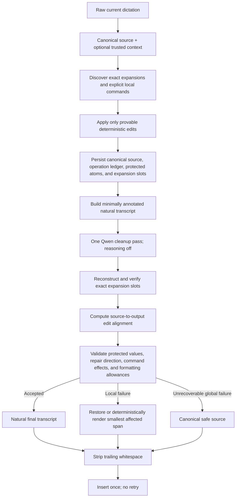

# ParaQwen Transcription Quality and Generalization Spec

## TL;DR

- Treat Wispr Flow as a **behavioral quality target**, not an architectural
  template. ParaQwen must approach its natural backtracking, email, list,
  punctuation, and context-sensitive formatting quality without training,
  fine-tuning, cloud inference, or a second model pass.
- Remove the requirement that Qwen preserve per-repair structural markers.
  Repair metadata stays out of band; the model receives a natural transcript
  plus only the minimum disposable command and exact-expansion structure.
- Keep deterministic code where it is authoritative: exact snippets and file
  references, unambiguous local edits, protected-value integrity, command
  outcome validation, recovery, and trailing-whitespace removal. Do not make
  regexes and lexical overlap heuristics responsible for understanding open-
  ended language.
- Replace all-or-nothing validation with operation-aware validation and the
  smallest safe fallback. One damaged repair or ignored list command must not
  discard an otherwise correct email layout or unrelated cleanup.
- Ship only after a diverse, deduplicated, composition-heavy live corpus proves
  that the design generalizes beyond prompt examples and authored test phrases.

## Status and relationship to the first backtracking spec

This is a corrective follow-up to
[`backtracking-and-self-repair.spec.md`](backtracking-and-self-repair.spec.md).
The first spec established useful safety properties, diagnostics, exact
expansion protection, one-shot state, and a live benchmark. Its implementation
also introduced a rigid in-band repair protocol and semantic validators that
regressed existing formatting and still do not reliably generalize.

Where this spec conflicts with the first spec, this spec controls. In
particular, the requirement that Qwen reproduce every repair boundary is
retired. Exact snippet and file-reference structure remains protected.

## Objective

Deliver the highest practical transcription quality from the existing local
Parakeet → deterministic Pre-AI → Qwen 3.5 9B → deterministic Post-AI pipeline,
with Qwen reasoning disabled and without model training or fine-tuning.

The desired experience is that a speaker can dictate naturally, revise their
thought, issue a nearby editing instruction, switch between prose, email, lists,
and technical prompts, and receive the final intended text without learning a
small set of test-shaped phrases.

The system cannot mathematically prove the semantics of arbitrary English.
Its goal is therefore a deliberate balance:

1. Qwen handles open-ended linguistic inference and formatting.
2. Deterministic code handles exact data, high-confidence local operations,
   source grounding, integrity limits, and recovery.
3. Deterministic code does not pretend that word overlap, a cue allowlist, or a
   sentence-length threshold is a general semantic model.

## Non-goals

- No training, fine-tuning, adapters, embeddings, or learned local classifier.
- No cloud model, external API, background repair, retry, ensemble, or second
  Qwen pass.
- No replacement ASR, audio analysis, pause inference, or word timestamps.
- No editing text from an earlier dictation or controlling the target app.
- No weakening of snippet, slash-command, file-reference, state-integrity,
  plugin fail-open, or terminal trailing-whitespace protections.
- No promise of exact Wispr Flow parity. Its models, training data, context
  pipeline, and internal repair implementation are proprietary.
- English is the target for this phase. Multilingual repair and formatting need
  their own corpus and language-specific design.

---

## Audit evidence and confirmed regressions

The review on 2026-07-13 used the installed `spokenly-qwen9b` model digest
`d3993a4c1837`, `think=false`, temperature zero, and three runs per supplied
input.

### Email plus correction

Input:

```text
umm, hi Greg. Let's connect soon. Are you available on Friday at three? no, actually four. Best, Zak.
```

In all three current-pipeline runs, Qwen produced a correctly cleaned and
formatted email but omitted the in-band repair boundaries. Post-AI rejected
the output with `repair boundary count mismatch` and restored the unformatted,
uncorrected source. The pre-backtracking prompt and processor produced the
correctly formatted, corrected email in all three comparison runs.

### Repair plus deterministic commands plus list formatting

Input:

```text
Tomorrow I want to send the onboarding guide to the sales team. I mean the support team. The first draft includes installation steps and troubleshooting notes. Delete the last sentence. The final draft includes setup steps, troubleshooting notes, and contact information. New paragraph. The rollout priorities are reliability, speed, and documentation. Make those a numbered list. What should we review before launch?
```

Pre-AI correctly removed the first-draft sentence, inserted the paragraph,
framed the sales → support repair, and emitted a numbered-list command. Qwen
resolved the repair but removed the command token without formatting the list.
Post-AI accepted the ignored operation because it checked token consumption,
not command effect.

A handcrafted bullet list passes the current validator. A correct numbered
list is rejected because `1`, `2`, and `3` are treated as invented protected
numbers. This proves that the model contract and Post-AI validator disagree.

### Semantic validation counterexamples

The current validator accepted all of these incorrect transformations:

- `The deployment is paused. No customer should be notified.` →
  `Customer should be notified.`
- `The API is stable. Actually, the CLI is stable too.` →
  `The CLI is stable too.`
- `Enable audit logging. I mean disable audit logging.` →
  `Enable audit logging.`

The detector also failed to create any repair candidate for:

- `We should ship Friday. Wait, Monday.`
- `We should ship Friday. On second thought, Monday.`

These are not isolated missing phrases. They show that cue enumeration and
lexical grounding cannot establish intent, polarity, additivity, or which side
of a repair is final.

### Evaluation gap

The committed backtracking corpus reports 126 cases but only 72 unique raw
transcripts. It contains no email-shaped input, inline delete instruction, new
paragraph instruction, list command, or combined repair-plus-command case. The
three-run live artifact already contains eight positive failures that fell
back to unresolved source wording. Passing the current suite therefore does
not establish general transcription quality.

---

## Highest-risk findings

| Risk | Why it is dangerous | Required correction |
| --- | --- | --- |
| In-band repair boundaries are a model obligation | Correct email or document reformatting can remove or relocate markers, causing Post-AI to discard good prose. More markers increase prompt burden and failure probability. | Remove model-visible per-repair START/END/CUE framing. Keep repair evidence in private state and validate the natural output against the source. |
| Semantic validation is lexical rather than semantic | Word counts and overlap accept negation reversal, dropped additive facts, and the wrong side of a correction. | Narrow deterministic validation to properties it can prove. Add directional repair checks, polarity/modal protection, and conservative ambiguity handling; do not claim semantic certainty from overlap. |
| Inline commands have no outcome contract | A model can delete a command token without performing it, and Post-AI reports success. | Persist typed command intent and target metadata, then verify the requested effect independently of token disappearance. |
| Authorized formatting conflicts with protected atoms | Numbered-list labels are rejected as invented numbers even though the command authorizes them. | Make protected-value validation operation-aware. Formatting-generated ordinals are metadata, not dictated numeric facts. |
| Failure is transcript-wide | One missing repair marker discards email layout, grammar cleanup, and unrelated valid repairs. | Validate and recover by operation or bounded affected span; preserve safe accepted work elsewhere. |
| Cue and restatement rules are test-shaped | Adding phrases to a regex expands the memorized surface forms without solving open-ended repair recognition. | Keep only high-precision deterministic command recognition. Let Qwen interpret natural repairs from full context, with broad source/output safety constraints. |
| The prompt contains competing contracts | Qwen is told to return natural final text, preserve many opaque markers, consume other markers, follow many examples, and avoid transformations that later validators actually permit. | Replace the prompt with a shorter priority hierarchy and composition examples selected by ablation evidence. |
| Dual model/safe source representations drift | Semantic commands are removed from one representation but retained in another, so validation and fallback disagree about what happened. | Use one canonical source plus an ordered operation ledger and derived views, rather than independently transformed source strings. |
| Benchmark volume masks duplication | Repeated templates inflate pass rates and do not test natural input diversity or feature interactions. | Require unique semantic scenarios, held-out cases, pairwise feature composition, real Parakeet captures, and human intent review. |
| Deterministic repetition and alignment heuristics overreach | Local punctuation shapes and transcript length can change whether the same wording is deleted or accepted. | Remove deterministic semantic deletion that is not exact and provably redundant; make alignment thresholds length-stable and safety-focused. |

---

## Design principles

### 1. Natural transcript in, natural transcript out

Qwen should see wording close to what the speaker said. Every model-visible
protocol token consumes model attention and creates another nonlinguistic
failure mode. Exact placeholders remain justified for snippets and file
references because their contents must never be generated or rewritten.
Semantic repair boundaries do not meet that standard and are removed.

### 2. Taxonomies belong in evaluation, not necessarily runtime

Replacement, restart, restatement, discard, and additive clarification remain
useful labels for corpus balance and error analysis. The runtime does not need
to force every utterance into one of those labels before Qwen can clean it.

### 3. Determinism must prove, not infer

Use deterministic code for:

- Exact trigger matching and expansion placement.
- Unambiguous deletion of a preceding word or punctuated sentence.
- Explicit new-line, new-paragraph, and spoken punctuation commands.
- High-confidence list formatting when item boundaries are already explicit.
- State integrity, source/output alignment, protected values, command outcomes,
  and trailing-whitespace removal.

Do not use deterministic code as a substitute semantic model for:

- Whether `actually` is additive or corrective.
- Whether two topically related clauses are restatements.
- Whether negation may be removed.
- Which noun phrase an open-ended correction replaces.
- Whether an arbitrary natural-language instruction is a command.

### 4. Prefer graceful degradation over transcript-wide rollback

The safe fallback for a local operation is the smallest source span that can be
restored without changing order or protected data. A failure involving an
exact expansion may still require reconstruction of its protected segment, but
it must not automatically erase accepted formatting in unrelated segments.

### 5. Optimize for distributions, not examples

No production heuristic may be justified by one fixture. A rule needs a named
input family, positive and negative minimal pairs, real-ASR evidence, and a
measurable improvement on a held-out set.

### 6. Do not build a second language model out of validators

Post-AI cannot prove arbitrary semantic equivalence with regexes, token counts,
or a home-grown ontology. It should reject changes that violate demonstrable
source, operation, order, polarity, protected-value, or size invariants. It
should not accumulate special rules intended to decide every possible meaning.

### Rejected approaches

| Approach | Reason for rejection |
| --- | --- |
| Add every missed repair phrase to `CUE_PATTERN` | Improves recall only for memorized surfaces and continuously expands false-positive handling. |
| Add more narrowly matched prompt examples | Encourages benchmark memorization and increases conflicts in a small model's instruction context. |
| Keep repair markers and add marker-recovery heuristics | Recreates the same placement ambiguity that caused snippet-shifting bugs and still discards valid formatting. |
| Ask Qwen for JSON, an edit program, or a repair ledger | Adds a second structured-output task that can fail independently and competes with natural transcript quality. |
| Use a second Qwen validation pass | Violates latency and one-pass constraints and still is not an independent guarantee. |
| Make all backtracking deterministic | Open-ended repair, additivity, and restatement require language understanding; a rule system will remain rigid. |
| Accept all model output without validation | Risks invented or modified technical values, commands, paths, names, and numeric facts. |
| Reconstruct arbitrary failed prose span by span | Turns fallback into another semantic editor. Local recovery is allowed only for uniquely aligned ledger operations. |

---

## Target architecture



### Canonical source and operation ledger

Pre-AI persists one canonical source and an ordered ledger. Derived model and
fallback views must be reproducible from those two values.

Each operation record contains only fields relevant to its type:

```json
{
  "id": 3,
  "type": "numbered_list",
  "source_span": [242, 309],
  "command_span": [310, 340],
  "confidence": "deterministic|model_assisted",
  "authorized_formatting": ["colon", "line_breaks", "ordinal_labels"],
  "source_digest": "..."
}
```

Repair-like language may be recorded as a broad observation for diagnostics,
but Qwen is not required to echo an ID, nonce, type, or boundary. The source
text remains authoritative.

### Minimal model-visible structure

Allowed model-visible structure is limited to:

1. Existing exact snippet/file-reference tokens and the minimum segment
   metadata required to reconstruct their positions.
2. Disposable typed command hints only when Pre-AI cannot safely execute the
   command itself.

Disposable command hints need not survive. Post-AI validates their effects from
the ledger. Repair cues remain natural words in the transcript; Qwen removes or
preserves them based on full context.

### Source-to-output alignment

Post-AI computes one bounded, deterministic alignment between the canonical
source view and reconstructed model output.

The alignment must:

- Ignore differences that are purely casing, whitespace, paragraph layout, or
  equivalent punctuation.
- Recognize narrow number-word/digit equivalence without treating different
  values as equivalent.
- Preserve source order for semantic tokens and protected values except inside
  an explicitly authorized operation.
- Produce changed spans that can be associated with a ledger operation or a
  conservative cleanup class such as filler removal.
- Use a length-stable algorithm and thresholds. The same local change cannot
  become valid merely because unrelated text was added elsewhere.

Alignment is a safety and localization mechanism, not a semantic oracle.

### Directional repair validation

For an explicit or strongly evidenced correction, Post-AI verifies direction:

- The later repair-side distinctive content survives.
- The earlier conflicting alternative may be removed.
- The earlier alternative may not survive while the later distinctive content
  disappears.
- A correction may not remove an unrelated complete proposition merely because
  it shares words with the repair.
- Negation, prohibition, modality, comparatives, and quantifiers are treated as
  high-risk meaning-bearing tokens. Their removal requires later source wording
  that explicitly supplies the changed polarity or modality.
- An additive continuation preserves both propositions.

If deterministic evidence cannot distinguish correction from additivity, the
system accepts Qwen's output only when both source propositions remain. This is
the conservative boundary of a no-training, one-pass design.

This validation is intentionally asymmetric. It can prove that a later source
alternative survived and an earlier local alternative disappeared. It cannot
prove that every free-form rewrite is semantically ideal. Output that requires
that stronger claim is judged by the model and evaluated by held-out human
rubrics, not approved by adding another lexical rule.

### Operation-aware command validation

Every recognized command has an observable success condition:

| Command | Required effect |
| --- | --- |
| Delete previous word | The recorded preceding word is absent; surrounding source order remains. |
| Delete previous sentence | Only the recorded preceding sentence is absent. |
| New line / paragraph | A line or paragraph boundary exists at the recorded location. |
| Bullet list | Target items occur once, in order, on bullet-prefixed lines. |
| Numbered list | Target items occur once, in order, with sequential ordinal labels. Generated ordinals are authorized formatting, not source numbers. |
| Spoken punctuation | Requested symbol occurs at the recorded boundary without consuming unrelated punctuation. |

Token disappearance is never evidence of command success.

Clear comma-, conjunction-, or sequence-word-delimited lists should be rendered
deterministically when item boundaries are provable. Open-ended item
segmentation remains model-assisted, but its output must satisfy item coverage
and ordering. If it fails, restore only the target span in readable inline form
rather than rolling back the entire dictation.

### Bounded fallback rules

Local fallback is allowed only when all of these are true:

1. The failed behavior has a persisted operation-ledger record.
2. Source-to-output alignment maps one non-overlapping output span uniquely to
   that operation's source span.
3. Restoring the recorded source span preserves the surrounding token order and
   every protected expansion boundary.
4. The restoration does not require generating connective words or inferring
   new punctuation beyond the operation's authorized formatting.

If any condition fails, Post-AI uses the canonical safe source reconstruction.
It does not guess at a partial merge. This keeps local recovery from becoming a
second, increasingly rigid transcript editor.

| Failure | Recovery |
| --- | --- |
| Ignored or malformed ledger-backed list/paragraph command with unique alignment | Restore or deterministically render only its recorded target span. |
| Invalid natural repair but uniquely bounded explicit repair observation | Restore that source repair span, preserving accepted text outside it. |
| Missing, reordered, or damaged exact expansion structure | Reconstruct the affected protected segment from its authoritative slot manifest; if segment mapping is not unique, use canonical safe source with exact expansions. |
| Ambiguous alignment, overlapping failed operations, or unexplained semantic insertion/deletion | Use canonical safe source; do not partially merge. |
| Missing or invalid state | Use portable canonical source/raw transcript according to the existing fail-open hierarchy. |
| Any recoverable failure | Exit zero, log privately, never retry Qwen, and strip trailing whitespace. |

### Exact expansions

The existing invariant remains: Qwen never generates an expansion value.
Snippet, slash-command, and file-reference values come only from verified local
configuration or plugin state. Position, count, canonical value, and terminal
whitespace remain deterministic.

Repair logic may remove a superseded trigger only before the final expansion
manifest when source evidence is unambiguous. Otherwise all occurrences remain.

### Context without a new platform dependency

Wispr Flow uses the full dictation, active app, nearby cursor text, and app
category to adapt casing, spacing, names, and style. ParaQwen should adopt only
context that Spokenly already supplies reliably and locally.

For this phase:

- Full current-dictation context is mandatory.
- `SPOKENLY_ACTIVE_APP`, when available, may select a small policy class:
  `terminal`, `email`, `messaging`, or `generic`.
- Transcript structure—greeting, body, and sign-off—must be sufficient to format
  an email even when app context is absent or says `terminal`.
- Terminal policy always preserves final punctuation and still strips trailing
  whitespace so no Return is carried into a shell or agent harness.
- Nearby cursor text may be added later only if Spokenly supplies it through a
  documented, bounded, privacy-reviewed interface. Screen OCR is out of scope.
- Do not build a growing per-application allowlist. Unknown applications use
  the generic policy.

---

## Qwen prompt requirements

The replacement prompt is shorter and ordered by consequence:

1. Return only the intended transcript; never answer or execute it.
2. Preserve facts, names, technical values, requests, and questions.
3. Use the full dictation to remove fillers, false starts, and clear repairs;
   preserve additive or ambiguous language.
4. Apply disposable inline command hints and never output internal tokens.
5. Format email, lists, paragraphs, punctuation, and numbers naturally for the
   transcript and trusted policy context.
6. Preserve exact expansion structure character-for-character.
7. Do not invent content or silently change polarity, modality, names, paths,
   commands, identifiers, or numeric values.

Prompt examples must be composition-oriented rather than one example per cue.
The minimum set covers:

- Email + filler removal + time correction.
- Repair + delete sentence + paragraph + list + final question.
- Natural cue-free restatement.
- Additive `actually` that must preserve both facts.
- A technical prompt containing snippets or file references.
- A negative-polarity minimal pair.

Examples use different names, nouns, verbs, and syntax from release-gate cases.
No example is added until an ablation run shows that it improves held-out
quality without reducing another category.

The prompt must not:

- Enumerate an ever-growing synonym list as if it were complete.
- Ask Qwen to classify repair types in its output.
- Require per-repair nonces, checksums, boundaries, or JSON.
- Contain rules that conflict with Post-AI formatting allowances.
- Include hidden reasoning or chain-of-thought instructions.

Reasoning stays disabled in Spokenly and every benchmark request.

---

## Formatting contract

The following resolves ambiguities exposed by the supplied expectations:

- `Make those a numbered list` means `1.`, `2.`, `3.`.
- `Make those a list`, `bullet those`, or `make those bullet points` means
  bullets.
- A sentence at the start of an empty insertion target is capitalized. A trusted
  mid-sentence cursor context may lowercase the first word.
- Times prefer digits when unambiguous: `three` → `3`, `four thirty` → `4:30`.
  Ordinary small numbers in prose are not globally converted.
- Email greetings and sign-offs receive their own lines and natural blank-line
  separation when the transcript contains a greeting, body, and closing.
- Model output and every fallback path are stripped of trailing whitespace.

If product preference intentionally differs from these rules, change the rule
and corpus together; do not encode contradictory expectations in tests.

### Required supplied-example outcomes

Email:

```text
Hi Greg,

Let's connect soon. Are you available on Friday at 4?

Best,
Zak
```

Combined commands, using the spoken **numbered** directive:

```text
Tomorrow, I want to send the onboarding guide to the support team. The final draft includes setup steps, troubleshooting notes, and contact information.

The rollout priorities are:

1. Reliability
2. Speed
3. Documentation

What should we review before launch?
```

Equivalent comma placement after `Tomorrow` may be style-configurable, but the
recipient, deleted sentence, paragraph, list type, item order, and final question
are not optional.

---

## Acceptance criteria

### A. Regression recovery and composition

| AC | Criterion |
| --- | --- |
| 1 | The two supplied regression inputs satisfy the required outcomes across three local-model runs with reasoning disabled. |
| 2 | Email formatting remains correct when a repair occurs in the body, greeting, sign-off, or meeting time. |
| 3 | A transcript may combine deterministic deletion, paragraph insertion, repair, list formatting, question preservation, and exact expansions without one feature disabling another. |
| 4 | Ignoring a disposable command hint is detected as command failure; token removal alone never passes. |
| 5 | Authorized numbered-list labels are accepted and cannot alter dictated numeric facts. |
| 6 | A local command or repair failure does not discard unrelated accepted email, paragraph, punctuation, or cleanup work when the affected span can be isolated safely. |

### B. Generalized repair behavior

| AC | Criterion |
| --- | --- |
| 7 | Repairs may be recognized from explicit cues, ASR variants, restarts, and natural restatement without requiring every phrase to appear in a runtime cue allowlist. |
| 8 | `wait`, `on second thought`, `rather`, interrupted clauses, repeated constituents, and unseen paraphrases are represented in held-out evaluation even when they are absent from prompt examples. |
| 9 | Natural uses of `actually`, `no`, `rather`, `mean`, `wait`, and similar words remain intact when context is not corrective. |
| 10 | Additive clarification preserves both propositions. |
| 11 | The later repair side cannot be dropped while the earlier conflicting alternative survives. |
| 12 | Negation, prohibition, modality, comparison, and quantifier changes require explicit later source evidence. |
| 13 | Cue-free repair is accepted only when output retains a later source-grounded alternative; ordinary related sentences are not collapsed. |
| 14 | The same local transformation receives the same validation result when unrelated prefix or suffix text is added. |

### C. Prompt and model contract

| AC | Criterion |
| --- | --- |
| 15 | Qwen receives no per-repair START, END, CUE, nonce, checksum, or repair-type token. |
| 16 | Qwen runs exactly once with reasoning disabled and temperature zero. |
| 17 | The prompt contains a single non-conflicting priority hierarchy and the minimum ablation-supported composition examples. |
| 18 | The model is never asked to return analysis, reasoning, JSON, an edit ledger, or a classification taxonomy. |
| 19 | Email, list, paragraph, question, and technical-prompt cleanup remain normal model tasks rather than special-case prompt branches. |

### D. Deterministic processing and validation

| AC | Criterion |
| --- | --- |
| 20 | Pre-AI derives every model/fallback view from one canonical source and ordered operation ledger. |
| 21 | High-confidence word/sentence deletion, line/paragraph insertion, and exact punctuation remain deterministic and locally scoped. |
| 22 | Every model-assisted command has a persisted target and observable success condition. |
| 23 | Post-AI computes a bounded source/output alignment once, not once per cue or rule. |
| 24 | Protected URLs, emails, slash commands, file references, paths, filenames, identifiers, hashes, versions, dates, times, names when confidently identified, and numeric values retain count, order, and semantic value unless an authorized repair supplies the later replacement. |
| 25 | Formatting punctuation, capitalization, whitespace, number-word equivalence, and command-authorized list ordinals are not treated as semantic inventions. |
| 26 | Alignment and grounding rules never accept the three documented semantic counterexamples. |
| 27 | Validation failure records the failed invariant and affected operation/span in private diagnostics. |
| 28 | Exact expansion reconstruction, plugin fail-open behavior, state ownership/mode/age checks, and one-shot state consumption remain intact. |
| 29 | Every final path removes trailing spaces, tabs, carriage returns, and newlines. |
| 30 | No transcript content or internal diagnostic is written to stderr/stdout except the final inserted transcript on stdout. |

### E. Evaluation and anti-overfitting

| AC | Criterion |
| --- | --- |
| 31 | The release corpus contains at least 240 unique semantic scenarios, with no duplicated raw transcript counting toward a gate. |
| 32 | At least 80 cases are direct Spokenly/Parakeet captures, distributed across every major behavior category. |
| 33 | At least 80 cases combine two or more features, with pairwise coverage across repair, email, list, inline command, punctuation, snippets, slash commands, file references, technical atoms, and long dictation. |
| 34 | At least 80 negative/minimal-pair cases cover additivity, negation, modality, deliberate repetition, quoted commands, ordinary cue words, and similar-but-independent clauses. |
| 35 | A held-out set is frozen before prompt and heuristic work; its exact wording is absent from the prompt and unit fixtures. |
| 36 | Synthetic punctuation/casing mutations supplement but never replace unique semantic or real-ASR cases. |
| 37 | Live evaluation compares the pre-backtracking baseline, current bounded-repair implementation, and new implementation on the same model digest and source corpus. |
| 38 | Three-run live results achieve at least 95% repair intent accuracy, 98% command-effect accuracy, 99% negative/additive preservation, and 100% exact-expansion and terminal-whitespace safety. |
| 39 | No major formatting category—email, list, paragraph, punctuation, question preservation, number/time formatting—regresses relative to the best prior baseline by more than two percentage points. |
| 40 | Every production regex or deterministic heuristic has a named behavior family, positive and negative fixtures, real-ASR evidence, and held-out improvement; single-example fixes are prohibited. |
| 41 | Prompt-section and example ablations are recorded; material that does not improve held-out quality or safety is removed. |
| 42 | At least 50 exploratory dictations created after implementation receive blind human intent review and do not count toward prompt tuning. |

### F. Performance, portability, and operations

| AC | Criterion |
| --- | --- |
| 43 | Combined deterministic Pre-AI/Post-AI p95 remains below 150 ms for representative transcripts through 2,000 words on the reference Mac. |
| 44 | The portable core remains independent of macOS/iTerm2; optional context and file-reference plugins load only when enabled and verified. |
| 45 | Unknown app context uses generic formatting, and missing context never blocks dictation. |
| 46 | There is no background retry, delayed replacement, network call, or model invocation in validators. |
| 47 | Migration can be disabled with one temporary feature flag until the new live and human gates pass; the flag and retired implementation are removed after stabilization. |

---

## Evaluation design

### Corpus dimensions

Each record stores:

- Raw authored text and, when available, actual Parakeet transcript.
- Behavior labels used only for evaluation.
- Required retained propositions and tokens.
- Required removed spans.
- Command intent and observable effect.
- Protected atoms and permitted equivalences.
- Formatting requirements and allowed style variants.
- Whether the case is prompt-development, held-out, or post-implementation
  exploratory data.
- Human reviewer and review status.

### Composition matrix

Use pairwise coverage rather than an exhaustive Cartesian product. Required
interactions include:

- Repair × email.
- Repair × numbered and bullet lists.
- Repair × delete/new paragraph/spoken punctuation.
- Repair × snippet/slash/file reference.
- Email × snippet signature.
- List × dictated numbers that must not be confused with ordinal labels.
- Long technical prompt × multiple independent repairs.
- Additive/negative minimal pairs × every high-risk protected atom class.

### Metrics

Substring predicates remain useful for exact expansions but are insufficient for
language quality. Report:

- Intent success by human-reviewed rubric.
- Reparandum-removal precision and repair-side retention.
- Negative/additive preservation.
- Command recognition and command-effect success separately.
- Email, list, paragraph, punctuation, number/time, and question-format success.
- Protected-value and expansion integrity.
- Whole-output fallback rate and local-fallback rate.
- Model marker/token damage rate.
- Median and p95 deterministic/model latency.

Every failure report includes raw, Pre-AI, model, Post-AI, fallback scope, and
validator reason in the existing redacted local diagnostic format.

---

## Implementation sequence

### Phase 0: Freeze evidence before changing behavior

1. Add the supplied regressions and semantic counterexamples to a new corpus.
2. Capture current and pre-backtracking outputs on the pinned model.
3. Deduplicate the existing corpus and report unique-scenario metrics alongside
   historical metrics.

### Phase 1: Simplify the model contract

1. Create the canonical source and operation-ledger schema.
2. Stop emitting per-repair boundary/cue markers.
3. Replace the prompt with the concise hierarchy and composition examples.
4. Keep exact expansion framing unchanged.
5. Run A/B live tests before adding new heuristics.

### Phase 2: Make commands enforceable

1. Record every recognized command, target, authorized formatting, and success
   condition.
2. Execute provable local commands before Qwen.
3. Add deterministic clear-list rendering and model-assisted ambiguous-list
   verification.
4. Add operation-aware ordinal handling.

### Phase 3: Replace semantic over-validation

1. Implement one source/output alignment.
2. Add directional repair-side retention and high-risk polarity/modal checks.
3. Remove length-sensitive whole-transcript overlap thresholds and cue-specific
   semantic branches once their replacements pass the corpus.
4. Add smallest-span fallback and diagnostics.

### Phase 4: Generalization gates

1. Complete the 240-case unique corpus and pairwise composition matrix.
2. Freeze and run the held-out set.
3. Run prompt ablations and remove unsupported instructions/examples.
4. Run three complete local-model passes, deterministic performance tests, and
   50 post-implementation exploratory dictations.
5. Remove the migration flag and retired repair protocol only after every gate
   and human sign-off passes.

---

## What should be removed or simplified

The implementation should become smaller after migration. Delete rather than
carry forward:

- Model-visible repair START/END/CUE token construction and parsing.
- Per-repair nonces/checksums whose only purpose was requiring Qwen to echo
  semantic boundaries.
- Runtime repair-type classification that does not change a provable
  deterministic operation.
- Lexical grounding rules that claim semantic safety from word frequency or the
  later half of a region.
- Cue-specific natural-use branches added only to satisfy individual examples.
- Transcript-wide alignment thresholds whose result changes with unrelated
  context length.
- Multiple independently mutated source strings when one canonical source plus
  an operation ledger can derive them.
- Duplicate corpus records used only to reach a numerical case count.

Retain:

- Exact expansion tokens and redundant positional reconstruction.
- File-reference pane/CWD/worktree validation and plugin fail-open behavior.
- Protected-value extraction, narrowed to invariants it can prove.
- Atomic owner-only one-shot state.
- Redacted diagnostics.
- Reasoning-off/temperature-zero model configuration.
- Final trailing-whitespace removal.

---

## Research basis

### Behavioral target

- [Wispr Flow Smart Formatting & Backtrack](https://docs.wisprflow.ai/articles/5373093536-how-do-i-use-smart-formatting-and-backtrack), updated July 1, 2026, documents full-dictation repair using explicit cues or natural restatement, contextual preservation of ordinary `actually`, automatic numbered lists, number/time normalization, email formatting, and recovery of the original dictation. The behavior—not proprietary internals—is the target.
- [Wispr Flow Context Awareness](https://docs.wisprflow.ai/articles/4678293671-feature-context-awareness), updated June 23, 2026, documents active-app categories, nearby cursor context, name extraction, mid-sentence casing/spacing, and application-sensitive style. ParaQwen adopts only locally available, bounded context and does not add screen capture or cloud context.
- [Wispr Flow terminal guidance](https://docs.wisprflow.ai/articles/6478598909-using-flow-with-linux-wsl-and-terminal-applications), updated June 5, 2026, warns that context-aware formatting can unexpectedly transform terminal commands. ParaQwen therefore keeps terminal punctuation conservative and retains its no-trailing-Return guarantee.

### Speech repair and interactive dictation

- [A Speech-First Model for Repair Detection and Correction](https://aclanthology.org/H93-1066/) establishes the reparandum/editing-interval/repair structure. The terminology remains useful, but text-only ParaQwen lacks the prosodic evidence available to speech-first systems.
- [Toward Interactive Dictation](https://aclanthology.org/2023.acl-long.854/) shows that flat trigger templates are restrictive and frames open-ended spoken editing as segmentation plus an edit program. It also reports a real accuracy/latency tradeoff, supporting a small typed operation ledger for explicit commands instead of a growing phrase list.
- [DRES: Benchmarking LLMs for Disfluency Removal](https://arxiv.org/abs/2509.20321) reports that segmentation improves LLM stability, reasoning-oriented models tend to over-delete, and fine-tuning can harm generalization. ParaQwen keeps reasoning disabled, uses bounded source/output validation, and requires held-out generalization evidence rather than optimizing only authored examples.
- [Disfluency Generation for More Robust Dialogue Systems](https://aclanthology.org/2023.findings-acl.728.pdf) distinguishes repetition, repair, restart, filler, and interjection and demonstrates why keeping the abandoned slot value can corrupt downstream intent. Evaluation retains these categories even when runtime code does not hard-classify them.

---

## Human verification checklist

### Required regressions

- [ ] Dictate the supplied Greg email; verify email layout, `4`, sign-off, and no
  filler/correction residue.
- [ ] Dictate the supplied onboarding/list example; verify support replaces
  sales, the first-draft sentence is gone, the paragraph remains, the list is
  numbered, and the final question remains.
- [ ] Repeat both at least three times without changing the prompt or model.

### Generalization exploration

- [ ] Use at least five unprompted correction phrases not present in prompt
  examples.
- [ ] Use the same cue as correction, additivity, quotation, and ordinary prose.
- [ ] Correct a negated instruction, modal statement, time, name, filename,
  slash command, and list item.
- [ ] Mix an email with a snippet signature and a correction in the body.
- [ ] Mix two independent corrections with a list and file reference in a long
  agentic prompt.
- [ ] Dictate deliberate repetition and similar-but-independent propositions;
  verify neither is collapsed.
- [ ] Dictate in an empty text field, mid-sentence field when context is
  available, and iTerm2/Codex or Claude Code prompt.

### Safety and failure

- [ ] Damage an exact expansion token; verify exact deterministic recovery and
  no visible error.
- [ ] Simulate an ignored model-assisted command; verify the failure is detected
  and unrelated cleanup survives.
- [ ] Simulate stale state and unavailable optional context; verify portable
  dictation continues.
- [ ] Verify no final output ends with whitespace or triggers Enter.
- [ ] Inspect redacted diagnostics for useful operation/span failure evidence.

### Sign-off

- [ ] All acceptance criteria pass.
- [ ] Held-out and post-implementation exploratory cases meet their gates.
- [ ] No prompt example or production heuristic was copied from a held-out
  failure without adding a broader behavior family and negative controls.
- [ ] No critical content-loss, protected-value, expansion, or terminal-safety
  defect remains.
