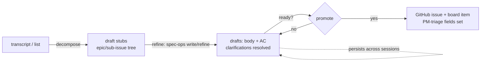

# gh-projects PM/CTO Evolution Spec

## TL;DR
- Evolve the `gh-projects` plugin so a **PM-who-is-also-CTO** of a ≤4-eng team can decide and act on the whole board **without reading every issue or view** — via four changes: rename three skills to user-intent verbs, rebuild intake into a **resumable pipeline with a local draft-staging area**, add a **read-only analysis/action layer**, and codify the board's **shared vocabulary + decision matrix** as the versioned rule source the skills cite.
- **Breaks if missed:** the skill renames are load-bearing — the `PreToolUse` guard is wired by skill name, so a rename that doesn't move the guard wiring **silently stops gating** `--squash`/unguarded-prod (AC-5). And the staging area must stay **pre-canonical drafts with one-way promotion** or it becomes a second source of truth, breaking the "the GitHub issue is the canonical unit" invariant (AC-16).
- **North star:** the PM/CTO lives mostly in **two** skills — `analyze-board` to decide what matters, `create-issues` to feed the machine — and everything else runs itself.

---

## Acceptance Criteria

<!-- Five capability groups. AC-ids are globally unique + stable. The groups are independently shippable; a suggested order is noted in the body but no cross-group dependency is asserted here. -->

### 1. Skill renames

| AC | Criterion |
|----|-----------|
| 1 | The skill `intake-issues` is renamed `create-issues` (directory + `SKILL.md` frontmatter `name`). |
| 2 | The skill `route-issue` is renamed `start-issue` (directory + frontmatter `name`). |
| 3 | The skill `promote-pr` is renamed `create-pr` (directory + frontmatter `name`). |
| 4 | `create-pr`'s `description` explicitly states it **also advances board Status across the PR lifecycle and offers a green-gated non-squash merge** — because the name omits the advance + merge that the skill performs. |
| 5 | The `PreToolUse` guard is active for **exactly** `start-issue` + `create-pr` (the renamed `route-issue`/`promote-pr`) and no other skill; no skill's guard wiring references an old name. |
| 6 | No file references an old skill name (`intake-issues`/`route-issue`/`promote-pr`) except deliberate historical/spec context — frontmatter, guard wiring, tests, and docs (`CLAUDE.md`, `README.md`, `GOLDEN-TEMPLATE-SETUP.md`, the marketplace plugin description) all use the new names. |
| 7 | The offline test suite passes with every skill-name assertion updated to the new name. |

### 2. Intake pipeline + local staging (`create-issues`)

| AC | Criterion |
|----|-----------|
| 8 | `create-issues` runs as three re-runnable stages — **decompose → refine → promote** — sharing one persistent backlog ledger, so an interrupted intake resumes without re-doing finished drafts. |
| 9 | A new deterministic engine manages the staging area: stdlib-only, exit codes `0/2/3/1`, dry-by-default, **no metered AI**. |
| 10 | The staging area lives under a **convention directory in the draft's target product repo**; each draft is a local file plus a ledger entry. |
| 11 | A ledger entry records: title, proposed `Type`/`Tier`/`Size`/`Priority`, parent/epic link, target repo, the draft file path, and a status of `stub` / `drafting` / `ready` / `promoted`. |
| 12 | A draft's **target repo is optional** while `stub`/`drafting` but **required** to reach `ready`/`promote` (issue creation needs a repo). |
| 13 | **Decompose** turns a transcript/list into draft stubs and proposes an epic / sub-issue / standalone tree **per the composition rules (AC-37)**; size and split are validated by the existing **AC-group-count heuristic** (deterministic), not invented free-hand. |
| 14 | **Refine** authors each draft's body + Acceptance Criteria by delegating to `spec-ops` (`write-spec` at the tier's rigor; `refine-spec` for the deep tier) and resolves clarifying questions **against the local draft file** — no GitHub issue exists yet. |
| 15 | **Promote** creates the real GitHub issue from a `ready` draft (body + AC), adds it to the board, sets the **PM-triage fields** (`Type`/`Tier`/`Priority`/`Size`/`PM-ID`/`Spec`) from the draft, and establishes the recorded parent/sub-issue links + blocked-by edges. |
| 16 | Promotion is **one-way**: once promoted, the draft is marked `promoted` and its local file archived/removed so it can never be edited as a second source of truth (preserves "the GitHub issue is the canonical unit"). |
| 17 | Promotion is **readiness-gated**: only a `ready` draft promotes; a `stub`/`drafting` draft is refused with a reason. |
| 18 | Unpromoted drafts **persist across sessions**; re-running `create-issues` resumes them. There is **no input-size threshold** that bypasses staging — readiness, not batch size, decides what reaches the board. |
| 19 | **Field-setting split:** `promote` sets only the PM-triage fields; it does **not** set work-start state (assignee, `In Progress`, linked branch) — those remain `start-issue`'s job. A newly promoted item lands at `Backlog`. |
| 20 | The staging engine exposes the subcommands `add`, `list`, `show`, `link` (epic/sub-issue tree), `promote`; `list` renders the drafts + statuses from documented columns. |
| 21 | The whole pipeline is **dry-by-default + idempotent**: re-running `promote` on an already-promoted draft is a clean no-op (never a duplicate issue), and the dry run previews the spec-ops delegation + the `gh issue create` before any `--force`. |

### 3. Analysis / action layer

| AC | Criterion |
|----|-----------|
| 22 | A new deterministic engine emits a **ranked** list of findings computed **read-only over the board's existing signals + blocked-by DAG** (no new persisted data); stdlib-only, exit codes `0/2/3/1`, **no metered AI**. |
| 23 | Each finding carries **machine-checkable evidence** (the issue numbers / field values that triggered it) **and the resolving skill to run** (the action) — so each digest line is a one-command fix. |
| 24 | `analyze-board` (new skill, strategic / whole-program) reports at least: rollup health; the **critical chain** (release-blockers that are themselves blocked); overdue × high-blast-radius items; **intake-hygiene gaps** (`Ready` items missing AC / `Size` / `Target date`; thresholds per AC-37); unassigned in-sprint work; stalled epics; and every item flagged `Decision needed`. |
| 25 | `analyze-sprint` (new skill, tactical / current iteration) **reuses the existing working-day capacity engine** to report per-assignee capacity vs load, over-allocation, what won't land this sprint, and a suggested rebalancing. |
| 26 | Both `analyze-*` skills are **read-only** — they never write the board (no field write, no Status-update post). |
| 27 | The findings **math lives in the deterministic engine** (cron-safe, honoring no-metered-AI); only the interactive skill layer narrates/prioritizes on the model. |
| 28 | Ranking is **stable**: the same board state yields the same finding order, so the digest is reproducible. |
| 29 | Each `analyze-*` skill renders a **fixed fill-in output skeleton** from documented engine output — no invented values. |
| 30 | The `analyze-*` skills are read-only and therefore **model-invocable** (not gated by `disable-model-invocation`), and each pins `model` + `effort` deliberately. |

### 4. Cross-cutting (invariants · tests · versioning)

| AC | Criterion |
|----|-----------|
| 31 | Every Projects v2 **write** introduced (the `promote` path) uses the GitHub **App installation token**, never `GITHUB_TOKEN`; no token is ever printed. |
| 32 | All new engine code honors the plugin invariants: `${CLAUDE_PLUGIN_ROOT}`/`Path(__file__)` path resolution (no hardcoded `~/.claude`), idempotent diff-before-mutate for any schema touch, and the per-plugin `.gitignore` ignores any new run-state. |
| 33 | The offline suite gains coverage for the two new engines and the renames, stays **fully offline** (the injectable `gh`/GraphQL seam — no network, no creds), and is green. |
| 34 | The plugin version is bumped in the root `marketplace.json` **and** the pinned assertion in `test_invariants.py` (bumped together). |

### 5. Vocabulary + decision matrix (the shared rule source)

| AC | Criterion |
|----|-----------|
| 35 | A new `rules/vocabulary.md` defines every plugin term — the work taxonomy (`Feature`/`Bug`/`Chore`/`Infra`/`Epic`), the triage/descriptive fields (`Size`, `Tier`, `Priority`), the auto Gantt-signals (`Schedule health`, `Slippage`/days, `Blast radius`/count, `Blocked`, `Impact level`, `Decision needed`), the `Status` lifecycle, and the new staging terms (`stub`/`drafting`/`ready`/`promoted`) — each with its meaning, what it is **not**, and how the workflow uses it. |
| 36 | `vocabulary.md` explicitly disambiguates the confusable **orthogonal axes**: `Size` vs `Tier` vs `Priority`; `Impact level` vs `Blast radius`; `Blast radius` vs `Blocked`. |
| 37 | A new `rules/composition.md` (the decision matrix) codifies the cross-field judgment calls: **Epic vs Milestone**; **reduce scope vs move `Target date`** (keyed on `Blast radius` + `Schedule health`); **when to split** an issue into sub-issues/Epic (AC-group-count threshold · appetite > L · mixed `Type`); the **`Feature`/`Bug`/`Chore`/`Infra`** boundaries; and **when to flag `Decision needed`**. |
| 38 | `fields.json` remains the **canonical source** of every field/option **name** + its terse UI description; `vocabulary.md`/`composition.md` own the fuller meaning + judgment and **never redefine a name** (no duplicate source of truth), and never restate `tier-rubric.md`/`github-fields.md` (they link to them). |
| 39 | A test asserts every field/option **name** referenced in `vocabulary.md` matches `fields.json` **and** the `signals.py`/`dag.py` constants — so the prose can't drift from the code on names. |
| 40 | `create-issues` (decompose) and `analyze-board` **cite `composition.md`** as the rule source for their split / epic-vs-milestone / hygiene decisions, and reference `rules/vocabulary.md` + `rules/composition.md` in frontmatter — so the judgment is grounded in the versioned matrix, not ad-hoc. |
| 41 | `scaffold-repo` installs a **condensed, consumer-facing "board language" reference** into the board repo (or points the issue forms at it) so devs/PMs on a board share the same definitions. |

---

## Current state → Target

The plugin keeps its thin-SKILL-over-deterministic-engine shape; this changes the **skill set** and adds **two engines**.

| | Today | After |
|---|---|---|
| **Setup** | `scaffold-repo` | `scaffold-repo` *(unchanged)* |
| **Intake** | `intake-issues` (one-shot raw dump → issues) | `create-issues` (resumable decompose → refine → promote over a local staging area) |
| **Plan** | `plan-sprint` | `plan-sprint` *(unchanged)* |
| **Start work** | `route-issue` (fields + branch) | `start-issue` (work-start state: branch + assign + Status) |
| **PR** | `promote-pr` | `create-pr` *(same behavior; name + description clarified)* |
| **Signals** | `sync-signals` | `sync-signals` *(unchanged)* |
| **Analyze** | *(none — read 8 views by hand)* | `analyze-board` + `analyze-sprint` *(new)* |
| **Engines** (`lib/`) | `gh` · `sprint` · `scaffold` · `dag` · `pm` · `intake` · `setup_board` | + `backlog` (staging ledger) · + `analysis` (findings) |
| **Reference** (`rules/`) | `github-fields` · `tier-rubric` · `ac-rubric` + field one-liners in `fields.json` (scattered) | + `vocabulary.md` (terms + axis disambiguation) · `composition.md` (decision matrix), cited by the skills |

**Suggested sequencing (guidance, not a committed dependency):** ship **group 1** (renames) first as a standalone change; author **group 5** (vocabulary + matrix) next — it is the rule source **groups 2–3 cite**; then **group 3** (analysis, additive + read-only over existing signals); then **group 2** (staging, most design-sensitive). Each group is independently shippable.

---

## Skill renames

| Old | New | Why | Move-points (must change together) |
|---|---|---|---|
| `intake-issues` | `create-issues` | user-intent verb; pairs with `create-pr` | dir · frontmatter `name` · tests · docs |
| `route-issue` | `start-issue` | maps to the "Start work" lifecycle step; thins further once `promote` sets triage fields (AC-19) | dir · frontmatter `name` · **guard wiring** · tests · docs |
| `promote-pr` | `create-pr` | user-intent verb; description carries the advance+merge (AC-4) | dir · frontmatter `name` · **guard wiring** · tests · docs |

The guard (`PreToolUse`) is referenced **by skill name** from the two work-skills' frontmatter; renaming without moving that reference leaves the guard inert (`--squash` and unguarded-prod stop being blocked) with no test failure unless a test pins the wiring — hence AC-5 makes "guard active for exactly the two renamed skills" an explicit end-state.

---

## `create-issues` pipeline + local staging

Ingesting a large transcript or backlog into well-formed issues is **multi-session, not atomic**: each issue needs decomposition, AC authoring (via `spec-ops`), clarifying-question resolution, and initial fields. The pipeline makes that resumable.

**Draft lifecycle:** `stub` → `drafting` → `ready` → `promoted`. Only `ready` promotes (AC-17); everything not promoted persists in staging for the next session (AC-18); promotion is one-way and removes the local draft (AC-16).

**Ledger entry (one per draft):**

| Field | Notes |
|---|---|
| title | proposed issue title |
| `Type` / `Tier` / `Size` / `Priority` | proposed PM-triage fields, applied at promote (AC-15) |
| parent / epic link | the decompose tree; becomes a native parent/sub-issue + blocked-by edge at promote |
| target repo | optional while drafting, **required to promote** (AC-12) |
| draft file path | the local `spec-ops`-authored body + AC |
| status | `stub` / `drafting` / `ready` / `promoted` |

**Staging location:** drafts are filed under a convention directory in the **target product repo** (team-visible, git-versioned), since that is where the issue ultimately lives.

> [NEEDS CLARIFICATION: where a draft's file physically lives **before** a target repo is assigned (status `stub`/`drafting` with `repo = null`) — held in the working repo's staging dir and moved on repo-assignment, vs. ledger-only until a repo is chosen. Resolve in `refine-spec`.]

**The canonical-issue guardrail (load-bearing):** the staging area is a **pre-canonical holding pen**, never a parallel tracker. Promotion is one-way; the draft is archived/removed on promote; a promoted draft is never edited. This is what preserves the plugin's "the GitHub issue is the canonical unit" invariant (AC-16).

**Field-home split after this change** (extends the existing split):

| Skill | Sets |
|---|---|
| `create-issues` (`promote`) | `Type` · `Tier` · `Priority` · `Size` · `PM-ID` · `Spec` (lands at `Backlog`) |
| `plan-sprint` | `Sprint` · `Milestone` · `Start`/`Target` · `Ready` order |
| `start-issue` | `Status → In Progress` · assignee · linked branch |
| `create-pr` | `Status` across the PR lifecycle (monotonic) |

---

## Analysis & action layer

The board already computes the signals an analysis needs — `Schedule health`, `Slippage`/days, `Blast radius`/count, `Blocked`, the rollup Status, and `plan-sprint`'s working-day capacity. The analysis layer is a **new machine-lens over those same signals**: it adds no data, it **ranks and routes** what already exists, so the PM reads one digest instead of eight views.

**Findings — every finding is `(evidence, action)`:**

| Surface | Example findings | Action (resolving skill) |
|---|---|---|
| `analyze-board` | `Ready` issues missing AC / Size / Target | `create-issues` |
| | release-blocker `#42` is itself blocked by `#19` | `start-issue #19` |
| | item flagged `Decision needed` | (PM decides) |
| | stalled epic; overdue × high blast radius | `plan-sprint` / `start-issue` |
| `analyze-sprint` | dev X at 140% capacity | `plan-sprint` (rebalance) |
| | items that won't land this sprint | `plan-sprint` |

**AI boundary (explicit):** the findings **math** is deterministic and lives in the engine (cron-safe, honoring no-metered-AI, AC-22/27); only the **interactive skill** narrates and prioritizes on the model — which is allowed, because the no-metered-AI invariant governs the **signals computation + workflows**, not the human-facing skills. `analyze-*` never write the board (AC-26), so they are read-only and model-invocable (AC-30).

---

## Vocabulary & decision matrix

Two new `rules/` files turn scattered definitions + in-the-PM's-head judgment into a single **versioned rule source the skills cite** (today only `intake-issues` references `rules/`). They do **not** restate what already has a home — `rules/github-fields.md` (field homes), `rules/tier-rubric.md` (Tier), `rules/ac-rubric.md` (AC bar), and `fields.json` (canonical names + UI one-liners).

**`vocabulary.md` — definitions + the disambiguation no single field description can hold.** The confusable axes are orthogonal:

| Pair | Axis A | Axis B |
|---|---|---|
| `Size` vs `Tier` vs `Priority` | appetite (S/M/L, not points) — *how much effort* | spec rigor/risk (T1–T3) — *how much spec* · urgency (P0–P3) — *how soon* |
| `Impact level` vs `Blast radius` | intrinsic value-if-late — *does it hurt on its own* | dependency fan-out — *how many other items break* |
| `Blast radius` vs `Blocked` | what **I** block downstream | am **I** blocked upstream |

**`composition.md` — the decision matrix.** The judgment calls, keyed on signals the board already computes:

| Decision | Rule |
|---|---|
| **Epic vs Milestone** | *work structure* (a capability that decomposes into sub-issues; rollup via Sub-issues %) → **Epic**; *time/release boundary* (a ship-date bucket driving the Roadmap) → **Milestone**. Orthogonal — an Epic spans Milestones; a Milestone holds many Epics' issues; both can apply to one issue. |
| **Reduce scope vs move `Target date`** | trigger `Schedule health = At risk/Overdue`. `Blast radius = Blocks release` (or blocks a milestone) → **protect the date, cut scope**; low blast radius + soft date → **move `Target`, accept `Slippage`**. Never silently both. |
| **When to split** | AC-group count ≥ the intake threshold → sub-issues under an Epic; appetite > L → split; mixed `Type` in one issue → split by `Type`. |
| **`Feature`/`Bug`/`Chore`/`Infra`** | new user-facing capability / defect in existing behavior / maintenance with no user-visible change / config-as-contract platform (→ T3 infra-spec class). |
| **Flag `Decision needed`** | blocked on a product/architecture choice only the PM/CTO can make — *not* a dependency (`Blocked`), *not* effort (`Size`). |

**Drift lock:** the names in `vocabulary.md` are test-locked to `fields.json` + the `signals.py`/`dag.py` constants (AC-39); prose is human-owned — the glossary can never go stale on a name while staying free to explain.

---

## Boundaries

- **Out of scope (note as future):** `analyze-board` posting its digest as the project Status-update body or a tracking issue, and any scheduled (cron) emission of the digest. This spec keeps `analyze-*` strictly **read-only and on-demand**.
- **`fields.json` stays the canonical name source** — `vocabulary.md`/`composition.md` reference field/option names, never redefine them, and never restate `tier-rubric.md`/`github-fields.md` (they link to them).
- **Do not touch** the deterministic signal computation (`signals.py`/`dag.py` math) or the three Status-writing layers (native built-ins, `board-sync`, `board-status`) — the analysis layer **reads** these, never changes them.
- **Do not** widen the `spec-ops` interface beyond the pinned `intake.py` map (`WRITE_SPEC_SKILL` / `REFINE_SPEC_SKILL` / `TIER_RIGOR`); `create-issues` reuses it, it does not fork it.
- The staging area is **drafts only** — it must never hold or mutate state for an already-promoted (canonical) issue.

---

## Checklist

**Skills (`skills/`)** — group 1, 2, 3
- [ ] Rename three skill dirs + frontmatter; update `create-pr` description — AC-1, AC-2, AC-3, AC-4
- [ ] Re-point guard wiring to the renamed skills — AC-5
- [ ] Rebuild `create-issues` SKILL.md as decompose→refine→promote orchestrator — AC-8, AC-13, AC-14, AC-15, AC-21
- [ ] New `analyze-board` + `analyze-sprint` SKILL.md (read-only, model-invocable, fill-in skeleton) — AC-24, AC-25, AC-29, AC-30

**Engines (`lib/`)** — group 2, 3
- [ ] `lib/backlog.py` — staging ledger + `add`/`list`/`show`/`link`/`promote`, draft lifecycle, one-way promotion — AC-9, AC-10, AC-11, AC-12, AC-16, AC-17, AC-18, AC-19, AC-20
- [ ] `lib/analysis.py` — ranked findings engine, read-only over signals + DAG, stable order — AC-22, AC-23, AC-28
- [ ] `analyze-sprint` reuses `sprint.py` capacity — AC-25
- [ ] `promote` writes via App token, reuses existing `gh.py` verbs (add-item / set-field / links) — AC-15, AC-31

**Reference (`rules/`)** — group 5
- [ ] `rules/vocabulary.md` — terms + orthogonal-axis disambiguation — AC-35, AC-36
- [ ] `rules/composition.md` — decision matrix (epic/milestone · scope/date · split · type · decision-needed) — AC-37
- [ ] name-sync test; `fields.json` canonical — AC-38, AC-39
- [ ] skills cite `rules/`; `scaffold-repo` installs the board-language card — AC-40, AC-41

**Cross-cutting**
- [ ] Path resolution, idempotency, `.gitignore` run-state — AC-32
- [ ] Offline tests for both engines + renames; suite green — AC-7, AC-33
- [ ] Version bump in `marketplace.json` + `test_invariants.py` — AC-34
- [ ] Docs (`CLAUDE.md`, `README.md`, `GOLDEN-TEMPLATE-SETUP.md`) reflect new skills + names — AC-6
