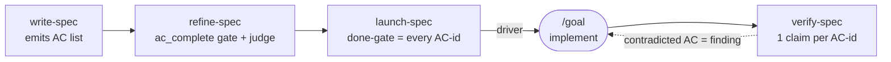

# Acceptance Criteria Layer for spec-ops Spec

**Status:** Implemented in spec-ops **v0.4.0**.
**Touches:** `write-spec`, `refine-spec` (+ stop-hook), `launch-spec`, `verify-spec`, README, manifests.

> This spec is written in the very format it introduces — the `## Acceptance Criteria` section below is the contract; the body says how/where and cites each `AC-id`.

## TL;DR

- spec-ops specs now open with a flat, stable-id'd **`## Acceptance Criteria`** list — the human's two-minute scan of *what must be true* **and** the machine's checklist — enforced across all four skills so no requirement falls off between spec and "done".
- The list is **enumerated exhaustively, never condensed**. The detailed body stays exactly as dense as before; it just sits *below* the criteria and cites each `AC-id`. Enumeration ≠ abbreviation.

---

## Acceptance Criteria

- **AC-1** — `write-spec`'s emitted spec structure contains a `## Acceptance Criteria` section placed directly after `## TL;DR`, before the feature body.
- **AC-2** — Each acceptance criterion is a single, atomic, observable end-state ("X is true") carrying a stable id (`AC-1`, `AC-2`, …) — never a task ("do X").
- **AC-3** — `write-spec`'s writing philosophy directs the author to enumerate criteria **exhaustively and never condense** them, and to keep them behavior-level with the implementing detail in the body under the same `AC-id`.
- **AC-4** — `refine-spec`'s readiness gate carries an `ac_complete` dimension that holds **only** when every functional requirement and constraint is captured as a discrete, atomic, testable criterion and nothing load-bearing remains only in prose.
- **AC-5** — `refine-spec`'s independent readiness judge hunts for any requirement/constraint not captured as a discrete criterion and returns it as a per-criterion `FAIL`.
- **AC-6** — The `refine-spec` stop-hook ledger schema includes `ac_complete`, and the hook blocks the stop until **every** present gate flag is `true` (it stays generic over flag names — no hard-coded key).
- **AC-7** — The Acceptance Criteria list is exempt from `refine-spec`'s bloat-cutting (treated as load-bearing, like decision/config/field tables).
- **AC-8** — `launch-spec`'s emitted `/goal` driver states the goal and done-gate as *"not done until **every acceptance criterion (`AC-1..N`) is satisfied** AND `verify-spec` returns zero contradicted claims."*
- **AC-9** — `launch-spec`'s precondition scan flags a missing Acceptance Criteria list and recommends running `refine-spec` first.
- **AC-10** — `verify-spec`'s enumerate step seeds the ledger with **one claim per `AC-id`** (carrying the id in the claim text) whenever the target has an Acceptance Criteria section.
- **AC-11** — `verify-spec`'s judge treats any `AC-id` absent from the ledger as `missed`, and the completion gate requires every `AC-id` present as a grounded claim.
- **AC-12** — A `contradicted` acceptance criterion is surfaced as a reported finding, not a stop-blocker; `verify-spec` still edits nothing.
- **AC-13** — The README and both manifest descriptions document the AC layer, and the marketplace version is bumped to `0.4.0`.

---

## Why this layer exists

Two distinct pains pulled in opposite directions: refined specs were **hard for a human to digest**, yet acceptance criteria were **missed at completion**. The root cause was not too much detail — it was that requirements lived as **inline narrative scattered across many sections**, never enumerated as discrete, checkable items, so nothing tracked their coverage.

The fix separates **enumeration** from **condensation**. A condensed second doc would trade away the very thing that prevents missed criteria; instead, an exhaustively enumerated AC list sits *on top of* the unchanged detailed body. Maximum detail is kept for the AI implementer; the human gets a scannable contract; the pipeline gets an enforceable checklist.

---

## Three altitudes, one document

The AC list does not duplicate the body — they are three views of the same change at different altitudes, each said once.

| View | Where | Answers | Primary audience |
|---|---|---|---|
| **Acceptance Criteria** | top, after TL;DR | what must be **true** | human scan + the gate |
| **Detailed body** | middle | **how / where** (cites `AC-id`) | the AI implementer |
| **Checklist** | bottom | what to **do** (cites `AC-id`) | progress tracking |

Cross-references run on the stable `AC-id`: every behavioral rule in the body maps back to a criterion, and every checklist item cites the criteria it satisfies — so coverage is traceable both directions.

---

## How each skill changed

| Skill | Change |
|---|---|
| **write-spec** | New `## Acceptance Criteria` in the emitted structure; philosophy rule *"enumerate the acceptance criteria"* (exhaustive, atomic, behavior-level, never condense); Checklist comment ties items to `AC-id`s. |
| **refine-spec** | New `ac_complete` gate flag + readiness-gate checklist item + judge criterion; new **Refine** step bullet that promotes prose into criteria, splits compound ones, and cross-checks coverage both ways; AC list added to the bloat carve-out. |
| **refine-spec stop-hook** | `ac_complete` added to the ledger schema hint. Validation already iterates flags generically, so the gate enforces it with no logic change. |
| **launch-spec** | Goal sourced from TL;DR + Acceptance Criteria; done-gate requires every `AC-id` satisfied + `verify-spec` clean; precondition scan checks the AC list exists. |
| **verify-spec** | Enumerate seeds a claim per `AC-id`; judge flags a missing `AC-id` as `missed`; completion gate requires every `AC-id` enumerated and grounded. |
| **README / manifests** | AC layer added to design principles and skill table; descriptions updated; version `0.3.7 → 0.4.0`. |

---

## Boundaries

- **Do not condense the detailed body.** The AC layer is additive — it sits above the body, which keeps its full grounding/anchors density for the AI implementer. Enumeration, not abbreviation.
- **Do not introduce a second document.** Rejected alternatives: a separately maintained functional-requirements doc, and a generated functional digest — both reintroduce a sync tax and split coverage tracking. One spec, AC as a top section.
- **Keep the stop-hook generic over flag names.** No hard-coded `ac_complete` required-key check; the hook continues to enforce "all present flags true" so the schema stays the single source of which flags exist.
- **Preserve the invariants.** `verify-spec` still edits nothing (a `contradicted` AC is reported, never auto-fixed); `launch-spec` stays emit-only. The AC wiring changes contract *text*, not these guarantees.

---

## Checklist

- [x] **write-spec** — `## Acceptance Criteria` in the structure skeleton; "Enumerate the acceptance criteria" philosophy subsection; Checklist↔AC comment. _(AC-1, AC-2, AC-3)_
- [x] **refine-spec** — `ac_complete` gate flag in the ledger schema; readiness-gate checklist item; judge instruction; Refine-step bullet; bloat carve-out. _(AC-4, AC-5, AC-7)_
- [x] **refine-spec stop-hook** — `ac_complete` in `SCHEMA_HINT`. _(AC-6)_
- [x] **launch-spec** — goal + done-gate reference every `AC-id`; precondition scan. _(AC-8, AC-9)_
- [x] **verify-spec** — enumerate seeds a claim per `AC-id`; judge `missed` rule; completion-gate bullet. _(AC-10, AC-11, AC-12)_
- [x] **README + `marketplace.json` + `plugin.json`** — document the layer; bump to `0.4.0`. _(AC-13)_
