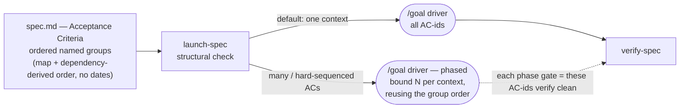

# spec-ops Evolution — Prior Art & Recommendation

**Status:** Research + recommendation. Nothing implemented. Builds on spec-ops **v0.4.0** (the flat, id'd Acceptance Criteria layer). Reflects the design decisions settled in discussion (see *Decisions locked* below).
**Inputs:** the local alternative perspective [`../pm-task-management/large-spec-analysis.md`](../pm-task-management/large-spec-analysis.md) (phased delivery with scoped ACs), plus a 6-angle web survey of prior art (Kiro, GitHub Spec Kit, Tessl, EARS, BDD/Specification-by-Example, requirements-traceability/DO-178C, and the LLM "dropped requirements" literature).

### Decisions locked
- **The flat AC core is validated** — extend it, don't restructure it.
- **Human "what / where" lives in the spec; AI completeness lives in the driver.** The AC section becomes **ordered named groups** (a capability map + a dependency-derived build order, **no dates/timelines**). `launch-spec` separately bounds requirement-count per implementation context.
- **No per-AC type tags.** The value they implied (don't drop or rubber-stamp non-functional constraints) is captured by two skill rules instead: a `verify-spec` evidence standard that scales with what an AC asserts, and a `refine-spec` hunt for unstated constraints.
- **No mandatory structured AC syntax (EARS/Gherkin).** Adopt only its *completeness probe* as a refine prompt, not its keywords.
- **All four prior open questions are now resolved** — derived-requirements handling, the R3 phasing trigger, R1's noise filter (calibrated against a real diff), and R2's group granularity. See *Open questions — resolved* and R1–R3.

---

## TL;DR

1. **The v0.4.0 core is validated, not in need of restructuring.** Six independent literatures endorse what spec-ops already does: stable atomic AC-ids, exhaustive enumeration, an independent clean-context judge, a done-gate bound to every AC-id, and — the rarest thing in the field — **grounding against real code/git/live state instead of the doc**. Everything below is additive.
2. **Phasing splits cleanly by audience.** The *human's* two questions — "what am I building" and "where do I start" — are answered **in the spec** by ordered, named AC groups with a dependency-derived order and **zero dates**. The *AI's* completeness problem (requirements drop combinatorially as count and context grow) is answered **in `launch-spec`**, which bounds how many AC-ids one implementation context holds at once. Same ordering, two altitudes. The local analysis's instinct was right; it just needed splitting across the two layers.
3. **No type tags, no template syntax — capture their value as skill rules.** A capable verifier already infers *how* to ground an AC from its text, so a type tag is mostly formality. What's real — constraints get dropped or rubber-stamped — becomes a `verify-spec` evidence rule (a measurable threshold needs a *measurement*; a universal invariant needs an *exhaustive check*) and a `refine-spec` constraint hunt.
4. **The genuinely new, cheap wins are directional.** spec-ops defends *forward* coverage (every AC has evidence) well. It's missing **backward** coverage — delivered code that maps to **no** AC (scope creep / silent reinterpretation) — and a recorded **verification method** per AC. Both live in `verify-spec`.

---

## The questions on the table

v0.4.0 shipped a flat, stable-id'd `## Acceptance Criteria` contract wired through the done-gate and `verify-spec`. Three follow-on questions remained, and the local `large-spec-analysis.md` proposed a concrete fourth answer:

- **(a) Phasing** — should a spec carry an *ordered delivery plan*, each phase with an exit gate + scoped ACs? *(the large-spec-analysis proposal)*
- **(b) Structured syntax / typing** — should ACs use a template (EARS `WHEN … SHALL …`) or carry type tags instead of free-form sentences?
- **(c) Traceability** — what machinery best stops a requirement silently falling off between spec and "done"?

---

## What the prior art *validates* in v0.4.0

The survey is overwhelmingly a confirmation that the v0.4.0 bet was correct. Each spec-ops mechanism mapped to its independent endorsement:

| spec-ops v0.4.0 mechanism | Endorsed by | What they say |
|---|---|---|
| Flat, **stable, never-reused AC-ids** | RTM, DO-178C | Unique IDs are the join key across every artifact; "the single discipline spec-ops most fully implements." |
| **Enumerate** every requirement as one atomic, testable end-state | InFoBench/DRFR, BDD/Gherkin | Decomposition into atomic yes/no units is the *only* way to measure coverage; "one behavior per scenario." |
| **Independent, clean-context judge** | Rubrics-as-Rewards, Self-Refine, ManyIFEval, Three Amigos | Per-criterion chain-of-thought grading beats a holistic "looks done"; a clean-context reviewer beats self-grading. |
| **Done-gate = every AC-id satisfied** | RTM / Definition-of-Done, ATDD | DoD must bind to every acceptance criterion; "acceptance tests *are* the completion criteria." |
| **Ground against real code/git/live state, never the spec** | (differentiator) Context Rot, SAFe P#5, Tessl drift | Gates must be objective evaluations of a *working system*; this is the answer to spec-drift that even Tessl only partially solves. |
| **AC list OPENS the spec** | Lost-in-the-Middle, Context Rot, IFScale | Earliest-position, shortest-context requirements are the most reliably honored; mid-prose requirements are dropped first. |
| **`ac_complete` gate** (nothing load-bearing left only in prose) | EARS, Spec Kit `/checklist` | Structure surfaces missing/under-specified requirements *at authoring time*. |

**Takeaway:** v0.4.0 already implements the *spine* of best practice and one thing almost nobody else has (reality-grounded verification). The flat AC list stays as the canonical contract; the work below is additive.

---

## (a) Phasing — the answer splits by audience

The local analysis's core observation is correct: *"the single most expensive question for any implementer is **what do I build first**,"* and that's a **human** question, asked when reading the spec to understand it — not only a scheduling concern. v0.4.0's flat list answered *completeness* but left that human question unanswered. The fix is to serve it **in the spec**, while keeping the AI's distinct problem **in the driver**.

### In the spec: ordered named groups (the human's map + order)

The AC section becomes **ordered, named groups** of AC-ids:

```
## Acceptance Criteria   (build top-down; §N order is suggested, "needs §X" is binding)

### 1. Asset versioning — start here
- AC-1 — every asset URL carries a ?v=<hash> stamp
- AC-3 — replaying a request is idempotent (no duplicate state)

### 2. Edge hardening — needs §1
- AC-2 — p95 asset latency < 200ms
- AC-4 — no asset is served directly from the ALB
```

- **Group names are the "what am I building" map**; reading top-to-bottom is "where do I start."
- **`needs §X` on a header is the only *binding* dependency**; group order is otherwise a *suggested* reading order. Where ACs are genuinely independent, no false precedence is implied — grouping alone carries readability.
- **No dates, no time-boxes, no effort estimates** — order is *derived from real dependencies*, never a schedule.
- **AC-ids remain the canonical, stable contract**; groups are ordered headers over them. A one-group spec is just the flat list — zero overhead when order doesn't matter (your "a single phase is fine").
- Within-group AC-level `·dep AC-x` only on the rare occasion a within-group order genuinely matters.

This is admissible against the research precisely because of the guardrails. The literature's case against "phases in the spec" was about two specific things, both neutralized here:

- **Predictive, time-boxed gates** (SAFe found phase-gate timing uncorrelated with success; Wikipedia: phase-gate ≈ waterfall) → killed by banning dates/time-boxes. ([SAFe](https://framework.scaledagile.com/base-milestones-on-objective-evaluation-of-working-systems/), [Wikipedia](https://en.wikipedia.org/wiki/Phase-gate_process))
- **Arbitrary ordering as design leakage** ("when multiple viable approaches exist, you're in design territory") → killed by deriving order from *genuine dependencies*; independent ACs are grouped, not force-ordered. ([Tyner Blain](https://tynerblain.com/blog/2006/02/11/requirements-vs-design-which-is-which-and-why/))
- **BDD's anti-coupling rule** → preserved: each AC stays individually atomic/observable; grouping is metadata laid *over* uncoupled ACs, not coupling baked into them. ([Abstracta](https://abstracta.us/blog/testing-tools/a-guide-to-good-cucumber-practices/))

And it matches how the peer tools actually work: Spec Kit and Kiro *do* group/sequence — by **referencing** a global requirement-ID space, never minting a parallel store ([Spec Kit tasks](https://raw.githubusercontent.com/github/spec-kit/main/templates/tasks-template.md), [Kiro](https://kiro.dev/docs/specs/)). Ordered groups are exactly that: a view over the stable AC-ids.

### In the driver: bound the count per context (the AI's completeness defense)

The LLM literature gives the strongest *quantified* reason to keep requirement-count low **per execution context**: all-instruction success ≈ (per-instruction success)^N ([Curse of Instructions / ManyIFEval](https://openreview.net/forum?id=R6q67CDBCH)); frontier models hit only ~68% at 500 instructions with **omission-dominated** failures ([IFScale](https://arxiv.org/abs/2507.11538)); reliability degrades far below the window ([Context Rot](https://www.trychroma.com/research/context-rot), [Lost in the Middle](https://arxiv.org/abs/2307.03172)). The defense is to bound how many AC-ids one *implementation context* must satisfy at once — which is `launch-spec`'s job, not the spec's.



`launch-spec` reuses the spec's **group order** as the basis for execution phases, stepping up from a single context only on a **structural** signal (hard sequencing, or an AC count large enough to overload one context) — the same "structural signals, not counts" rule it already uses to pick `/goal` vs `ultracode` vs `/batch` (memory [[launch-spec-driver-selection-structural]]). Single context is the default; each emitted phase's exit gate is "these AC-ids verify clean," reusing shipped machinery.

### What the local analysis got right, and where each piece lands

| large-spec-analysis idea | Verdict | Where it lives |
|---|---|---|
| "What do I build first" is the expensive question | ✔ valid (and a *human* question) | **Now answered in the spec** via ordered named groups (top = start here); `launch-spec` additionally bounds N per AI context. |
| Explicit phases with exit gates | ✔ gate + grouping/order · ✘ dates/time-boxes | Grouping + dependency-derived order in the spec (no dates); per-phase "AC-ids verify clean" gate in the driver. |
| "Breaks if missed" block at the very top | ✔ — already largely the **TL;DR** | Reinforce write-spec's TL;DR as the breaks-if-missed lead; no new artifact. |
| Keep Boundaries / Out-of-Scope | ✔ strongly | Already a first-class spec-ops section; never cut. |
| Appendix model / functional-doc split | ✘ | Rejected in v0.4.0 (sync tax, split coverage); ordered groups give the digestible top-layer instead. |
| "Thin end-to-end first" (walking skeleton) | ✔ — but as an **AC**, not a build step | Encode "AC-1: an end-to-end path from X to observable Y runs" as a behavioral criterion (Cockburn / Elephant Carpaccio). |

---

## (b) Structured syntax & typing — capture the value, skip the formality

EARS is real and battle-tested (Rolls-Royce/IEEE RE'09; Airbus, NASA, Bosch), and its ambiguity reduction is *structural*: explicit `trigger / precondition / system / response` slots make a missing trigger **visible** ([Mavin](https://alistairmavin.com/ears/), [Jama](https://www.jamasoftware.com/requirements-management-guide/writing-requirements/adopting-the-ears-notation-to-improve-requirements-engineering/)). BDD's Given-When-Then is the same idea, and Test Double shows GWT criteria working as the **direct target for an AI implementer** running a per-criterion green-gate loop — structurally identical to spec-ops's per-AC-id driver loop ([Test Double](https://testdouble.com/insights/three-amigos-with-ai-stop-building-the-wrong-thing-faster)).

**But neither a syntax mandate nor per-AC type tags earns its keep here:**

- **EARS is documented-weak for exactly spec-ops's hard cases** — >3 preconditions, math/decision-tables, and **non-functional/architectural constraints** ([QRA](https://qracorp.com/when-not-to-use-ears/), [Wikipedia](https://en.wikipedia.org/wiki/Easy_Approach_to_Requirements_Syntax)). `SHALL` reads as forward *intent*, clashing with spec-ops's *observable end-state to verify after the fact*. The Boundaries section is prohibitive and has no stimulus-response shape at all. Even the leading peer hasn't committed (Spec Kit issue [#1356](https://github.com/github/spec-kit/issues/1356), open).
- **Type tags are mostly formality** for a capable verifier. Given "p95 latency < 200ms," the agent already infers *measurement*; given "no asset served from the ALB," it infers *static check*. The tag restates what the model concludes from the text, at a per-line authoring + scan cost.

**The two real things under "typing," expressed as skill rules instead of tags:**

1. **`verify-spec` evidence standard scales with what the AC asserts** — a *measurable threshold* demands an actual measurement (not "the code sets a timeout"); a *universal invariant* demands an exhaustive/static check (not one representative citation); a *behavior* grounds against code/git/exercise. This closes the real gap: a perf or security constraint getting **rubber-stamped by code-reading**. Keyed on the AC's content; zero authoring overhead. → R4.
2. **`refine-spec` hunts for unstated constraints/NFRs** — the most-dropped requirements (idempotency, perf, limits, security). This is also where the one useful EARS idea lands: a *completeness probe* ("what initiates this, under what precondition, what's the observable bound?") — as a refine prompt, not syntax. → R5.

---

## (c) Traceability — close the two directional gaps

spec-ops already implements the load-bearing half of a Requirements Traceability Matrix: stable IDs (the join key), forward coverage (Checklist cites AC-ids; `verify-spec` grounds each AC), and a machine-gated Definition-of-Done. Measured against RTM/DO-178C, **two directional gaps remain** ([RTM](https://en.wikipedia.org/wiki/Traceability_matrix), [DO-178C](https://en.wikipedia.org/wiki/DO-178C)):

1. **Backward (code → AC) is missing.** spec-ops confirms every AC has code evidence, but cannot surface *delivered code that maps to no AC* — DO-178C's "each line of source code has a purpose (connected to a requirement)." This is where **scope creep, silent reinterpretation, and "derived requirements"** (behaviors discovered mid-run with no AC) hide today. → R1.
2. **AC → verification-method is implicit.** `verify-spec` grounds each AC but doesn't *record how*. Capturing the grounding artifact per AC (file:line / command / CLI observation) turns the ledger into a durable, re-groundable matrix and enables drift detection on re-verify (Tessl's `[@test]` link idea, generalized to allow observation for infra). → R6.

Spec Kit's `/analyze` (a cross-artifact coverage gate flagging *requirement-with-no-task* and *task-with-no-requirement* before implement) is the published proof point for both directions ([Spec Kit](https://raw.githubusercontent.com/github/spec-kit/main/README.md)).

---

## Landscape at a glance

| Approach | Strongest idea for spec-ops | Conflict / risk | Verdict |
|---|---|---|---|
| **Kiro** (3-file; EARS ACs; `_Requirements: 1.1_` task back-refs; approval gates) | Phases/tasks *reference* a global ID space, never renumber | Nested `N.k` numbering would break our done-gate + per-AC ledger; gates are *authoring* not *verification*; exact mechanics from a leaked gist | **Borrow** back-ref discipline · **Skip** nested IDs |
| **GitHub Spec Kit** (`/clarify`, `/analyze`, `/checklist`; phased tasks w/ checkpoints; `[NEEDS CLARIFICATION]`) | `/analyze` coverage gate (req w/ no task = dropped); sequencing kept *out* of the spec, in tasks | Little conflict — matches our split-by-audience conclusion | **Adapt** (coverage gate → R1; markers → R7) |
| **Tessl** (code-anchored specs; inline `[@test]` links; drift checks) | Record the grounding artifact per AC → re-groundable matrix | Link-existence ≠ proof of currency | **Borrow** (verification-method → R6) |
| **EARS** (5 templates → `SHALL`) | The *completeness probe* (name the trigger/precondition/observable bound) | Weak for infra/math/NFR/Boundaries; `SHALL`=intent vs end-state; verbose; type-tag formality | **Skip** the syntax/tags · **Keep** the probe (→ R5) + evidence-standard idea (→ R4) |
| **BDD / Spec-by-Example / ATDD** | GWT validates the per-AC-id driver loop; declarative-not-imperative; refine-time dedup/boundary pass | Scenario coupling is an anti-pattern → keep ACs atomic under group headers | **Adapt** (principles, not mandatory syntax) |
| **Phased delivery & gates** (walking skeleton, SPIDR, SAFe, phase-gate) | The **gate** + dependency-derived grouping; thin-slice-first as an AC; SPIDR for AC granularity | Dated/time-boxed phases = waterfall; arbitrary order = design leakage | **Borrow** gate + grouping · **Skip** dates/time-boxes |
| **LLM context research** (Lost-in-Middle, Context Rot, Curse of Instructions, IFScale, Self-Refine, Rubrics, Anthropic) | (N)^N collapse → bound N **per execution context** (R3); precision-first "you missed AC-X" feedback (R7) | Decomposition adds tokens → keep ACs terse | **Adopt** (driver bounding + feedback) |

---

## Recommendations, ranked by leverage ÷ risk

> All additive to v0.4.0. None restructures the flat AC list — they organize it (R2), bound it at execution (R3), and tighten its verification (R1, R4, R6).
>
> **Digestibility guardrail (resolved).** The north star is a *scannable output spec* — so the test for any addition is: *does it survive into the final spec as something the reader must wade through?* By that test only **R2's optional group headers** add reader-facing surface, and they *aid* reading. The rest are process/gate mechanics the reader never sees: **R5** is a refine-time *probe* (process, not format), **R7's** markers are *transient* (removed by readiness), and **R1/R4/R6** are *verification* internals. Authoring burden stays low because the heaviest analysis (R2's dependency order, R5's NFR hunt) lands in `refine-spec`, where grounding already happens — not on the first-draft author.

### R1 — `verify-spec`: backward-coverage pass (code → AC) — **highest leverage, low risk**
Add a pass that walks the implementation diff and flags every **substantive** hunk mapping to **no** owning AC-id, with a noise filter/allowlist for refactors, formatting, tests, CI, config churn, and docs. Reported as findings, never auto-fixed (preserves edits-nothing).
- **Why #1:** the *one* dropped-requirement risk the independent judge does **not** already catch — it re-derives ACs *forward* and flags missing ones, but cannot see code with no AC. Closes DO-178C's third clause; surfaces scope creep, silent reinterpretation, and derived-requirements-with-no-AC.
- **On an unmapped substantive hunk** (the *derived-requirement* case, resolved): `verify-spec` **reports it, proposes candidate AC text, and triages** intended (→ "add this AC and re-run `refine-spec`") vs unintended (→ "remove or justify"). The triage is **always a non-blocking report** — the gate never waits on an answer, so it runs unchanged when `verify-spec` is invoked **autonomously as the `/goal` done-gate** (no human present). An interactive **`AskUserQuestion`** confirm is an *optional convenience offered only on direct human invocation*, **never a gate dependency**. It **edits nothing** and never auto-reopens `refine-spec`.
- **Noise filter — calibrated against a real diff** (the uncommitted v0.4.0 implementation: 7 files, `AC-1..13`): the allowlist produced **zero false positives** — every substantive hunk mapped to an owning AC. Two edges sharpened: (1) split manifests on the *field* — `description`/`version` edits are docs (allowlist), but `dependency`/`entrypoint`/`script`/`permission` edits are substantive; (2) docs/config an AC *explicitly governs* (e.g. AC-13 "README documents the layer") are **not backward findings** — R1 inspects only behavior-bearing hunks, and that artifact's coverage is a *forward* concern (R6). A genuinely unmapped behavior hunk (e.g. an unspecified new flag) still flags correctly.
- **Basis:** DO-178C three-way analysis; RTM bidirectional traceability; Spec Kit `/analyze`. **Touches:** `verify-spec`. **Risk:** false positives → mitigated by the substantive-change filter (validated above).

### R2 — `write-spec` + `refine-spec`: ordered named groups for the AC section — **high leverage, low risk**
Let the AC section carry **ordered, named groups** of AC-ids (capability map + dependency order, `needs §X` for binding cross-group deps, **no dates**) when grouping earns its keep. AC-ids stay canonical and stable; a one-group spec is just today's flat list.
- **Why:** directly answers the human's "what am I building / where do I start" — the north star v0.4.0 left open — without prose bloat or schedules.
- **Split by epistemic position (resolved):** `write-spec` emits the flat list with *optional* loose clustering when the author already sees obvious capabilities — it **never manufactures a dependency order it can't yet know**. `refine-spec`, which has grounded against the codebase via its `Explore` agents, is where `needs §X` edges are **validated and committed** and the build order is finalized. A real dependency is a *grounded fact*, so it belongs to the skill that does the grounding — this also keeps `write-spec` light (see the digestibility guardrail).
- **Granularity rule (resolved):** flat by default; introduce named groups only when the ACs fall into **≥2 recognizable capability clusters** *or* a **binding `needs §X` cross-group dependency** exists. Prefer ≥2 ACs per group; a solo-AC group is allowed only for a genuine "start here" capability (e.g. the walking-skeleton AC). More than ~5–6 groups signals the spec may be too big — surface it, don't hard-block.
- **Basis:** Spec Kit per-story grouping; requirements-vs-design + SAFe guardrails (no dates, dependency-derived). **Touches:** `refine-spec` (commits the grounded order + `needs §X`) and `write-spec` (skeleton + optional clustering). **Risk:** low; purely organizational over existing IDs.

### R3 — `launch-spec`: structurally-triggered context bounding — **high leverage, low risk**
When a **structural** signal fires, emit a phased driver that partitions AC-ids — reusing R2's group order — so no single context holds all N, re-front-loading each phase's ACs. **Default = one context, no phasing.** Each phase's exit gate = "these AC-ids verify clean."
- **Trigger (resolved):** R3 **inherits `launch-spec`'s existing structural driver-selection signals** (independence, carried interdependence, unbounded scope — the `/goal` vs `ultracode` vs `/batch` rule, [[launch-spec-driver-selection-structural]]); it **invents no AC-count threshold**. When those signals already escalate beyond one context, R2's named groups become the partition boundaries.
- **Basis:** Curse-of-Instructions (N)^N + Lost-in-the-Middle; Spec Kit checkpoints; SAFe (evidence-based, not calendar). **Touches:** `launch-spec`. **Risk:** low; reuses the done-gate and the existing structural driver-selection rule.

### R4 — `verify-spec`: evidence standard scales with what the AC asserts — **medium-high leverage, low risk**
Make grounding strictness a function of the AC's content (no tags): a **measurable threshold** requires a measurement; a **universal invariant** requires an exhaustive/static check; a **behavior** requires code/git/exercise. A bare code citation is insufficient evidence for a perf/security constraint.
- **Why:** closes the loose-verification gap where a constraint is "satisfied" by code-reading rather than demonstration — the real value under "typing," minus the formality.
- **Basis:** DO-178C "verified by test"; Rubrics-as-Rewards. **Touches:** `verify-spec` (grounding rule + judge). **Risk:** low; must keep CLI/observation first-class so infra ACs aren't forced into a test suite.

### R5 — `refine-spec`: unstated-constraint/NFR hunt (+ completeness probe) — **medium leverage, low-medium risk**
Extend the `ac_complete` gate to actively probe for **dropped non-functional constraints** (perf, security, idempotency, limits, concurrency) and, per behavioral AC, force the completeness probe: "what initiates this, under what precondition, what's the observable bound?" A prompt, **not** a syntax requirement; exempt math/Boundaries.
- **Basis:** EARS completeness argument (de-keyworded); InFoBench/DRFR atomicity; ManyIFEval. **Touches:** `refine-spec` (+ one-line `write-spec` note). **Risk:** medium — must not regress scannability or invite template-theater; "convey meaning over template" stays the rule.

### R6 — `verify-spec`: record verification-method per AC + emit a compact coverage table — **medium leverage, low risk**
Each AC-id's ledger entry records *how* it was grounded (file:line / command / read-only CLI observation). On completion, emit a compact `AC × {evidence, method, checklist-item}` table where an **empty cell is the finding**. Pairs with R4 (the method is the evidence-standard's output).
- **Basis:** RTM empty-cell detection; Tessl `[@test]` links. **Touches:** `verify-spec` (ledger schema + handoff). **Risk:** low — formalizes output it already produces; keep it *generated*, never an author-maintained N×M document.

### R7 — `refine-spec` / `write-spec`: cheap authoring-quality borrows — **low leverage, very low risk**
- Ban unresolved **`[NEEDS CLARIFICATION: …]`** markers at readiness (extends the existing no-`TODO`/`TBD`/`FIXME` + open-questions-resolved gate).
- Give the readiness judge a **`[Gap]` / `[Ambiguity]` / `[Conflict]`** finding taxonomy.
- Make coverage feedback **precision-first**: a bare "AC-N is not yet captured/satisfied" measurably drives recovery of dropped items.
- **Basis:** Spec Kit `/clarify` + `/checklist`; ManyIFEval ("precision over recall in feedback"). **Touches:** `refine-spec`, `write-spec`. **Risk:** minimal.

### R8 — `write-spec`: "thin end-to-end first" as an AC, not a phase — **pilot**
Where a walking skeleton matters, guide authors to encode it as a behavioral criterion ("AC-1: an end-to-end path from X to observable Y runs") rather than a build-order instruction — naturally the first group's `start here` AC.
- **Basis:** Cockburn walking skeleton; Elephant Carpaccio. **Touches:** `write-spec`. **Risk:** low.

---

## Graduation — slice by code-coupling, not by skill or outcome

The first-slice question ("outcome slice R1+R2 vs single-skill slice R1+R4+R6") dissolves under the real rule: **bundle recommendations that touch the same code; otherwise sequence by leverage.**

- **R4 + R6 are coupled** — both reshape `verify-spec`'s *forward* ledger (R6 records the method R4's evidence-standard produces) → ship together.
- **R1 is uncoupled from R4/R6** — it's a *separate backward pass*, not a ledger reshape → it need not wait for them, and it's the highest-leverage item, so it can ship first/alone.
- **R1 and R2 are uncoupled** (different skills, no shared code) → one slice or two at equal risk; pairing them ships visible value on **both** north-star pains at once.
- **R3** depends on R2's groups existing; **R5 / R7 / R8** are light, low-coupling follow-ons.

A defensible path: **R1 (± R2) → R4 + R6 → R3 → R5 / R7 / R8.** Each is its own `0.x.0` bump with its own dogfooded spec. The exact first cut stays open until you choose to build.

## Explicitly *not* doing (anti-recommendations)

- **Don't** restructure the flat AC list into Kiro-style nested `N.k` numbering — it breaks the done-gate and per-AC ledger that already give spec-ops *stronger* traceability than the nested model. Ordered groups sit *over* the flat IDs; they don't replace them.
- **Don't** put dates, time-boxes, or effort estimates in the spec — order is dependency-derived grouping only.
- **Don't** mandate EARS or Given-When-Then syntax, and **don't** add per-AC type tags — both are formality without downstream value for a capable verifier, and a token-bloat risk the context research says backfires.
- **Don't** require a passing test per AC — correct for app features, wrong for infra ACs grounded by read-only live state; observation must stay a first-class verification method.
- **Don't** build a heavyweight, author-maintained N×M RTM document — generate a compact table instead.

---

## Open questions — resolved

The four follow-ups from the prior draft are now settled; each is folded into the recommendation it touches.

- **Derived requirements → resolved.** On an unmapped behavior, `verify-spec` **flags + proposes candidate AC text + triages** intended vs unintended, **report-only**, using an interactive `AskUserQuestion` confirm when intent is ambiguous. It never auto-edits the spec or auto-reopens `refine-spec` (preserves edits-nothing). → **R1**.
- **Phasing trigger (R3) → resolved.** No AC-count threshold; R3 **inherits the existing structural driver-selection signals** ([[launch-spec-driver-selection-structural]]), with R2's groups as the partition boundaries. → **R3**.
- **Backward-pass noise filter (R1) → resolved + calibrated.** Run against the real uncommitted v0.4.0 diff: **zero false positives** on a faithful implementation. Taxonomy sharpened on manifests (`description`/`version` = docs; deps/entrypoint = substantive) and AC-governed docs (a forward concern, not a backward finding). → **R1**.
- **Group granularity (R2) → resolved.** Flat by default; group only on ≥2 capability clusters or a binding `needs §X`; prefer ≥2 ACs/group; >~5–6 groups signals an oversized spec. → **R2**.

One *new* follow-up surfaced while resolving these, deferred until a slice ships:

- **Re-verify drift (after R6).** Once `verify-spec` records a verification-method per AC, a *re-run* can detect when previously-grounded evidence has gone stale (Tessl's drift idea, generalized to allow observation). Worth its own pass once R6 exists.

---

## Sources

**AI spec-driven tooling**
- Kiro Specs (official): https://kiro.dev/docs/specs/ · feature-specs: https://kiro.dev/docs/specs/feature-specs/ · requirements-first: https://kiro.dev/docs/specs/feature-specs/requirements-first/
- Kiro spec-agent system prompt (leaked gists): https://gist.github.com/notdp/5f1960814d9aa21660d90b748826c960 · https://gist.github.com/notdp/19822831b54190bd9c6b34f6b69fadeb
- GitHub Spec Kit: manifesto https://github.com/github/spec-kit/blob/main/spec-driven.md · spec template https://raw.githubusercontent.com/github/spec-kit/main/templates/spec-template.md · tasks template https://raw.githubusercontent.com/github/spec-kit/main/templates/tasks-template.md · checklist command https://github.com/github/spec-kit/blob/main/templates/commands/checklist.md · README pipeline https://raw.githubusercontent.com/github/spec-kit/main/README.md · EARS request #1356 https://github.com/github/spec-kit/issues/1356
- Tessl spec-driven-development tile: https://github.com/tesslio/spec-driven-development-tile
- AGENTS.md vs CLAUDE.md vs Cursor Rules (contrast class): https://codersera.com/blog/agents-md-vs-claude-md-vs-cursor-rules-comparison-2026/

**Structured requirements syntax (EARS)**
- Mavin EARS guide: https://alistairmavin.com/ears/ · Wikipedia: https://en.wikipedia.org/wiki/Easy_Approach_to_Requirements_Syntax · Jama: https://www.jamasoftware.com/requirements-management-guide/writing-requirements/adopting-the-ears-notation-to-improve-requirements-engineering/ · QRA "when not to use": https://qracorp.com/when-not-to-use-ears/

**BDD / Specification by Example / ATDD**
- Specification by Example (Manning): https://www.manning.com/books/specification-by-example · process patterns PDF: https://cdn.bookey.app/files/pdf/book/en/specification-by-example.pdf · Codurance "refining the spec": https://www.codurance.com/publications/2017/04/03/learning-specification-by-example-from-gojko-adzic
- ATDD (Agile Alliance): https://agilealliance.org/glossary/atdd/ · Gherkin ACs (TestQuality): https://testquality.com/how-to-write-effective-gherkin-acceptance-criteria/ · Cucumber practices (Abstracta): https://abstracta.us/blog/testing-tools/a-guide-to-good-cucumber-practices/ · Three Amigos with AI (Test Double): https://testdouble.com/insights/three-amigos-with-ai-stop-building-the-wrong-thing-faster · Three Amigos (Testomat): https://testomat.io/blog/what-are-three-amigos-in-agile/

**Traceability & coverage**
- Requirements traceability (Wikipedia): https://en.wikipedia.org/wiki/Requirements_traceability · Traceability matrix: https://en.wikipedia.org/wiki/Traceability_matrix · DO-178C: https://en.wikipedia.org/wiki/DO-178C · Requirements management / DoD: https://en.wikipedia.org/wiki/Requirements_management · RTM overview (Perforce): https://www.perforce.com/resources/alm/requirements-traceability-matrix

**LLM dropped-requirements / context**
- Lost in the Middle: https://arxiv.org/abs/2307.03172 · Context Rot (Chroma): https://www.trychroma.com/research/context-rot · Anthropic context engineering: https://www.anthropic.com/engineering/effective-context-engineering-for-ai-agents · IFScale: https://arxiv.org/abs/2507.11538 · Curse of Instructions / ManyIFEval: https://openreview.net/forum?id=R6q67CDBCH · InFoBench/DRFR: https://aclanthology.org/2024.findings-acl.772/ · Self-Refine: https://arxiv.org/abs/2303.17651 · Rubrics as Rewards: https://arxiv.org/abs/2507.17746

**Phased delivery & gates**
- Walking skeleton (Cockburn via Blodgett): https://www.mattblodgett.com/2020/09/start-with-walking-skeleton.html · (Freeman & Pryce): https://tjenwellens.eu/blog/technique-walking-skeleton-for-incremental-development/ · SPIDR (Mike Cohn): https://www.mountaingoatsoftware.com/blog/five-simple-but-powerful-ways-to-split-user-stories · Elephant Carpaccio (Kniberg/Cockburn): https://blog.crisp.se/2013/07/25/henrikkniberg/elephant-carpaccio-facilitation-guide · Requirements vs design (Tyner Blain): https://tynerblain.com/blog/2006/02/11/requirements-vs-design-which-is-which-and-why/ · AC vs DoD (TechTarget): https://www.techtarget.com/searchsoftwarequality/tip/How-to-compare-acceptance-criteria-vs-definition-of-done · (Scrum.org): https://www.scrum.org/resources/blog/what-difference-between-definition-done-and-acceptance-criteria · SAFe Principle #5: https://framework.scaledagile.com/base-milestones-on-objective-evaluation-of-working-systems/ · Phase-gate (Wikipedia): https://en.wikipedia.org/wiki/Phase-gate_process · Vertical slicing (monday.com): https://monday.com/blog/rnd/vertical-slice/
