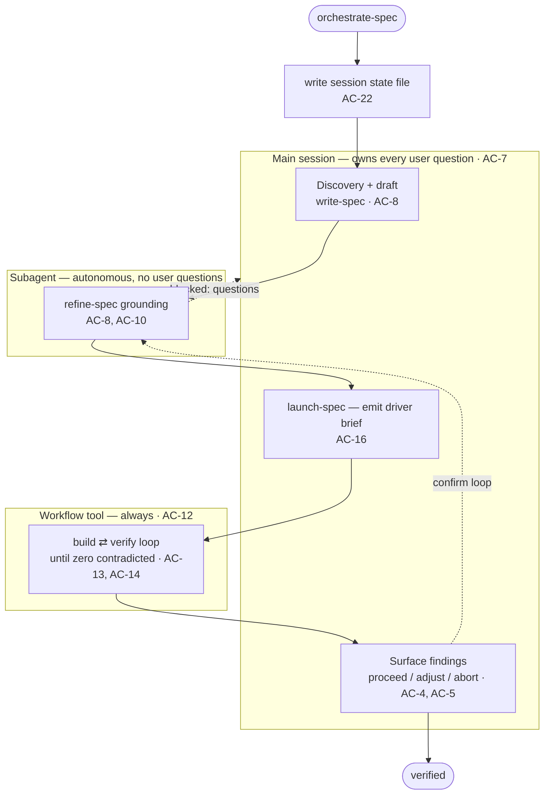

# orchestrate-spec Skill Spec

## TL;DR
- A new spec-ops skill, **`orchestrate-spec`**, runs the whole spec workflow — write → refine → launch → build → verify — in **one main session**, so the user never hand-runs each skill; it delegates the heavy, autonomous stages to fresh-context subagents/workflows and keeps the main session small.
- **breaks if missed:** subagents cannot ask the user (a Claude Code platform constraint) → the orchestrator MUST own every user question in the main session (AC-7, AC-9); the **build⇄verify stage always runs as a Workflow** (AC-12) that exits only on **zero `contradicted` criteria** (AC-14); and the delegated verify **returns its ledger** so the orchestrator can materialize the baseline (AC-17) — the verify ledger is session-keyed and deleted on success, so it can't be read back from `/tmp`.
- A skill-scoped **`Stop` hook** turns the pipeline into a state machine, blocking the turn from ending until each stage's **artifact** actually exists (AC-23, AC-24).

---

## Acceptance Criteria

`orchestrate-spec` **composes** the existing spec-ops skills and changes none of their behavior; the only edits to existing files are the additive `write` verbs in AC-19. AC-ids are globally unique and stable; the groups are a "what am I building" map, not a build order (this is one coherent skill — `launch-spec` will not phase it).

### 1. Pipeline, gates & the outer loop

| AC | Criterion |
|----|-----------|
| 1 | An end-to-end path from a bare idea to a verified implementation completes within a single `orchestrate-spec` run, without the user manually invoking any other spec-ops skill. |
| 2 | The run executes the stages in order — write → refine → launch → build → verify — and each stage begins only after the previous stage's **artifact** exists (order is enforced from artifacts, not assumed). |
| 3 | The run is configurable **from/to**: the user may enter at a later stage (e.g. from an existing ready spec) and/or stop early (e.g. at "ready spec"), and only stages within the selected range execute. |
| 4 | At every stage transition the orchestrator surfaces the stage's result and a **proceed / adjust / abort** gate before continuing. |
| 5 | After verify, the orchestrator surfaces the findings and any proposed amendments and **asks the user before looping back to refine** — the outer verify→refine loop is human-confirmed, never automatic. |
| 6 | On a confirmed loop, the orchestrator re-enters refine (ingesting the verify→refine amendments via `spec_amendments.py`) and re-runs the downstream stages. |

### 2. Main-session vs delegation boundary

| AC | Criterion |
|----|-----------|
| 7 | **Platform invariant (relied upon):** subagents cannot call `AskUserQuestion`. Therefore all user interaction — discovery, clarification, driver selection, stage-gate approvals, surfacing of findings — happens in the **main session**; no subagent ever prompts the user. |
| 8 | Discovery and the initial **draft run in the main session** (preserving discovery context); **refine-grounding is delegated to a subagent**, and build⇄verify runs as a Workflow (AC-12). |
| 9 | A delegated stage that needs a user decision returns a structured **"blocked — questions"** result; the orchestrator surfaces those in one batched `AskUserQuestion` round and re-dispatches the stage with the answers. |
| 10 | Delegated stages **invoke the real spec-ops skills** (`refine-spec`, `verify-spec`) rather than reimplementing their logic. |
| 11 | Subagent return values are consumed as **structured results** (schema-validated where the orchestrator depends on specific fields), not trusted as free-text claims. |

### 3. Build + verify as a Workflow

"Workflow" here is the Claude Code **Workflow tool** — the same dynamic-workflow mechanism (`pipeline()` / `parallel()` JS spawning subagents) that `launch-spec`'s **`ultracode` driver** already emits. It is a **main-loop-only tool** (a subagent cannot call it — another reason the orchestrator runs in main); the orchestrator skill's own instruction to use it satisfies the tool's opt-in.

| AC | Criterion |
|----|-----------|
| 12 | The build⇄verify stage **always executes via the Workflow tool** — never as a main-session `/goal` or `/batch` run. |
| 13 | `launch-spec`'s selected driver-type maps to a workflow shape: **`/goal` → a build⇄verify loop** (its emitted build instructions become the loop's build node; the loop owns the single verify gate — see body); **`/batch` → `parallel`/`pipeline`** over the batch units; **`ultracode` (dynamic workflow) → run its emitted workflow brief directly**. |
| 14 | The loop exits when the verify stage reports **zero `contradicted` acceptance criteria** — a bar **deliberately stricter than verify-spec's own gate**, which lets `contradicted` findings pass — bounded by a **max-iteration cap (default 3)**; reaching the cap unconverged returns a structured **"blocked — unconverged"** result. |
| 15 | The build workflow is **autonomous**: it never attempts to ask the user, and a genuine spec gap or blocker is returned as a structured **"blocked"** result the orchestrator surfaces in the main session. |
| 16 | `launch-spec`'s standalone behavior is **unchanged** (still emit-only; still selects among its three drivers); the orchestrator consumes its emitted driver prompt/brief as the workflow's build instruction. |
| 17 | The verify stage **returns its complete verify ledger** as part of its structured result; the orchestrator persists that ledger to a temp file for the `write` verbs (AC-18) — materialization never depends on the session-keyed verify ledger surviving in `/tmp`. |

### 4. Deterministic side effects

| AC | Criterion |
|----|-----------|
| 18 | The orchestrator drives every spec side-effect **from the main session**: `spec_git.py commit` (draft; ready spec); and — from the persisted verify ledger (AC-17) — `skills/verify-spec/drift_baseline.py write` + `scripts/spec_amendments.py write` to materialize the baseline and the verify→refine amendments. |
| 19 | `skills/verify-spec/drift_baseline.py` and `scripts/spec_amendments.py` each gain an **additive `write <spec> <ledger-file>` verb** that emits the **same artifact** verify-spec's `Stop` hook would, reusing existing module functions — baseline via `criteria_from_claims(marker["claims"])` + `current_head_sha()` → `write_baseline(spec, sha, criteria)`; amendments via `findings_from_ledger(marker)` → `write_amendments(spec, findings)` (template: the `write_drift_baseline` / `write_spec_amendments` helpers in `skills/verify-spec/stop_verify_spec.py`). The verb is idempotent (amendments clear on empty findings, per `write_amendments`) and returns distinct exit codes per the project convention. Existing verbs and verify-spec's `Stop` hook are unchanged. |
| 20 | Side effects are correct **regardless of whether skill-scoped hooks also fire** inside delegated subagents/workflows: a double-write is a harmless idempotent overwrite, and a non-fire is covered by the orchestrator's own call. |
| 21 | Every commit is **scoped to the spec file only** — never `git add -A`, never a push. The orchestrator passes a **single canonical absolute spec path** (symlinks resolved once up front) to all scripts, so the per-script `/tmp` keys stay self-consistent (baseline keys on `abspath`, amendments on `realpath`). |

### 5. Self-enforcement state machine & resume

| AC | Criterion |
|----|-----------|
| 22 | On start, the orchestrator writes a **session-keyed state file** at `/tmp/claude-orchestrate-spec-${CLAUDE_SESSION_ID}.json` recording the ordered stages, each stage's status, the spec path, the from/to range, the next expected action, and an abort flag. |
| 23 | A **skill-scoped `Stop` hook** (active only while `orchestrate-spec` runs, registered via SKILL.md frontmatter — the same registration mechanism `refine-spec`/`verify-spec` use) blocks the turn from ending while any in-range stage is incomplete, re-injecting which stage to run next. |
| 24 | The hook judges each stage's completeness from **artifact ground-truth**, never self-reported state: draft / ready spec committed (`spec_git.py needs-commit` → `no`); **verify complete = the drift baseline** (located via `drift_baseline.py path`) exists, its `verifiedAtSHA` equals current `HEAD`, and **no criterion's verdict is `contradicted`** (read via `drift_baseline.py load`). |
| 25 | The user can **abort**: when the user explicitly aborts, the orchestrator sets the abort flag and the `Stop` hook then allows the turn to end. |
| 26 | The hook has a **loud fallback**: after a bounded number of consecutive blocks (**default 3** — an independent counter from AC-14's build-loop cap) on the same stage with no artifact progress, it stops blocking and surfaces the stall. |
| 27 | The hook **fails open** when it cannot tell a run is active, or on its own error — never wedging an unrelated session — consistent with the existing spec-ops hooks. |
| 28 | **Same-session resume:** re-invoking `orchestrate-spec` in the same session continues at the first incomplete in-range stage (stages whose artifacts already exist are skipped); a state file from a **completed or aborted** run is not resumed — it is replaced by a fresh run. |

### 6. Packaging & non-regression

| AC | Criterion |
|----|-----------|
| 29 | The four existing skills (`write-spec`, `refine-spec`, `launch-spec`, `verify-spec`) keep their standalone behavior **unchanged** — the only edits to existing files are the additive `write` verbs (AC-19). |
| 30 | The new skill is registered and discoverable, and is **user-invocation-only** (`disable-model-invocation: true`), since it commits and spawns workflows. |
| 31 | The plugin version is bumped in the repo-root **`.claude-plugin/marketplace.json`** (the only place spec-ops versions live), from the current `0.16.1` to `0.17.0`. |

---

## How orchestrate-spec runs the pipeline

**Today:** the user runs `write-spec`, then `refine-spec`, then `launch-spec`, then the emitted driver, then `verify-spec` — each by hand, each piling onto one growing context.
**Target:** one `orchestrate-spec` invocation drives all five, delegating the heavy stages to fresh contexts and keeping only the interaction + control flow in the main session.



### Stage map

The orchestrator runs each stage in the lane below, checks the **artifact** as the completeness signal, and itself calls the **side-effect script** from the main session — so correctness never depends on a subagent's hook firing (AC-18, AC-20).

| Stage | Runs where | Invoked via | Completeness artifact | Side-effect the orchestrator calls |
|---|---|---|---|---|
| **Discovery + draft** | Main | `write-spec` in-session | committed **draft** spec file | `spec_git.py commit` (draft) |
| **Refine** | Subagent (grounding) ⇄ Main (questions) | `Task` → `spec-ops:refine-spec` | committed **ready** spec | `spec_git.py commit` (ready) |
| **Launch** | Main | `spec-ops:launch-spec` (emit-only) | emitted **driver prompt/brief** + driver-type | — |
| **Build ⇄ Verify** | **Workflow tool** | shape by driver-type; verify is the loop's check stage | **drift baseline** at HEAD SHA, zero `contradicted` | `drift_baseline.py write` + `spec_amendments.py write` (from the returned ledger) |
| **Outer loop** | Main | `AskUserQuestion` → back to Refine | (human decision) | `spec_amendments.py` ingest on re-refine |

A **verify-only** range (from/to = verify, e.g. against an existing implementation) runs verify as a single delegated subagent that returns its ledger — same materialize step, no build loop.

### Batched-question contract (AC-9, AC-11)

A delegated subagent that hits a decision it cannot make returns `{ status: "blocked", questions: [{ q, options, recommended }] }` (else `{ status: "ok", result }`). The orchestrator renders the questions in **one** `AskUserQuestion` round, then re-dispatches the same stage with the answers appended. It depends only on the schema'd fields — a subagent's prose is never taken as ground truth.

### Build ⇄ verify as a Workflow (AC-12 – AC-19)

`launch-spec` is emit-only; the orchestrator takes its emitted brief and **runs it via the Workflow tool** (never a literal main-session `/goal`/`/batch`). The workflow loops **build → verify**; the verify stage invokes `verify-spec` and returns a structured `{ verdict, ledger }`. The build node performs only the implementation work; the loop's verify stage is the **single done-gate** — when the `/goal` driver is the build node, the orchestrator does **not** also fire that driver's own embedded verify gate (that embedded gate is for standalone `/goal` use). The loop's **exit condition is zero `contradicted` criteria** — read from the verdict directly, bounded by a max-iteration cap (**default 3**). Because verify-spec's *own* gate lets `contradicted` findings pass, the orchestrator's zero-contradicted bar is the **stricter** one and is enforced here, not by verify.

When the loop finishes, the workflow **returns its final verify ledger** to the orchestrator, which (in the main session) writes it to a temp file and materializes the persistent artifacts:

```bash
python3 "${SPEC_OPS}/skills/verify-spec/drift_baseline.py" write <abs-spec-path> <ledger-file>   # baseline: verifiedAtSHA + per-AC verdicts
python3 "${SPEC_OPS}/scripts/spec_amendments.py"          write <abs-spec-path> <ledger-file>   # verify→refine handoff (backward-sweep findings)
```

These new `write` verbs reuse verify-spec's module functions (AC-19), so they emit the **identical** artifact the verify `Stop` hook would — the orchestrator no longer depends on that hook firing inside the workflow.

### State file & the Stop-hook gate (AC-22 – AC-28)

- **State file:** session-keyed JSON at `/tmp/claude-orchestrate-spec-${CLAUDE_SESSION_ID}.json` (the same `/tmp` + session-key convention `refine-spec` uses). It holds the ordered stage list, each stage's `status`, the spec path, the `from`/`to` range, the `next` action, and an `abort` flag. On invocation, an existing state file for a **completed or aborted** run is replaced; an incomplete one is **resumed** (AC-28).
- **The gate:** the skill-scoped `Stop` hook re-reads the state on every attempted turn-end and **verifies the next in-range stage's artifact against ground truth** before allowing progress — draft/ready committed (`spec_git.py needs-commit`), and **verify done = the drift baseline exists at the current HEAD SHA with no `contradicted` criterion** (located via `drift_baseline.py path`, read via `drift_baseline.py load`; the baseline keys on `abspath`, so resolve it through the script, never by recomputing the key). If an in-range stage is incomplete it **blocks and re-injects the next action**; if `abort` is set, or after the bounded no-progress fallback, it allows the stop; it **fails open** when it can't tell a run is active.

---

## Boundaries

- **Do not modify** `write-spec`, `refine-spec`, `launch-spec`, or `verify-spec` behavior — `orchestrate-spec` *composes* them. In particular, **`launch-spec` stays emit-only**.
- **The only permitted edits to existing files** are the **additive `write` verbs** on `skills/verify-spec/drift_baseline.py` and `scripts/spec_amendments.py` (AC-19) — existing verbs, module functions, and verify-spec's `Stop` hook must behave exactly as before.
- **Do not depend on skill-scoped hooks firing inside subagents/workflows** — drive all side effects by calling the scripts from the main session. Treat any hook double-write as a harmless idempotent overwrite.
- **Reuse the existing scripts**; do not duplicate their logic or any skill's logic.
- **Commits:** path-scoped to the spec file only, never `git add -A`/`.`, never push.
- **Versioning:** bump in the repo-root `.claude-plugin/marketplace.json` only; never add a `version` to `plugin.json`.
- Build the skill with **`skill-creator`** and follow the project's skill patterns (thin skill over a deterministic engine; the hook enforces the invariant; `disable-model-invocation: true`). State lives in the state engine, not prose.

---

## Checklist

**Skill — `skills/orchestrate-spec/SKILL.md`** (frontmatter incl. `hooks: Stop`, `disable-model-invocation: true`, tools: Read/Write/Edit/Bash/Task/Skill/Workflow/AskUserQuestion)
- [ ] Pipeline sequencing, from/to range, stage gates, outer loop — AC-1, AC-2, AC-3, AC-4, AC-5, AC-6
- [ ] Main-vs-delegation boundary + batched-question contract — AC-7, AC-8, AC-9, AC-10, AC-11
- [ ] Build⇄verify always-Workflow, driver→shape mapping, zero-contradicted exit + cap, autonomy, ledger return — AC-12, AC-13, AC-14, AC-15, AC-16, AC-17

**Stop hook — `skills/orchestrate-spec/stop_orchestrate_spec.py`**
- [ ] Artifact-ground-truth gate (incl. drift-baseline SHA + zero-contradicted check), abort flag, bounded loud fallback, fail-open — AC-23, AC-24, AC-25, AC-26, AC-27

**State engine — `scripts/spec_orchestrator.py`** (CLI: `init` / `status` / `advance` / `abort` / `check`)
- [ ] Session-keyed state file shape, stage/artifact status, same-session resume / stale-state replace — AC-22, AC-24, AC-28

**Side-effect verbs (additive, existing scripts)**
- [ ] `write` verb on `skills/verify-spec/drift_baseline.py` and `scripts/spec_amendments.py` (reuse module fns; emit-identical) — AC-19
- [ ] Orchestrator-driven commit + materialize calls; scoped commits; single canonical spec path — AC-18, AC-20, AC-21

**Packaging — repo-root `.claude-plugin/marketplace.json`**
- [ ] Skill registered + user-invocation-only; version `0.16.1 → 0.17.0`; existing skills' behavior untouched — AC-29, AC-30, AC-31
