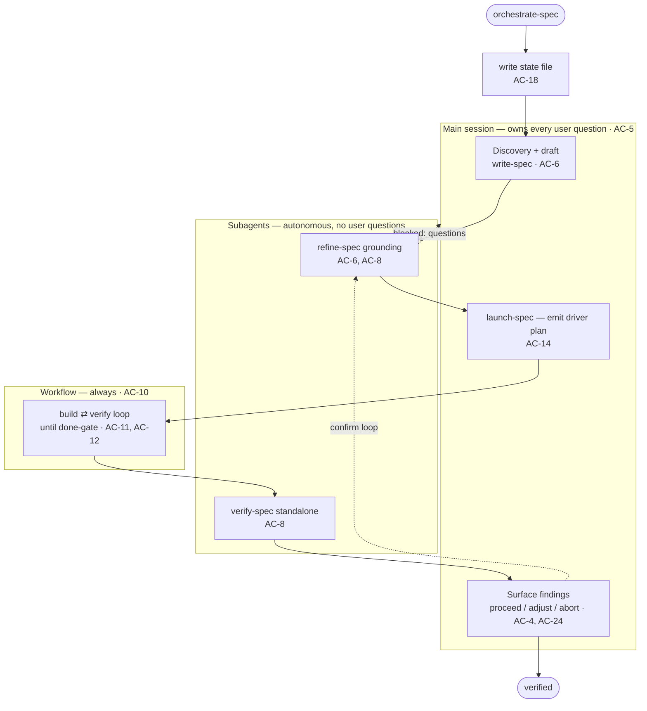

# orchestrate-spec Skill Spec

## TL;DR
- A new spec-ops skill, **`orchestrate-spec`**, runs the whole spec workflow — write → refine → launch → build → verify — in **one main session**, so the user never hand-runs each skill; it delegates the heavy, autonomous stages to fresh-context subagents/workflows and keeps the main session small.
- **breaks if missed:** subagents cannot ask the user (`AskUserQuestion` is unavailable to them) — the orchestrator MUST own every user question in the main session (AC-5, AC-7); and the **build⇄verify stage always runs as a Workflow**, never a main-session `/goal`/`/batch` (AC-10).
- A skill-scoped **`Stop` hook** turns the pipeline into a state machine: it blocks the turn from ending until each stage's *artifact* actually exists (AC-19, AC-20) — the reliability rail against a polluted main context "forgetting" to continue.

---

## Acceptance Criteria

The orchestrator delegates to the existing spec-ops skills and **modifies none of them**. AC-ids are globally unique and stable; the groups are a "what am I building" map, not a build order.

### 1. Pipeline & orchestration

| AC | Criterion |
|----|-----------|
| 1 | An end-to-end path from a bare idea to a verified implementation completes within a single `orchestrate-spec` run, without the user manually invoking any other spec-ops skill. |
| 2 | The run executes the stages in order — write → refine → launch → build → verify — and each stage begins only after the previous stage's **artifact** exists (order is enforced from artifacts, not assumed). |
| 3 | The run is configurable **from/to**: the user may enter at a later stage (e.g. from an existing ready spec) and/or stop early (e.g. at "ready spec"), and only stages within the selected range execute. |
| 4 | At every stage transition the orchestrator surfaces the stage's result and a **proceed / adjust / abort** gate before continuing — the human checkpoints are preserved, not bypassed. |

### 2. Main-session vs delegation boundary

| AC | Criterion |
|----|-----------|
| 5 | All user interaction — discovery, requirement/constraint clarification, driver selection, stage-gate approvals, surfacing of findings — happens in the **main session** via `AskUserQuestion`; no subagent ever prompts the user. |
| 6 | Discovery and the initial **draft run in the main session** (preserving discovery context); **refine-grounding and standalone verify are delegated to subagents**. |
| 7 | A delegated stage that needs a user decision returns a structured **"blocked — questions"** result; the orchestrator surfaces those in one batched `AskUserQuestion` round and re-dispatches the stage with the answers — it never leaves a subagent to ask. |
| 8 | Delegated stages **invoke the real spec-ops skills** (`refine-spec`, `verify-spec`) rather than reimplementing their logic. |
| 9 | Subagent return values are consumed as **structured results** (schema-validated where the orchestrator depends on specific fields), not trusted as free-text claims. |

### 3. Build + verify as a Workflow

| AC | Criterion |
|----|-----------|
| 10 | The build⇄verify stage **always executes as a Workflow** — never as a main-session `/goal` or `/batch` run. |
| 11 | `launch-spec`'s selected driver-type maps to a workflow shape: **`/goal` → a loop** that builds then verifies until verify passes; **`/batch` → parallel/pipeline** over AC groups; **`ultracode` → its existing workflow**. |
| 12 | The inner build⇄verify loop is **gated by `verify-spec` passing every acceptance criterion** (the done-gate), bounded by a maximum iteration cap. |
| 13 | The build workflow is **autonomous**: it never attempts to ask the user, and a genuine spec gap or blocker is returned as a structured **"blocked"** result the orchestrator surfaces in the main session. |
| 14 | `launch-spec`'s standalone behavior is **unchanged** (still emit-only; still selects among the three drivers); the orchestrator consumes its compiled build plan as the workflow stage's prompt. |

### 4. Deterministic side effects

| AC | Criterion |
|----|-----------|
| 15 | The orchestrator drives every spec side-effect by calling the **standalone scripts from the main session** — `spec_git.py` (commit the draft; commit the ready spec), `drift_baseline.py` (verify baseline), `spec_amendments.py` (verify→refine handoff). |
| 16 | Side effects are correct **regardless of whether skill-scoped hooks also fire inside delegated subagents**: a double-fire is a harmless idempotent no-op, and a non-fire is covered by the orchestrator's own call. |
| 17 | Every commit is **scoped to the spec file only** — never `git add -A`, never a push — consistent with `spec_git.py`. |

### 5. Self-enforcement state machine

| AC | Criterion |
|----|-----------|
| 18 | On start, the orchestrator writes a **state file** recording the ordered stages, each stage's status, the spec path, the configured from/to range, the next expected action, and an abort flag. |
| 19 | A **skill-scoped `Stop` hook** (active only while `orchestrate-spec` runs, registered via SKILL.md frontmatter like `refine-spec`/`verify-spec`) blocks the turn from ending while any in-range stage is incomplete, re-injecting which stage to run next. |
| 20 | The hook judges each stage's completeness from **artifact ground-truth** (draft committed? ready spec committed? verify ledger present and gate-passed?), not from self-reported state. |
| 21 | The user can **abort**: when the user explicitly aborts, the orchestrator sets the abort flag and the `Stop` hook then allows the turn to end. |
| 22 | The hook has a **loud fallback**: after a small bounded number of consecutive blocks on the same stage with no artifact progress, it stops blocking and surfaces the stall rather than looping forever. |
| 23 | The hook **fails open** when it cannot tell a run is active, or on its own error — never wedging an unrelated session — consistent with the existing spec-ops hooks. |

### 6. Outer loop & resume

| AC | Criterion |
|----|-----------|
| 24 | After verify, the orchestrator surfaces the findings and any proposed amendments and **asks the user before looping back to refine** — the outer verify→refine loop is human-confirmed, never automatic. |
| 25 | If the user confirms a loop, the orchestrator **re-enters refine** (ingesting the verify→refine amendments via `spec_amendments.py`) and re-runs the downstream stages. |
| 26 | Re-invoking `orchestrate-spec` for an interrupted run **resumes from the state file**: stages whose artifacts already exist are skipped, and execution continues at the first incomplete in-range stage. |

### 7. Packaging & non-regression

| AC | Criterion |
|----|-----------|
| 27 | The four existing skills (`write-spec`, `refine-spec`, `launch-spec`, `verify-spec`) keep their standalone behavior **unchanged** — `orchestrate-spec` composes them and modifies none. |
| 28 | The new skill is registered and discoverable, and is **user-invocation-only** (`disable-model-invocation: true`), since it commits and spawns workflows. |
| 29 | The plugin **version is bumped in `marketplace.json`** (the only place spec-ops versions live). |

---

## How orchestrate-spec runs the pipeline

**Today:** the user runs `write-spec`, then `refine-spec`, then `launch-spec`, then the emitted driver, then `verify-spec` — each by hand, each piling onto one growing context (or across disconnected sessions, re-feeding the spec path each time).
**Target:** one `orchestrate-spec` invocation drives all five, delegating the heavy stages to fresh contexts and keeping only the interaction + control flow in the main session.

### Stage map

The orchestrator runs each stage in the lane below, checks the **artifact** as the completeness signal, and itself calls the **side-effect script** (so correctness never depends on a subagent's hook firing — AC-15, AC-16).

| Stage | Runs where | Invoked via | Completeness artifact | Side-effect the orchestrator calls |
|---|---|---|---|---|
| **Discovery + draft** | Main | `write-spec` in-session | committed **draft** spec file | `spec_git.py commit` (draft) |
| **Refine** | Subagent (grounding) ⇄ Main (questions) | `Task` → `spec-ops:refine-spec` | committed **ready** spec | `spec_git.py commit` (ready) |
| **Launch** | Main | `spec-ops:launch-spec` (emit-only) | compiled **build plan** + driver-type | — |
| **Build ⇄ Verify** | **Workflow** | `Workflow` (template by driver-type) | **verify ledger** present + gate-passed | `drift_baseline.py`, then `spec_amendments.py` |
| **Outer loop** | Main | `AskUserQuestion` → back to Refine | (human decision) | `spec_amendments.py` ingest on re-refine |

### Batched-question contract (AC-7, AC-9)

A delegated subagent that hits a decision it cannot make returns a structured result of the shape `{ status: "blocked", questions: [{ q, options, recommended }] }` (or `{ status: "ok", result }`). The orchestrator renders the questions in **one** `AskUserQuestion` round, then re-dispatches the same stage with the answers appended. The orchestrator depends only on the schema'd fields — a subagent's prose is never taken as ground truth (a subagent in testing confidently misreported a plugin version, so structured + verified is the rule).

### State file & the Stop-hook gate (AC-18 – AC-23)

- **Location/format:** a JSON state file at `/tmp/claude-orchestrate-spec-${CLAUDE_SESSION_ID}.json` — the same `/tmp` + session-key convention the `refine-spec` ledger uses. It holds: the ordered stage list, each stage's `status`, the spec path, the `from`/`to` range, the `next` action, and an `abort` flag.
- **The gate:** the skill-scoped `Stop` hook re-reads the state on every attempted turn-end and **verifies the next in-range stage's artifact against ground truth** before allowing progress — draft committed (`spec_git.py needs-commit`), ready spec committed, verify ledger present and gate-passed. If an in-range stage is incomplete, it **blocks and re-injects the next action**; if `abort` is set, or after a bounded number of no-progress blocks, it allows the stop (loud fallback); it **fails open** when it can't tell a run is active.

---

## Boundaries

- **Do not modify** `write-spec`, `refine-spec`, `launch-spec`, or `verify-spec` behavior — `orchestrate-spec` *composes* them. In particular, **`launch-spec` stays emit-only** (it selects + compiles a driver; it does not execute).
- **Do not depend on skill-scoped hooks firing inside subagents** — drive all side effects by calling the existing scripts from the main session. Treat any hook double-fire as a harmless no-op.
- **Reuse the existing scripts** (`scripts/spec_git.py`, `scripts/spec_amendments.py`, `skills/verify-spec/drift_baseline.py`); do not duplicate their logic or any skill's logic.
- **Commits:** path-scoped to the spec file only, never `git add -A`/`.`, never push.
- **Versioning:** bump in `marketplace.json` only; never add a `version` to `plugin.json`.
- Build the skill with **`skill-creator`** and follow the project's skill patterns (thin skill over a deterministic engine; the hook enforces the invariant; `disable-model-invocation: true`). State lives in scripts, not prose.

---

## Checklist

**Skill — `skills/orchestrate-spec/SKILL.md`** (frontmatter incl. `hooks: Stop`, `disable-model-invocation: true`, tools: Read/Write/Edit/Bash/Task/Skill/Workflow/AskUserQuestion)
- [ ] Pipeline sequencing, from/to range, stage gates, resume — AC-1, AC-2, AC-3, AC-4, AC-26
- [ ] Main-vs-delegation boundary + batched-question contract — AC-5, AC-6, AC-7, AC-8, AC-9
- [ ] Build⇄verify always-Workflow + driver→shape mapping + autonomy — AC-10, AC-11, AC-12, AC-13, AC-14
- [ ] Outer verify→refine loop (human-confirmed) — AC-24, AC-25

**Stop hook — `skills/orchestrate-spec/stop_orchestrate_spec.py`**
- [ ] Artifact-ground-truth gate, abort flag, bounded loud fallback, fail-open — AC-19, AC-20, AC-21, AC-22, AC-23

**State engine — `scripts/spec_orchestrator.py`** (CLI: `init` / `status` / `advance` / `abort` / `check`)
- [ ] State file shape, session-keyed `/tmp` path, stage/artifact status — AC-18, AC-20, AC-26

**Side-effect wiring** (reuse, no new logic)
- [ ] Orchestrator-driven `spec_git.py` / `drift_baseline.py` / `spec_amendments.py` calls; scoped commits — AC-15, AC-16, AC-17, AC-25

**Packaging — `.claude-plugin/marketplace.json`**
- [ ] Skill registered + user-invocation-only; version bump; existing skills untouched — AC-27, AC-28, AC-29
