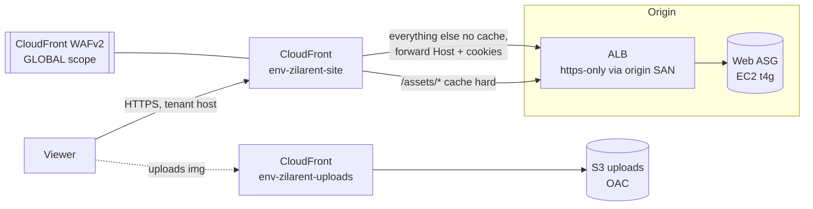

# CDN Site Fronting Spec

Put CloudFront in front of the whole site (ALB origin) to edge-cache static assets and
offload the web tier. **Scope: CDN + static delivery only** — DB/cache/OPcache rework is
deferred (see [Deferred](#deferred)).

## TL;DR

- **New CloudFront distribution** (`[env]-zilarent-site`) fronts every tenant host with the **ALB as origin**: `/assets/*` edge-cached hard, everything else uncached so auth/checkout/dashboard stay correct.
- Cache-busting is per-release **`?v=<sha>`** — but hundreds of asset URLs don't carry it today, the highest-risk fix (AC-24).
- **Breaks the site if missed:** forward the viewer `Host` (AC-2), trust CloudFront's IPs so auto-ban doesn't misfire (AC-19), carve out file-upload routes or checkout breaks (AC-16), cache **only** `/assets/*` (AC-3).

---

## Acceptance Criteria

*Build top-down; §N order is a suggested reading order, `needs §X` is the binding dependency. No dates — order is dependency-derived. AC-ids are globally unique and stable.*

### 1. CloudFront distribution & static delivery — start here

| AC | Criterion |
|----|-----------|
| 1 | A new CloudFront distribution `[env]-zilarent-site` fronts every tenant host with the existing ALB as origin. |
| 2 | The default `*` behavior is uncached (`CachingDisabled` + `AllViewer`): forwards viewer Host + cookies + query, allows all HTTP methods, compresses. |
| 3 | `/assets/*` is the only cached behavior: the cache key includes the `v` query and omits Host/cookies, TTL min 0 / default 86400 / max 31536000, brotli+gzip — **not** `Managed-CachingOptimized`. |
| 4 | No cache behavior exists for `/robots.txt`, `/sitemap.xml`, or `/favicon.ico` (they stay on the uncached default). |
| 5 | Distribution settings hold: `http2and3`, `PriceClass_All`, viewer protocol `redirect-to-https`, IPv6 enabled, `us-east-1` SNI-only `TLSv1.2_2021` ACM cert keyed on `site_aliases`, `origin_read_timeout = 60`, raised origin keep-alive. |
| 6 | 5xx responses are not edge-cached (`custom_error_response error_caching_min_ttl = 0` for 500/502/503/504). |
| 7 | A CloudFront response-headers policy on `site` sets HSTS `max-age=300` (no `preload`/`includeSubDomains`), `X-Content-Type-Options: nosniff`, `Referrer-Policy: strict-origin-when-cross-origin`. |
| 8 | The existing `uploads` distribution is bumped to `PriceClass_All`. |
| 9 | Uploads are served through the `uploads` CloudFront domain: `aws.cdn.domain` is set per env and the legacy `aws.cdn.{bucket,region,credentials}` keys are retired. |

### 2. Origin trust & lock-down — needs §1

| AC | Criterion |
|----|-----------|
| 10 | `origin.<env>.zila.rent` (CNAME → ALB DNS) is the CloudFront origin `domain_name` and a SAN on the ALB ACM cert, so origin TLS validates. |
| 11 | An `X-Origin-Verify` secret (Secrets Manager, `ignore_changes`) is sent by the CloudFront origin header and enforced by the ALB listener rule (403 on missing/mismatch). |
| 12 | The ALB security group is restricted to the CloudFront origin-facing managed prefix list. |
| 13 | The ALB WAF is reduced/removed **only after** AC-11 + AC-12 are deployed and verified. |

### 3. WAF migration — needs §2

| AC | Criterion |
|----|-----------|
| 14 | A new `CLOUDFRONT`-scoped WebACL on `site` is the sole home of IP blocking: operator IPv4 block set + AWS-managed Common + Known-Bad-Inputs + IP-Reputation. |
| 15 | A Stripe-webhook carve-out waives `SizeRestrictions_BODY` / `RestrictedExtensions` for `api/stripe/webhook/(:segment)`. |
| 16 | Upload routes carve out `SizeRestrictions_BODY` **and** `CrossSiteScripting_BODY` (→ Count): public `Checkout::uploadDrivingLicense\|uploadInsurance` (**breaks checkout if missed**) plus the listed admin upload routes. |
| 17 | Staging removes the regional ALB WebACL entirely; prod keeps a managed content-rules backstop (Common + Known-Bad-Inputs; no IP set, no IP-reputation) mirroring the Stripe + upload carve-outs. |
| 18 | The old regional operator IP set is deleted (recreated at `CLOUDFRONT` scope). |

### 4. Behind-the-edge request correctness — needs §1

| AC | Criterion |
|----|-----------|
| 19 | `get_client_ip()` returns the real viewer IP, not a CloudFront edge IP: nginx `set_real_ip_from` includes CloudFront's published CIDRs (IPv4 + IPv6), regenerated at each AMI bake from `ip-ranges.json`. |
| 20 | The dead `CF-Connecting-IP` branch is removed from `get_client_ip()` + `error_blocked.php`; `security.enableAutoBan` stays off until verified. |
| 21 | Cookies are `Secure` (`Config\Cookie::$secure = true`). |
| 22 | CloudFront forwards `X-Forwarded-Proto`, so the app keeps emitting `https://` URLs. |
| 23 | http→https and any www→apex redirects happen at CloudFront or the nginx vhost (never the `.htaccess` literal); no redirect loop, no mixed content. |

### 5. Asset versioning & cache correctness — needs §1

| AC | Criterion |
|----|-----------|
| 24 | Every `/assets/*` URL carries `?v=<sha>`: an idempotent pass in `GlobalFilter::after()` stamps `?v=<asset.version>` onto unversioned `/assets/…` URLs, gated on `RUNNING_MODE==='prod'` and **separate** from `content_cdn_process`. |
| 25 | nginx sets `Cache-Control: public, max-age=31536000, immutable` on `^/assets/` (baked into the AMI); landed **only after** AC-24. |
| 26 | nginx `gzip` is enabled for dynamic content types at the origin. |
| 27 | The deploy busts the page cache (`rm -rf shared/writable/cache/public`) after the symlink swap. |
| 28 | `asset.version` continues to stamp the release SHA per deploy (not regressed). |

### 6. Deploy & timeout correctness — needs §5

| AC | Criterion |
|----|-----------|
| 29 | Prod runs a post-deploy `/assets/*` CloudFront invalidation after the fleet is fully on the new release; staging does not. |
| 30 | The smoke test validates `/health` through CloudFront (uncached) against the locked-down origin; the `--resolve` direct-ALB bypass is dropped; a direct ALB hit from outside the prefix list is refused at the SG. |
| 31 | No stale PHP (distinct `releases/<sha>` realpath + FPM reload per deploy) and no stale assets/HTML (given AC-24 + AC-27). |
| 32 | Long synchronous requests (>60s imports/exports) are moved to the Redis task queue (else accept a CloudFront 504). |

### 7. DNS cutover — needs §2, §4, §5, §6

| AC | Criterion |
|----|-----------|
| 33 | Per env, the app/web/deploy changes land **before** any host is repointed, so the first edge traffic is correct. |
| 34 | Each brand host is repointed to the CloudFront domain per-brand (staging `stagingv3.zila.rent` first, then prod): apex hosts via ALIAS/ANAME/CNAME-flattening (or `www` + redirect), subdomains via plain CNAME. |
| 35 | `domains.settings.cdn_enable = 0` is forced on every domain. |
| 36 | A break-glass rollback is documented: repoint the host to the ALB, reopen the ALB SG, and disable the `X-Origin-Verify` listener rule. |

---

## Current state

| Path | Today | Target |
|------|-------|--------|
| Website + dashboard HTML | Brand hosts → ALB (HTTPS 443) → EC2 — **no CDN** | CloudFront → ALB, dynamic uncached |
| `/assets/*` (js/css/themes/fonts) | nginx off the EC2 box, **no `Cache-Control`** | CloudFront edge-cached, long TTL |
| User uploads (`/files`, `/uploads`) | Referenced **direct from S3** (legacy ap-northeast-1) | Existing `[env]-zilarent-uploads` CloudFront (already built) |
| WAF | Regional, on the ALB ([`modules/edge`](../terraform/modules/edge/main.tf)) | CloudFront WAF owns all IP rules; ALB backstop = prod content-rules only, staging none |

Tenant brand domains are a **mix of apex and subdomain hosts**, each with DNS at its **own
brand's provider** — **CloudFlare is not in use** (its `CF-Connecting-IP` reads in
`get_client_ip()` and `error_blocked.php` are dead legacy and get removed). **Apex** brands
need ALIAS/ANAME/CNAME-flattening (a subdomain can plain-CNAME), so cutover is coordinated
**per brand** (see [DNS cutover](#dns-cutover)).

The app is already CDN-aware: `get_base_asset_url()`, `cdn_url_status()`, and `assets_version()`
in [`url_helper.php`](../../app/Helpers/url_helper.php), plus the private `content_cdn_process()`
body rewrite in `GlobalFilter::after()`. This spec builds the missing distribution; it does
**not** flip the app's `cdn_distribution_url` plumbing on (in fact `domains.settings` must keep
`cdn_enable=0` — see [Boundaries](#boundaries)).

---

## Boundaries

Out of scope — the implementer must **not**:

- **Flip the app's own CDN plumbing on.** Keep `domains.settings.cdn_enable = 0` on every domain; `content_cdn_process()` / `cdn_distribution_url` stay off. CloudFront fronts the site while the app keeps emitting root-relative `/assets/…`. Enabling both double-rewrites asset URLs.
- **Cache anything but `/assets/*`.** Never add a cached behavior for a path that varies per tenant at the same URL — HTML, dashboard, checkout, APIs, `/robots.txt`, `/sitemap.xml`, `/favicon.ico`.
- **Nest the §0 `?v=` stamp inside `content_cdn_process`.** It is a *separate*, `RUNNING_MODE=prod` pass; `content_cdn_process` is gated off by `cdn_url_status()`.
- **Pull in backend/perf work** — page-cache→Redis, RDS right-sizing, OPcache preload are [Deferred](#deferred).
- **Reduce or remove the ALB WAF before** the origin lock-down (SG prefix list + `X-Origin-Verify`) is deployed and verified.

---

## Target architecture

---

## CloudFront site distribution

New `aws_cloudfront_distribution.site` in [`modules/cdn`](../terraform/modules/cdn/main.tf),
wired in [`accounts/<env>/main.tf`](../terraform/accounts/staging/main.tf) alongside the
existing `uploads` distribution. Fed a new `site_aliases` variable (the tenant hostnames) with
its own ACM cert in `us-east-1` (reuse the module's cert pattern, keyed on `site_aliases`).

**Settings**

| Setting | Value |
|---|---|
| Aliases | Per-env `var.site_aliases` — **staging:** `stagingv3.zila.rent`; **prod:** `cars.bluediamondvacations.com` + `akamaikauairental.com` (no `www`) — see [DNS cutover](#dns-cutover) |
| Viewer cert | ACM in `us-east-1`, SNI-only, `TLSv1.2_2021` |
| `http_version` | `http2and3` |
| `price_class` | `PriceClass_All` (worldwide/APAC audience). **Also bump the existing `uploads` dist to `PriceClass_All`** (currently `PriceClass_100`). |
| Viewer protocol | `redirect-to-https` |
| IPv6 | enabled |

**Origin** — `origin_id = "alb-site"`, `domain_name = origin.<env>.zila.rent` (see
[Origin trust](#origin-trust); **not** the raw ALB DNS), custom origin config `https-only`,
**`origin_read_timeout = 60`** (CloudFront's max without a quota bump; matches ALB 60s idle /
FPM 90s terminate), keep-alive raised (`origin_keepalive_timeout`), plus a **secret custom
header** (`X-Origin-Verify`) the ALB checks. The secret lives in **Secrets Manager**
(`zilarent/<env>/platform/origin-verify`), `ignore_changes`'d, and is referenced in lockstep by
the CloudFront origin header and the ALB listener rule. Rotate both header-by-header — never
leave the ALB rule ahead of the origin header.

**Cache behaviors**

| Order | Path | Cache policy | Origin request policy | Notes |
|---|---|---|---|---|
| default | `*` | `CachingDisabled` `4135ea2d-6df8-44a3-9df3-4b5a84be39ad` | `AllViewer` `216adef6-5c7f-47e4-b989-5492eafa07d3` | Forwards Host + cookies + query. Dynamic HTML, checkout, dashboard, **and per-tenant `/robots.txt` · `/sitemap.xml` · `/favicon.ico`**. `compress=true`, **allow all methods** (POST/PUT/PATCH/DELETE). |
| 0 | `/assets/*` | **Custom** `[env]-zilarent-assets` — query `v` **in key**, brotli+gzip, TTL **min 0 / default 86400 / max 31536000** | **none** (omit `origin_request_policy_id`) | Keyed on **path + `?v` only** (cookies/Host stripped), `GET/HEAD`, `compress=true`. **Not** `CachingOptimized` (it sets QueryStrings=None, defeating `?v=`). |

> **Only `/assets/*` is cached.** Its key omits `Host`, safe **only** because assets are
> slug-pathed (`/assets/<slug>/…`) or genuinely shared (`/assets/admin`, `/assets/.common`) —
> the path alone identifies the bytes. **Never** cache a path that varies by tenant at the
> *same* URL — `/robots.txt` (custom-robots admin tool), `/sitemap.xml` (`Sitemap::index`),
> `/favicon.ico` — path-only caching would serve one tenant's file to another. They stay on the
> default (uncached, Host-forwarded) behavior. Anonymous public-HTML micro-caching is deferred;
> if added it must put `Host` in the key and handle the per-request CSRF `Set-Cookie`.

---

## Origin trust

The app resolves the tenant from the **`Host` header** (`TenantResolverFilter`), so CloudFront
must forward the viewer Host — handled by the `AllViewer` origin request policy.

But CloudFront-over-HTTPS validates the origin cert against the origin `domain_name`, and the
ALB's cert covers tenant domains, not its `*.elb.amazonaws.com` name — so the raw ALB DNS as
origin fails TLS. Fix:

- Create a stable **origin hostname** `origin.<env>.zila.rent` (a **CNAME → the ALB DNS name** — a subdomain, so CNAME is fine; the `zila.rent` zone is at GoDaddy, not Route 53) and use it as the CloudFront origin `domain_name`.
- Add it as a **SAN on the ALB ACM cert** (the Console-managed SAN pattern in `modules/acm` — `ignore_changes = [subject_alternative_names]` + `prevent_destroy` — survives `apply`; each brand onboarding already adds SANs this way).

---

## Client IP, host & scheme behind the edge

Audited against the live nginx/FPM config + app code. Scheme and host already work; the
client-IP path is the one that breaks.

- **Scheme: no change.** nginx maps `X-Forwarded-Proto: https` → `$_SERVER['HTTPS']=on` (`zilarent.conf`), so CI4 emits `https://` URLs (`baseURL` itself comes from the `app.baseURL` env). Just confirm CloudFront forwards `X-Forwarded-Proto`.
- **Host: no app change** — `AllViewer` forwards it (above).
- **Client IP — breaks when CloudFront is added; fix in nginx.** Today nginx `set_real_ip_from` (RFC1918) + `real_ip_recursive` resolves the real client because the only hop (the ALB) is RFC1918-trusted. Insert a CloudFront hop and the rightmost untrusted address becomes the **CloudFront edge IP**, so `REMOTE_ADDR` = edge IP — poisoning `IpBanFilter`/`BadRequestLogger` auto-ban (bans shared edge IPs) and audit logs. **Fix: add CloudFront's published IP ranges to nginx `set_real_ip_from`** so `real_ip_recursive` walks past the edge to the viewer; every IP consumer keeps working unchanged. Ranges change → at **AMI bake** (`infra/ami/build.sh`), fetch `https://ip-ranges.amazonaws.com/ip-ranges.json` and write one `set_real_ip_from` per CIDR where `service == "CLOUDFRONT"` (both `ipv4_prefixes` and `ipv6_prefixes`) into an nginx **include file** (e.g. `/etc/nginx/cloudfront-realip.conf`) that the `server` block `include`s; regenerated each rebake, so the ranges refresh. Remove the dead `CF-Connecting-IP` branch in `get_client_ip()` + `error_blocked.php`; keep `security.enableAutoBan` **off** until verified.
- **Cookies: set `Secure`.** `Config\Cookie::$secure = false` → `true` (the edge is always HTTPS; session/CSRF/remember-me inherit it). CSRF does no host check and sessions aren't IP-bound (`matchIP=false`), so neither breaks.
- **Redirects: not in `.htaccess`** (inert under nginx). Do http→https + any www→apex at **CloudFront** or in `infra/vhosts/zilarent.conf` — never port the `.htaccess` `http://` literal (downgrade loop).

---

## WAF

Source-IP rules only work where the request still carries the real client IP — that's
CloudFront, not the ALB (which sees edge IPs behind CloudFront). So **all IP-based filtering
moves to a new CloudFront WAF**; the ALB keeps at most content rules. The origin lock-down (not
a second WAF) is what guarantees nothing reaches the ALB uninspected.

**New CloudFront WebACL** — `scope = "CLOUDFRONT"` (`us-east-1`), on `[env]-zilarent-site`. Sole
home of IP blocking:

- Operator IPv4 block set, **recreated** at `CLOUDFRONT` scope seeded from the existing addresses (scope-bound → new resource per env; keep `ignore_changes` on `addresses`). Delete the old regional IP set.
- AWS managed: Common Rule Set, Known-Bad-Inputs, **and IP-Reputation**.
- Stripe-webhook carve-out on the Common Rule Set — waive `SizeRestrictions_BODY` / `RestrictedExtensions` for the webhook path (CI route `api/stripe/webhook/(:segment)` → WAF `POST` byte-match `starts-with /api/stripe/webhook/`) ([`infra-side-todos.md` §4](./infra-side-todos.md)).

**Regional ALB WebACL** ([`modules/edge`](../terraform/modules/edge/main.tf)):

- **Staging:** removed entirely — the origin lock-down is the only control.
- **Prod:** kept as a managed-**content**-rules backstop (Common Rule Set + Known-Bad-Inputs). No IP set, no IP-reputation (source-IP-based, blind behind CloudFront). Mirror the Stripe + upload carve-outs here too, since the same Common Rule Set re-inspects POSTs at this layer.

**Sequencing:** reduce/remove the ALB WAF **only after** the origin lock-down (SG prefix list +
`X-Origin-Verify`) is deployed and verified.

---

## Timeouts, uploads & the WAF body limit

- **Origin timeout.** CloudFront default is 30s; the app ceiling is ALB 60s idle / FPM `request_terminate_timeout=90s`. Set `origin_read_timeout = 60`. **Pre-cutover: audit synchronous requests that can exceed 60s** — imports (`EmailTemplates::import`, `Translations::import_data`, `Reviews::importGoogle`, crawler car-import) and report exports — and push them onto the Redis task queue, or CloudFront returns **504** even though the app would finish.
- **Uploads vs the Common Rule Set.** `AWSManagedRulesCommonRuleSet`'s `SizeRestrictions_BODY` **blocks bodies > 8 KB**, and CloudFront WAF inspects only the first body chunk — so every multipart upload trips it. Carve out **both** `SizeRestrictions_BODY` **and** `CrossSiteScripting_BODY` (via `rule_action_override` to `Count`, scoped to the upload paths below — binary image bodies trip both), sized for nginx's `client_max_body_size 100m`:
  - **Public checkout: `Checkout::uploadDrivingLicense`, `Checkout::uploadInsurance`** — multi-MB licence/insurance images. **Breaks checkout if missed.**
  - Admin: `Files::upload`, `Files::s3_upload_batch`, `Rental\Categories::uploadImage`, `Rental\SiteContent::uploadImage`, `Rental\Bookings::uploadDrivingLicense|uploadInsurance`, `EmailTemplates::upload|import`, `Translations::import_data`.

---

## Static caching, asset versioning & cache-busting

`/assets/*` is the only edge-cached class, so the only one that can serve **stale files** — HTML
is `CachingDisabled` (deploys live instantly) and PHP is opcache-safe (see [Deploy
correctness](#deploy-correctness)). The bust is `?v=` query-string based (fixed filenames, no
content hashing). Four things must hold — **#0 is the big one and is currently violated:**

0. **Every `/assets/*` URL must carry `?v=<sha>` — hundreds of emissions today don't.** An asset emitted without `?v=` is cached by path and, under `immutable`, **never updates after a deploy**. The gap — hundreds of raw `<link|script|img|source>` tags + inline-JS `'/assets/…'` literals, plus ~95 `asset_url()` and 17 `get_favicon()` emissions across every theme + admin + error/email view — is too large and varied to hand-fix safely. Arrays fed to `render_css_scripts`/`render_js_scripts` are **already** versioned — leave them.

   **Fix (one place): stamp versions in the output filter.** `GlobalFilter::after()` (`GlobalFilter.php:67-68`) already rewrites the body. Add an **idempotent** pass there that appends `?v=<asset.version>` to any `/assets/…` URL with no query (skip URLs already carrying a query; reuse `assets_version()`'s value — the existing `content_cdn_process()` regexes `/<link…href>/`, `/<script…src>/`, `//` are the template). Covers all unversioned HTML + inline-JS emissions at once. **Gate it on `getenv('RUNNING_MODE') === 'prod'` — a *separate* pass, NOT inside `content_cdn_process`**, which is gated on `cdn_url_status()` and stays off (Boundaries force `cdn_enable=0`); nesting it there means it never runs. `RUNNING_MODE=prod` is set on **both** the staging and prod deploys (only local dev differs), so the stamp — and `assets_version()`'s SHA — apply in both; that is what makes the staging validation meaningful. **Caveat:** assets referenced from compiled/external JS bundles aren't in the HTML, so version those few at source or rely on the prod post-deploy invalidation. Land before enabling `immutable`.
1. **Cache key includes `?v`.** Custom `[env]-zilarent-assets` policy whitelists query `v`. **Not** `Managed-CachingOptimized` (QueryStrings=None collapses `?v=v1`/`?v=v2` into one object).
2. **`asset.version` changes per deploy — already wired.** `write_asset_version` stamps the SHA into `shared/.env` (`deploy-common.sh`). Don't regress it.
3. **Long TTL via nginx.** Add a `location ~* ^/assets/` block setting `Cache-Control: public, max-age=31536000, immutable` to `infra/vhosts/zilarent.conf` (baked into the AMI by `infra/ami/build.sh`). Safe only because each release is a unique `?v=<sha>` URL.

**Compress at the origin.** CloudFront only auto-compresses **cacheable** objects, so
`CachingDisabled` dynamic responses (HTML/JSON) ship uncompressed. nginx `gzip` is currently
**off** — enable it for `text/html application/json text/css application/javascript
image/svg+xml …` in `infra/vhosts/zilarent.conf`. (CloudFront still compresses `/assets/*`.)

**Page cache.** `GlobalFilter`'s file cache lives in `writable/cache/public`, symlinked into
shared/ so it survives release swaps; nothing clears it on deploy. Latent (gated off by
`app.cache.enable=no`), but if any domain enables it, cached pages keep emitting the old `?v=`
until TTL. **Guard:** add `rm -rf "$APP_ROOT/shared/writable/cache/public"` after the symlink
swap in `deploy.sh`.

**Merged bundles are safe.** `app.min.js/.css` are generated into the per-release `public/` and
emitted with `?v=<sha>` → fresh URL each release.

**Invalidation.** Per-release `?v=<sha>` makes a wildcard `/assets/*` purge unnecessary as the
*busting* mechanism, but **prod runs it once per deploy** to close the rolling-deploy race (see
[Rolling deploys](#rolling-deploys--edge-cache-poisoning)). Staging needs it only for
out-of-band purges.

---

## Deploy correctness

Audited against `infra/deploy/*` + `infra/fpm/zilarent.conf` + `infra/vhosts/zilarent.conf`.

- **No stale PHP code — guaranteed** by two things: each release is a distinct realpath dir (`releases/<sha>`) **and** FPM is `reload`ed every deploy, so OPcache (`validate_timestamps=0`) always misses old code. Don't share release dirs or drop the reload.
- **No stale assets / HTML** — conditional on the §0 `?v=` fix and the page-cache bust above.
- **Smoke test must route through CloudFront once the origin is locked down.** `smoke-test.sh` runs on the **GitHub-hosted runner** and curls the internet-facing ALB **directly** (`--resolve` to the ALB IP). The SG lock-down (CloudFront origin-facing prefix list) is **L4** — it drops the runner's public IP *before* any listener rule, so an `X-Origin-Verify` header can't rescue it. **Fix: validate `/health` through CloudFront** — point `/zilarent/<env>/config/smoke-test-host` at the CloudFront domain and drop the `--resolve` bypass. `/health` is on the uncached `CachingDisabled` behavior, so it still reflects live origin health (the no-stale-200 reason the bypass existed). Land this with the SG lock-down; the direct-ALB bypass only works while the SG is still open (fresh bring-up / pre-cutover). The internal ALB→instance target-group `/health` check is unaffected.

---

## Rolling deploys & edge cache poisoning

**Staging (1 instance) is safe; multi-instance prod is not, by default.** During a prod rolling
deploy the fleet briefly runs mixed releases. Asset filenames are path-identical across releases
(only `?v=` differs), so:

1. A new instance serves HTML referencing `…/app.css?v=<N>`.
2. CloudFront misses, forwards to the ALB, which round-robins to a **not-yet-updated** instance on N-1.
3. That instance returns the **old** bytes at the same path → CloudFront caches them under key `(path, v=<N>)` with `immutable` → **permanently wrong for release N**.

**Fix: post-deploy `/assets/*` invalidation.** Add a step to `deploy-prod.yml` running
`aws cloudfront create-invalidation --distribution-id <site> --paths '/assets/*'` **after** the
SSM fan-out reports the whole fleet on N (before/with the smoke test). Cheap (1 path; 1,000
free/month). Residual risk: a browser that loaded an asset mid-window keeps stale CSS under
`immutable` until the next `?v=` bump — acceptable. **Don't run it on staging** (single instance;
the symlink swap is atomic). Content-hashed filenames are the gold-standard fix if mid-window
poisoning ever proves noticeable.

---

## Uploads via CloudFront

The `[env]-zilarent-uploads` distribution is built; the app change to serve uploads through its
domain (`aws.cdn.domain`) is tracked in [`infra-side-todos.md` §5](./infra-side-todos.md). In
scope here as "static delivery" — land that item; the OAC-only uploads bucket 403s images until
`aws.cdn.domain` is set.

---

## DNS cutover

Brand hosts are a **mix of apex and subdomains**, each at its **brand's own DNS provider**.
**Staging fronts only `stagingv3.zila.rent`** (a `zila.rent` subdomain at GoDaddy — a plain
CNAME), so the per-brand apex dance is a **prod-only** concern.

| Env | `site_aliases` | DNS attach |
|---|---|---|
| staging | `stagingv3.zila.rent` | CNAME in the GoDaddy `zila.rent` zone |
| prod | `cars.bluediamondvacations.com` (BDV) | **subdomain** → plain CNAME at the brand's provider |
| prod | `akamaikauairental.com` (Akamai) | **apex** → ALIAS/ANAME/CNAME-flattening (or move zone / `www`+redirect) |

`elies-kauai-rides` is **not in prod yet** — excluded until launch (add via the onboarding
runbook). **No `www` variants.** Per env, **staging first**:

1. Issue/validate the `us-east-1` ACM cert covering every `site_aliases` host — DNS-validation CNAMEs added at **each host's DNS provider** (GoDaddy for staging's `stagingv3.zila.rent`).
2. Add `origin.<env>.zila.rent` (CNAME → ALB DNS name, in the GoDaddy-hosted `zila.rent` zone) + add it as an ALB cert SAN.
3. `terraform apply` the `site` distribution + WAF + ALB SG lock-down.
4. Land the app/web/deploy changes ([checklist](#checklist)) **before** repointing, so the first edge traffic is correct.
5. **Per brand**, point the host at the CloudFront domain. A **subdomain** (BDV's `cars.bluediamondvacations.com`) is a plain **CNAME**. A bare **apex** (Akamai's `akamaikauairental.com`) **cannot CNAME** → the provider must support **ALIAS / ANAME / CNAME-flattening** (Route 53, Cloudflare-DNS, Cloudns…); where it can't, move that zone to one that can **or** serve on `www` with an apex→www redirect (adds a `www` ACM SAN).
6. Validate (below), then repeat for prod (the manual prod apply + deploy, dispatched on a semver tag pointing at `main`).

**Coordination:** each brand controls its own DNS, so cutover (and rollback) is a **per-brand**
step — schedule with each brand and keep TTLs low across the window.

---

## Validation

How to verify on staging before cutover and after each repoint — each step *checks* an AC (the assertions live in the Acceptance Criteria table, not here):

- **AC-3, AC-24, AC-25** — `/assets/*` returns `X-Cache: Hit from cloudfront` on the second hit with `Cache-Control: immutable`; deploy a CSS/JS change and confirm the new `?v=<sha>` URL is served (no stale file); spot-check vendor JS / tabler CSS / favicon for `?v=`.
- **AC-2, AC-21** — dashboard login, checkout, and cookie/CSRF flows work and stay **uncached** (`X-Cache: Miss`, no `Age`); cookies are `Secure`.
- **AC-1, AC-4** — the correct tenant renders per host (BDV host shows BDV); cross-tenant `/robots.txt` + `/sitemap.xml` never leak between tenants.
- **AC-16** — public checkout driving-license/insurance upload (multi-MB) completes, not 403'd.
- **AC-3, AC-26** — `/assets/*` is compressed by CloudFront and dynamic HTML is gzip/br compressed at the origin.
- **AC-5, AC-32** — the heaviest import/report completes without a CloudFront **504**.
- **AC-19, AC-20** — `get_client_ip()` shows the real viewer IP; test an IP ban + a logged request before re-enabling auto-ban.
- **AC-30** — `smoke-test.sh` passes through CloudFront against the locked-down origin; a direct ALB hit from outside the prefix list is refused at the SG.
- **AC-5, AC-23** — no `www`→apex / trailing-slash redirect loop; all stays `https://`; no mixed content; HTTP/3 negotiated.

---

## Other edge cases

- **Maintenance / 5xx must not be edge-cached.** CloudFront caches errors for a default min 10s even on `CachingDisabled` — the maintenance `503.html` (`infra/maintenance/`) could stick ~10s. Set `custom_error_response { error_code = 500/502/503/504, error_caching_min_ttl = 0 }` (or have the maintenance page send `Cache-Control: no-store`).
- **One shared `site` distribution fronts all brand hosts** (a CloudFront alias lives on only one distribution per account).
- **Scaling limits.** ACM cert default 10 SANs (request an increase toward ~100); CloudFront default 100 aliases/distribution. Track both in the onboarding runbook.
- **Security headers (in scope).** Attach a CloudFront **response-headers policy** to `site`: **HSTS `max-age=300`, no `preload`, no `includeSubDomains`** (short + reversible during migration — bump once all brands are stable), `X-Content-Type-Options: nosniff`, `Referrer-Policy: strict-origin-when-cross-origin`.

---

## Deferred

Authenticated traffic is uncacheable, so dashboard speed is a backend concern — recommended
follow-ups, out of scope here:

- Move the file-based page cache (`GlobalFilter`) to the provisioned Redis (shared, survives instance replacement) + hot-path object caching.
- Right-size staging RDS (`db.t4g.micro`) + index review.
- Add OPcache **preload** in the AMI (OPcache itself is already enabled).

---

## Checklist

**Terraform — `modules/cdn`**
- [ ] `aws_cloudfront_distribution.site` (ALB origin, `origin_read_timeout = 60`, `http2and3`, `PriceClass_All`, default `CachingDisabled`+`AllViewer` allowing **all methods**, only `/assets/*` cached).
- [ ] Custom `aws_cloudfront_cache_policy` `[env]-zilarent-assets` (query `v` in key, brotli+gzip, TTL **min 0 / default 86400 / max 31536000**) on `/assets/*` — **not** `CachingOptimized`. **No** cached behavior for `/robots.txt` · `/sitemap.xml` · `/favicon.ico`.
- [ ] CloudFront **response-headers policy** on `site` (HSTS `max-age=300`, no `preload`/`includeSubDomains`; `nosniff`; `Referrer-Policy: strict-origin-when-cross-origin`).
- [ ] `custom_error_response` `error_caching_min_ttl = 0` for 500/502/503/504.
- [ ] Bump the existing `uploads` dist to `PriceClass_All`.
- [ ] `site_aliases` variable (**staging:** `stagingv3.zila.rent`; **prod:** `cars.bluediamondvacations.com`, `akamaikauairental.com`) + `us-east-1` ACM cert.

**Terraform — WAF (`modules/edge` + new CloudFront WebACL)**
- [ ] New `CLOUDFRONT`-scoped WebACL (`us-east-1`) on `site`: IP block set + managed Common / Known-Bad-Inputs / IP-Reputation + Stripe carve-out (`api/stripe/webhook/(:segment)`).
- [ ] **Upload carve-outs** — override `SizeRestrictions_BODY` **and** `CrossSiteScripting_BODY` to `Count`: public `checkout/.../driving-license|insurance/upload`, admin `Files::upload`/`s3_upload_batch`/image+import uploads — sized for `client_max_body_size 100m`. (Missing the public ones **breaks checkout**.)
- [ ] Recreate the operator IPv4 block set at `CLOUDFRONT` scope; delete the regional one.
- [ ] **Staging:** remove the regional ALB WebACL + association. **Prod:** reduce to managed content rules (Common + Known-Bad-Inputs); mirror Stripe + upload carve-outs; drop the IP set + IP-reputation rule.

**Terraform — origin lock-down (`compute`)**
- [ ] ALB SG restricted to the CloudFront origin-facing managed prefix list (`com.amazonaws.global.cloudfront.origin-facing`, via an `aws_ec2_managed_prefix_list` data source).
- [ ] `X-Origin-Verify` secret in Secrets Manager (`ignore_changes`); referenced by the CloudFront origin custom header **and** the ALB listener rule (403 if missing/mismatched).
- [ ] `origin.<env>.zila.rent` added as a SAN on the ALB ACM cert.

**Terraform — `accounts/<env>`**
- [ ] Wire `module.cdn` `site_*` inputs; pass tenant hostnames into `site_aliases`.

**App (code) — required before `immutable` caching**
- [ ] **Stamp `?v=` on all `/assets/*` in the output filter** (§0): idempotent pass in `GlobalFilter::after()` (`GlobalFilter.php:67-68`) appending `?v=<asset.version>` to unversioned `/assets/…` URLs — gated on `RUNNING_MODE==='prod'`, **separate** from `content_cdn_process` (don't nest it behind the `cdn_url_status()` guard). Version any compiled-JS-referenced assets at source. (Optional: version `asset_url()`/`get_favicon()` at source.)
- [ ] **Client IP:** at AMI bake (`build.sh`), fetch `ip-ranges.amazonaws.com/ip-ranges.json` and write a `set_real_ip_from` per `service == "CLOUDFRONT"` CIDR (IPv4 + IPv6) into an nginx `include` file the `server` block sources; remove the dead `CF-Connecting-IP` branch in `get_client_ip()` + `error_blocked.php`. Keep `security.enableAutoBan` **off** until verified.
- [ ] `Config\Cookie::$secure = true`.

**Web server (nginx, baked via `infra/ami/build.sh`)**
- [ ] Add `location ~* ^/assets/` → `Cache-Control: public, max-age=31536000, immutable`. (**Not** `public/.htaccess` — inert under nginx.)
- [ ] Enable `gzip` (dynamic content types) at the origin.
- [ ] Do http→https + any www→apex redirect at CloudFront or in the nginx vhost.

**Deploy pipeline**
- [ ] Bust page cache on deploy: `rm -rf "$APP_ROOT/shared/writable/cache/public"` after the symlink swap in `deploy.sh`.
- [ ] **Prod-only:** post-deploy `aws cloudfront create-invalidation --paths '/assets/*'` in `deploy-prod.yml` after the fleet is fully on N. **Not** on staging.
- [ ] **Smoke test through CloudFront:** point `/zilarent/<env>/config/smoke-test-host` at the site dist's CloudFront domain (`terraform output` `domain_name`) and drop `smoke-test.sh`'s `--resolve` ALB bypass (the SG lock-down blocks the runner's direct ALB hit; `/health` is uncached so it still reflects origin health). Land with the lock-down.
- [ ] Confirm per-release `?v=<sha>` reaches the edge and changes on deploy (stamping already works).

**Pre-cutover audits**
- [ ] **Long synchronous requests:** audit admin imports + report exports for in-request ops > 60s; move them to the Redis task queue (else accept the CloudFront 504).
- [ ] **`domains.settings`:** force `cdn_enable=0` on all domains (a `1` would double-apply the app's own `content_cdn_process` over CloudFront).
- [ ] **Uploads via CDN domain (in scope):** land [`infra-side-todos.md` §5](./infra-side-todos.md) — `terraform output` the uploads dist `domain_name`, set `aws.cdn.domain=<domain>` in the encrypted `.env` per env (decrypt → edit → encrypt → commit), retire the old `aws.cdn.{bucket,region,credentials.*}` keys. Until set, the OAC-only uploads bucket 403s images.
- [ ] **Onboarding runbook** updated: a new brand domain needs ACM SAN + CloudFront alias + apex DNS (ALIAS/ANAME) + a `domains` row (the last also feeds the AutoBan host whitelist).

**DNS / cutover (per brand)**
- [ ] Lower each host's DNS TTL (e.g. 60s) **before** repoint; raise after stable.
- [ ] ACM DNS-validation records at each host's provider (the two prod hosts; staging `stagingv3.zila.rent` at GoDaddy).
- [ ] `origin.<env>.zila.rent` CNAME → ALB DNS name (GoDaddy-hosted `zila.rent` zone).
- [ ] **Akamai apex (`akamaikauairental.com`):** confirm its provider supports ALIAS/ANAME/CNAME-flattening; where not, move the zone or use `www` + apex→www redirect. (BDV's `cars.bluediamondvacations.com` is a subdomain — plain CNAME.)
- [ ] Break-glass documented: rollback = repoint the host to the ALB, temporarily reopen the ALB SG, **and** disable the `X-Origin-Verify` listener rule (else direct viewers without the header get 403).
- [ ] Each host repointed to CloudFront per brand (staging → prod).
